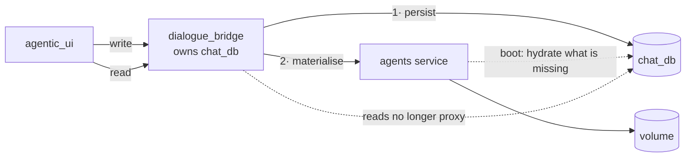

# 21 — Make Postgres the source of truth for user-created content

**Status:** proposed — not started
**Touches:** `dialogue_bridge` (new tables, new ownership), `agents` (loses read/CRUD surface, gains a hydrator), `agentic_ui` (unchanged contracts)
**Background:** [state & storage map](../draft/state-and-storage-map.md) §6–§7

Three object types a user creates — **custom agents**, **custom skills**, and
**agent memory** — exist in exactly one place: the agents-service volume. That
volume has no backup and no mirror, so losing it destroys content no `pg_dump`
can bring back, and it is what pins the agents service to a single replica.

This plan inverts the ownership: **Postgres holds the truth, the volume becomes
a materialised cache rebuilt on boot.** It ships in three parts, easiest first,
because each one proves more of the same machinery.

---

## 1. The one shape, three times



Four rules that apply to all three parts:

1. **Write order is persist-then-materialise.** Postgres commits first. If the
   agents call then fails, the row exists and the next hydrate fixes the volume —
   the reverse order loses the write.
2. **Reads stop proxying.** The bridge already owns `chat_db`, so a list/detail
   read becomes a query. This is where agents-service code is deleted.
3. **Hydration is idempotent and per-boot**, not a one-time migration. A fresh
   container, a wiped volume and a second replica all take the same path.
4. **The volume stays authoritative *within a run*.** The agent reads its mounted
   files; nothing changes at inference time. We are changing who *owns* the
   bytes, not how the agent reads them.

---

## 2. Part A — custom agents

The easiest, because **the bridge is already in the write path**.

`create_custom_agent` today proxies the definition to the agents service and then
upserts the `agents` row (`utils/user_agents.py:214`). The row exists; it just
holds metadata. We add the definition beside it and flip the read direction.

### 2.1 Schema

```sql
-- One row per file of a user-authored agent definition.
agent_definition_files(
  id, agent_id → agents.id ON DELETE CASCADE,
  path        text NOT NULL,     -- 'agent.yaml', 'AGENT.md', 'subagents/x.md'
  content     text NOT NULL,     -- UTF-8; the extension allowlist has no binary
  updated_at  timestamptz,
  UNIQUE (agent_id, path)
)
```

Text, not bytea: the server-side allowlist is `.md/.txt/.yaml/.yml`, so base64
would be dead weight. Caps (20 files / 256 KiB / 1 MiB) are already enforced at
validation and carry over unchanged.

### 2.2 Flow changes

| Operation | Today | After |
| --- | --- | --- |
| Create | proxy → agents writes volume → upsert row | validate (proxy) → **write rows** → materialise → upsert row |
| Update | proxy → agents rewrites folder | **replace rows** → materialise |
| Delete | proxy → agents removes folder → deactivate row | delete rows (cascade) → materialise removal → deactivate row |
| **List** | proxy to agents | **query `chat_db`** |
| **Detail** | proxy to agents | **query `chat_db`** |
| Validate | proxy to agents | **unchanged** — the spec rules live there |

Validation deliberately stays in the agents service. It is the only component
that knows the model allowlist, the native-tool registry and the reserved slugs;
duplicating it in the bridge would recreate the `REQUIRED_GATES` drift class.

### 2.3 Deleted from the agents service

`GET /agents/users/{u}/custom` and `GET .../custom/{slug}` lose their only
caller. Keep the **write** endpoints — they become the materialiser's API —
and keep validation.

### 2.4 Hydration

On agents-service boot, for each user with definition rows whose volume folder is
missing or stale, write the files. Compare on a content hash so a warm volume is
a no-op. Runs before `refresh_registry()`, same slot the global seeder uses.

---

## 3. Part B — custom skills

Same shape as A, with one extra: **there is no row at all today.** A custom skill
is `SKILL.md` plus any scripts, referenced from `manifest.json`, all on the
volume.

### 3.1 Schema

```sql
user_skills(
  id, user_id → users.id ON DELETE CASCADE,
  name text NOT NULL, description text, category text,
  origin      text NOT NULL DEFAULT 'user',   -- 'user' | 'agent'  (create_skill)
  created_by_agent text NULL,
  created_at  timestamptz,
  UNIQUE (user_id, name)
)

user_skill_files(id, skill_id → user_skills.id ON DELETE CASCADE,
                 path, content, UNIQUE (skill_id, path))
```

The pool's *membership* is a third table, because a pool entry can point at a
**global** skill the user added (no files of its own) as well as a custom one:

```sql
user_skill_pool(user_id, skill_name, type)   -- type: 'global' | 'custom'
user_agent_skills(user_id, agent_slug, skill_name)   -- tier ③ assignment
```

Those two are pure *selections* — small, and the thing a user notices losing
first. They belong to this part rather than a fourth one.

### 3.2 The reads that get deleted

`utils/skills.py` in the bridge is currently proxy-and-cache over the agents
service: `list_user_skills`, `get_user_skill_detail`, `get_user_agent_skills`.
All three become queries.

**The Redis skill caches then largely lose their reason to exist.**
`skills:user:<u>:registry` and `skills:user:<u>:agent:<a>` exist to avoid a
cross-service hop that will no longer happen. Removing them **also fixes the
known `create_skill` staleness bug** — there is no cache to invalidate. Keep
`skills:global` (the catalogue is genuinely remote and rarely changes).

That is a real simplification, not a side effect: one bug and two caches deleted
by making the data local.

---

## 4. Part C — memory

The special case, and the reason it is last.

**Memory is not written through the bridge.** The `remember` tool runs
*inside* an agent, mid-run, and writes `entries/<slug>.yml` + an `AGENTS.md`
index line straight to the volume. The browser is not involved, so there is no
request to hang persistence off.

### 4.1 How memory is actually read and written today

Worth stating precisely, because the names mislead.

| Path | Mechanism | Touches the bridge? |
| --- | --- | --- |
| Agent **reads** memory | `create_deep_agent(memory=agent_md_paths)` injects `/memories/AGENTS.md` as always-on context; entries are `read_file`-able because `/memories/` is a **mounted filesystem route** | No |
| Agent **writes** memory | the `remember` tool writes `entries/<slug>.yml` + an index line, straight to the volume | No |
| **UI** inspects memory | `agents/router/memories.py` (`list_memories` / `read_memory` / `delete_memory`) → bridge proxy | Yes |

**There is no tool that searches memories.** `search_past_conversations` is a
different feature entirely: it does semantic search over the user's past
*conversation messages* via `chat_db`'s pgvector index. Its endpoint is named
`/v1/internal/memory/search`, which is a misnomer — it searches
`message_embeddings`, not `agent_memories`.

### 4.2 What we borrow is the pattern, not the feature

`search_past_conversations` is nonetheless the precedent that makes this cheap:
it proves the **reverse channel** — the agents service calling the bridge on an
endpoint gated by `require_internal_caller` and blocked at the nginx edge, so
only the `backend` network can reach it.

Memory writes reuse that shape:

```
POST   /v1/internal/agent-memory/entries    upsert one entry
DELETE /v1/internal/agent-memory/entries    remove one
```

**Namespaced deliberately away from `/v1/internal/memory/`.** Adding
`/memory/entries` beside `/memory/search` would put message search and agent
memory under one prefix while they share nothing — different table, different
feature, different lifecycle. Renaming the existing route to
`/v1/internal/conversations/search` would be truer still; it is a one-line
change on both sides and worth folding in here.

No new trust model, no new transport — the pattern is proven and already
audited.

### 4.3 Schema

```sql
agent_memories(
  id, user_id → users.id ON DELETE CASCADE,
  agent_slug text NOT NULL,
  name       text NOT NULL,      -- the entry slug
  summary    text NOT NULL,      -- the AGENTS.md index line
  content    text NOT NULL,      -- the entry body
  created_at, updated_at,
  UNIQUE (user_id, agent_slug, name)
)
```

`AGENTS.md` is **derived**, not stored: it is an index over `summary`, and
regenerating it from rows is what keeps the two from drifting.

### 4.4 Write policy — the decision this part turns on

The tool must not become slower or failure-prone because of persistence.

**Write to the volume first, then mirror to the bridge; a failed mirror is
logged, never raised.**

Two reasons, and the second is structural rather than a preference:

1. The agent is mid-thought. A bridge blip must not fail a run.
2. **The agent reads memory from the mount, not from a query** (§4.1). Unlike
   custom agents and skills — where the volume is a materialised convenience —
   here the filesystem *is* the runtime read path. The volume cannot stop being
   authoritative during a run, so writing anywhere else first would mean the
   agent's next `read_file` misses a memory it just wrote.

The mirror is best-effort, with the gap closed by reconciliation on the next boot
(volume → Postgres for anything missing) — the same hydrator running in the other
direction.

That is the opposite of Parts A and B's persist-then-materialise, and
deliberately so: there, a user is waiting on a response and a lost write is
visible; here, an agent is mid-run and a raised error is worse than a delayed
mirror.

### 4.5 What the UI gains

The Memory tab currently proxies to the agents service to list and delete. It
becomes a `chat_db` query, and `runtime/filesystem/memory.py`'s read helpers
lose their remote caller.

---

## 5. Sequencing

| Part | Ships | Depends on |
| --- | --- | --- |
| **A · custom agents** | Tables + write path + read cutover + hydrator | — |
| **B · custom skills** | Tables (incl. pool + assignments) + read cutover + cache removal | A's hydrator pattern |
| **C · memory** | Internal write endpoints + table + reconciliation | The hydrator running both directions |

Each part is independently deployable and leaves the app working, because the
volume keeps serving the agent throughout — we are adding an owner, not moving
the runtime's data source.

---

## 6. Sharp edges

- **Migration of existing content.** Users already have agents, skills and
  memories on the volume with no rows. First boot after each part must
  back-fill *volume → Postgres*, and it must be idempotent — that is the same
  reconciliation Part C needs anyway, so build it as a two-way sync from the
  start rather than a one-shot import.
- **`agents.owner_user_id` stays the discriminator.** `NULL` = platform. The new
  tables hang off user-authored rows only; platform definitions stay in the
  image where they belong.
- **A save rewrites the whole folder.** The existing builder contract deletes any
  file it did not re-send. The Postgres write must mirror that exactly — replace
  the file set, not merge into it — or the two stores diverge on edit.
- **Deleting an agent must not cascade conversations.** Today delete deactivates
  the row precisely because `conversations.agent_id` cascades. The definition
  rows may hard-delete; the `agents` row still only deactivates.
- **Do not move validation to the bridge.** §2.2.
- **`create_skill` writes to pool + assignment, never to tier ④.** The new tables
  must preserve that distinction or a runtime tool call gains the ability to edit
  an agent's definition.
- **Caps are enforced twice or not at all.** File count/size limits currently live
  in the agents service validator; the bridge now writes first, so it must
  enforce them before insert.

---

## 7. What this unlocks

Once A–C land, the agents service holds no user state that cannot be rebuilt
from Postgres on boot. That makes it **stateless enough to run more than one
replica** — currently impossible, because a second container would have an empty
volume.

Worth naming as a goal now, because it changes a design choice: the hydrator has
to be a safe, idempotent, per-boot reconciliation rather than a migration script
run once by hand.

---

## 8. File map

| Concern | File |
| --- | --- |
| Bridge tables + migration | `src/dialogue_bridge/core/database/models.py`, `core/database/migrations/versions/` |
| Custom agent orchestration (already bridge-side) | `src/dialogue_bridge/utils/user_agents.py` |
| Skill proxy + cache (to become queries) | `src/dialogue_bridge/utils/skills.py`, `utils/skills_cache.py` |
| Reverse-channel precedent | `src/dialogue_bridge/router/internal_memory.py` |
| The `remember` tool | `src/agents/runtime/tools/remember.py` |
| Memory read helpers | `src/agents/runtime/filesystem/memory.py` |
| Path authority for materialisation | `src/agents/runtime/filesystem/layout.py` |
| Agent definition CRUD (write side kept) | `src/agents/runtime/abstractions/user_agents.py` |
| Skill registry (write side kept) | `src/agents/runtime/skill_registry/user_registry.py` |
| Boot sequence for the hydrator | `src/agents/main.py` (lifespan, before `refresh_registry()`) |
