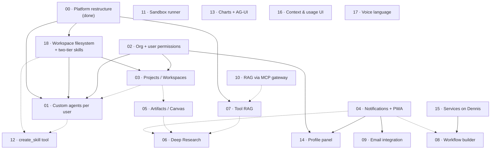

# Execution Plans

One plan per open item in [`src/TODO`](../../src/TODO), plus a status record for the platform restructure that is already delivered. A plan is the *pre-implementation* document: it states the goal, the current state of the codebase, the target design, the cross-service ripple, a phased execution order with acceptance criteria, and the risks. It is not a changelog — once an item ships, its plan is marked `Done` and the authoritative behaviour moves into `docs/flows/` or `docs/development/`.

These plans deliberately cross-reference each other. Most items in `src/TODO` are not independent: per-user custom agents need agent ownership, ownership needs the org/user permission model, long-running research needs notifications, and the workflow builder needs n8n on the VM. The **Dependency graph** below is the single source of truth for that ordering; every plan repeats its own slice of it in its `Depends on` / `Blocks` header.

---

## Status legend

| Status | Meaning |
| --- | --- |
| **Done** | Shipped and deployed. The plan stays as the design record; behaviour lives in `docs/flows/` or `docs/development/`. |
| **Partially done** | Some phases shipped. The plan states exactly which, and what remains. |
| **Not started** | Designed here, no code yet. |

---

## Index

| # | Plan | TODO section | Status |
| --- | --- | --- | --- |
| 00 | [Platform restructure — declarative agents, workspaces, per-agent tools](00-platform-restructure.md) | Agents | **Done** (Phases 0–2) |
| 01 | [Custom agents per user](01-custom-agents-per-user.md) | Agents | Not started |
| 02 | [Org + user permissions (multi-tenancy & RBAC)](02-org-and-user-permissions.md) | General | Not started |
| 03 | [Projects / Workspaces](03-projects-and-workspaces.md) | New Features | Not started |
| 04 | [Notification system + PWA](04-notifications-and-pwa.md) | New Features | Not started |
| 05 | [Artifacts / Canvas](05-artifacts-canvas.md) | New Features | Not started |
| 06 | [Deep Research mode](06-deep-research-mode.md) | New Features | Not started |
| 07 | [Tool RAG (dynamic tool selection)](07-tool-rag.md) | New Features | Not started |
| 08 | [Workflow / automation builder](08-workflow-automation-builder.md) | New Features | Not started |
| 09 | [Email integration](09-email-integration.md) | New Features | Not started |
| 10 | [RAG via the MCP gateway](10-rag-via-mcp-gateway.md) | Agents | Not started |
| 11 | [Sandboxed execution — the sandbox runner](11-sandbox-runner.md) | Agents | Partially done (Phase 1 lockdown shipped) |
| 12 | [`create_skill` tool](12-create-skill-tool.md) | Agents | Not started |
| 13 | [Charts + AG-UI interactive widgets](13-charts-and-agui-widgets.md) | Agentic UI | Not started |
| 14 | [Profile panel completion](14-profile-panel-completion.md) | Agentic UI | Not started |
| 15 | [Open-source services on Dennis](15-dennis-open-source-services.md) | General | Not started |
| 16 | [Context & usage UI](16-context-usage-ui.md) | Bugs / Fixes | Not started |
| 17 | [Dynamic voice language, per conversation](17-voice-language-dynamic.md) | Bugs / Fixes | Not started |
| 18 | [Workspace filesystem consolidation + two-tier skills](18-workspace-filesystem-consolidation.md) | derived (storage half of Projects/Workspaces) | Not started |

---

## Dependency graph

Arrows read **"must land before"**. Dashed arrows are soft couplings — the downstream item works without the upstream one, but is materially better with it.



**Independent (start any time):** 11, 13, 16, 17, and the infrastructure half of 15.

### Suggested order

1. **02** (permissions) — the widest blast radius; everything user- or org-scoped inherits from it.
2. **01** (custom agents per user) — the highest-value unlock and the natural continuation of 00.
3. **04** (notifications) — unblocks the async story for 06, 08, 09 and the HITL approval gate.
4. **03** (workspaces) → **05** (artifacts) → **06** (deep research) — the long-running-work arc.
5. **07**, **10** — retrieval/tooling scale-out.
6. **08** + **15**, **09** — automation and external integrations.
7. **11**, **12**, **13**, **14**, **16**, **17** — parallelisable, no hard blockers.

---

## Cross-cutting concerns

Every plan must state its impact on these, because they are the seams where multi-service changes break:

| Concern | Why it recurs |
| --- | --- |
| **Ownership & scoping** | Rows and files are keyed by `(user)`, `(user, agent)`, or `(user, workspace, agent)`. Adding a tier is a migration *and* a filesystem-layout change. See 02, 03. |
| **DB migrations** | Alembic chain in `src/dialogue_bridge/migrations/versions/`, current head `0016_retire_enabled_tools`. Every schema change is model + migration in one commit. |
| **Agent tool surface** | Tools are agent-declared (`agent.yaml`) minus per-(user, agent) disables. Any new tool goes through the native registry or the MCP gateway — never the request. See [tool harness](../development/tool-harness.md), plans 07, 10, 12. |
| **AG-UI event protocol** | New streamed UI affordances need an event type + normalizer + timeline reducer branch. See [agui-protocol](../development/agui-protocol.md), plans 05, 06, 13. |
| **Filesystem layout** | `/var/magenticx/{global,workspaces}`; agent files go through `FilesystemBackend`. Plans 01, 03, 05, 11, 12 all touch it. |
| **Secrets** | Swarm secrets + Vault; never plaintext env for sensitive values. Plans 09, 15 add new credentials. |
| **Trust boundary** | `require_internal_caller` + mTLS between services; only nginx:8050 is public. Any new service (11, 15) joins this model. |
| **Notifications** | Anything that completes while the user is away needs 04 to be user-visible. |
| **Docs** | A shipped plan updates the matching `docs/flows/` or `docs/development/` file and the table in `CLAUDE.md`. |

---

## Shared-resource coordination

Several plans independently reserve the *same* scarce resources. These are the collisions to settle before two of them are implemented in parallel.

### Alembic revision slots

The chain head is **`0016_retire_enabled_tools`**. Five plans each drafted their migration as `0017`, which cannot all be true. Whichever lands first takes `0017`; the rest rebase their `down_revision`. If two merge in parallel anyway, `alembic heads` shows two tips and the fix is `alembic merge` (see the CLAUDE.md migration workflow).

| Plan | Migration intent | Notes |
| --- | --- | --- |
| [01](01-custom-agents-per-user.md) | agent ownership (`owner_user_id`, `runtime_key`, partial unique index) | Hand-written — autogenerate ignores `postgresql_where`. |
| [02](02-org-and-user-permissions.md) | orgs, memberships, audit log (three revisions) | Widest surface; consider taking the first slots. |
| [03](03-projects-and-workspaces.md) | workspaces, members, files | Follows 02. |
| [05](05-artifacts-canvas.md) | `artifacts` + `artifact_versions` + `attachments.artifact_id` | |
| [16](16-context-usage-ui.md) | `messages.context_tokens`, `messages.model` | |
| [17](17-voice-language-dynamic.md) | `conversations.voice_mode_language` | Smallest; easy to slot anywhere. |

Plan [04](04-notifications-and-pwa.md) and [14](14-profile-panel-completion.md) also add `user_preferences` columns and new tables — same rule applies.

### Other contended resources

| Resource | Contenders | Resolution |
| --- | --- | --- |
| `UISnapshotSerializable.version` | 02, 03 (and any plan changing persisted UI state) | **One version bump per deploy.** Bumping twice in one release means the migration branch in `loadUISnapshot()` is never exercised for the intermediate shape. |
| Sidebar header real estate | 02 (org switcher), 03 (workspace switcher) | Agreed split: org switcher in the footer account dropdown, workspace switcher in the header. |
| A model registry (context window / pricing) | 01 (model allowlist), 06 (budgets), 16 (context meter) | One registry, built once. The only existing source of truth is the per-model profile already trusted by `summarization.py` — see [16](16-context-usage-ui.md) §1. |
| The `auto_attach=False` native-tool slot | 09 (mail tools), 13 (`render_chart`), 12 (`create_skill`) | Not exclusive, but 13 is documented as its "first inhabitant" — whichever ships first proves the path. |
| A HITL `edit` decision | 06 (prune/redirect a plan), 09 (edit a draft before send) | Both want to widen `approve`/`reject`. 09 designed around it (edit the draft row, then approve); 06 needs it. Build it once, in whichever lands first. |
| `/var/magenticx` persistence + physical layout | **18 owns it**; 01 and 03 consume it | The mount does not exist today. [18](18-workspace-filesystem-consolidation.md) provisions the volume (its Phase 0 *is* 01's blocking Phase 0) and owns the copy→verify→mark migrator; 03 keeps the workspace *entity* (tables, membership, switcher, memory tier). Whichever of 01/03 lands second must not re-move data. |

---

## Mandatory plan template

Every plan file follows this shape, in this order. Prose over bullets in sections 1–3; tables and diagrams where they carry more than prose would.

```markdown
# <Title>

> **Status:** Not started | Partially done | Done
> **TODO source:** <section> → "<verbatim snippet of the task>"
> **Depends on:** <plan links, or "nothing">
> **Blocks:** <plan links, or "nothing">
> **Services touched:** agents · dialogue_bridge · agentic_ui · rag_service · infra

<One or two paragraphs: what this delivers, for whom, and the mental model. No bullets.>

---

## 1. Goal & non-goals
## 2. Current state            <!-- what exists today, with real file:line refs -->
## 3. Target design            <!-- prose + mermaid -->
## 4. Data model & migrations  <!-- tables, columns, indexes, alembic revision slot -->
## 5. API surface              <!-- endpoints, schemas, auth deps, rate limits -->
## 6. Frontend surface         <!-- feature folder, components, api.ts, types -->
## 7. Cross-cutting impact     <!-- the ripple: other services, other plans, docs -->
## 8. Phased execution         <!-- numbered phases, each with acceptance criteria -->
## 9. Security & privacy       <!-- threat model, authz checks, fail-closed defaults -->
## 10. Testing strategy
## 11. Docs to update
## 12. Risks & open decisions
## 13. File map                <!-- concept → file → what to look for -->
```

### Conventions

- **One documented exception:** [00 · Platform restructure](00-platform-restructure.md) is a *retrospective status record*, not a forward plan, so it drops the sections that only make sense before implementation (API/frontend surface, testing strategy, phased execution) in favour of "phases as shipped" and "risks accepted". Every `Not started` / `Partially done` plan uses the full thirteen.
- **File names:** `NN-kebab-case-slug.md`, numbering fixed by the index above.
- **Links:** relative (`../development/tool-harness.md`, `01-custom-agents-per-user.md`). Code refs as `[path](../../src/…)`.
- **Don't invent shipped behaviour.** Section 2 describes only what is actually in the repo; anything speculative belongs in section 3 or 12.
- **Respect the repo rules** the plans will be implemented under: layered service structure, Pydantic/Zod validation at every boundary, parameterized SQL, fail-closed defaults, no `print`/`console.log`, docs updated in the same commit.
