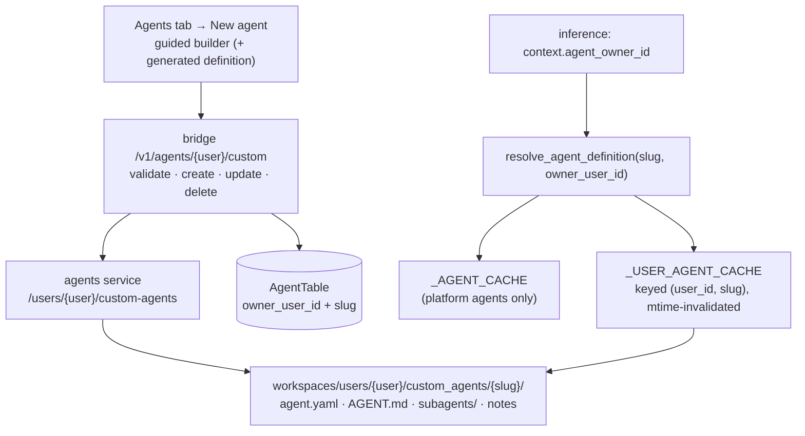

# Custom agents per user

> **Status:** **Delivered** (2026-08-12, `2efdda9` + `4e2d383`). Kept for the reasoning; the mechanism below is written as shipped, and where it diverged from the original plan the divergence is called out — the abandoned `runtime_key` scheme is described in §3.1 so nobody re-implements it.
> **TODO source:** **Agents** → "Create a functionality for the user to configure a custom agent with a set of tools and instructions, so that the user can create a custom agent for their own use case with their skills, prompts, tools, filesystem, sub agents and etc in yml formats and then he will be able to use them."
> **Depends on:** [00 · Platform restructure](00-platform-restructure.md) (done — the engine), [02 · Org + user permissions](../02-org-and-user-permissions.md) (ownership semantics)
> **Blocks:** nothing hard. Soft: [12 · `create_skill` tool](12-create-skill-tool.md) (an agent writing into *its own* user-owned definition)
> **Services touched:** agents · dialogue_bridge · agentic_ui (+ DB migration)

A user should be able to build their own agent — a name and icon, a system prompt, a model, a chosen set of tools, sub-agents, and skills — and then pick it in the composer like any built-in. The runtime for this already exists: plan 00 delivered `AgentSpec`, `YamlDeepAgent`, and directory-scan discovery, so an agent is already nothing more than a folder containing `agent.yaml`. What is missing is *ownership*: today every agent is a platform agent living in the global volume, discovered once into a process-global registry, and recorded in a table whose `slug` is globally unique.

So this plan is mostly not about agent behaviour — it is about teaching three layers that an agent can belong to somebody. The hard parts are the registry (a process-global dict cannot hold per-user agents without leaking them across users), the slug namespace (global uniqueness must become per-owner uniqueness), and the security floor (a user-authored agent runs with *platform* credentials, so the prompt is user data but the tool set and the approval gates must stay platform-governed).

---

## 1. Goal & non-goals

**Goal.** A user creates, edits, and deletes agents that only they can see and use; those agents are defined by the same `agent.yaml` contract as built-ins, stored in the user's workspace, validated by the same strict spec, and selectable for inference exactly like a global agent.

**Non-goals.**

- **User-authored tools.** Tools stay platform-owned (reviewed native code, or MCP servers behind the gateway). A user composes from the catalogue; they never supply executable tool code. This is the load-bearing security decision inherited from plan 00.
- **Sharing / publishing.** Agent sharing to an org or another user needs the org model — deferred to [02](../02-org-and-user-permissions.md).
- **Declarative LangGraph.** A user agent is a *deep* agent. Graph agents remain Python (plan 00 Phase 4).
- **Editing built-ins.** A user may not modify a platform agent; they may clone it into their own.

---

## 2. Current state

**The engine is ready.** `_scan_yaml_agents(root)` walks `<root>/agents/<slug>/agent.yaml`, validates with `AgentSpec.model_validate` plus `reference_errors()` (models + native-tool allowlists), and registers an `AgentDefinition(slug, manifest, factory, spec)` whose factory builds a `YamlDeepAgent`. Invalid specs are logged and skipped, never fatal. See [utils/agents.py](../../../src/agents/utils/agents.py) and [runtime/abstractions/](../../../src/agents/runtime/abstractions/).

**But everything about it is global.** Four concrete obstacles:

| Obstacle | Where | Consequence |
| --- | --- | --- |
| Discovery scans one root | `_build_registry()` → `_scan_yaml_agents(settings.filesystem.global_root)` | User workspaces are never looked at. |
| The registry is a process-global dict keyed by slug | `AGENT_REGISTRY: Dict[str, AgentDefinition]`, mutated in place by `refresh_registry()` | Two users' agents would collide on slug, and one user's agent would be visible to every request. |
| `AgentTable.slug` is `unique=True`, no owner column | [core/database/models.py](../../../src/dialogue_bridge/core/database/models.py) | Two users cannot both have a `research-bot`. |
| The bridge cache is process-global | `_AGENT_CACHE: Dict[str, AgentTable]`, primed by `prime_agent_cache` from `_load_active_agents` | A per-user agent placed in it leaks across users; and the cache is lazy (refresh on empty), so writes would not appear until restart. |

**Catalog sync.** `sync_agents_with_service(db)` pulls the agents-service manifest and upserts `AgentTable`, making the agents service the source of truth for the agent list. For user agents that direction has to invert — the user creates them through the bridge.

**Filesystem convention exists, data does not — and the path is not even persistent.** `settings.filesystem.workspaces_root` = `/var/magenticx/workspaces` is defined ([core/settings.py](../../../src/agents/core/settings.py) `FilesystemSettings`) and the directory is created in the image, but **neither `docker-compose.yaml` nor `docker-compose-denis.yaml` mounts anything at `/var/magenticx`**. The agents service mounts only the legacy roots:

```yaml
agents_filesystem:/var/agents/filesystem            # user_root → agent_root, tool_prefs, memory, skills
skills_registry_global:/var/agents/skills_registry/global
skills_registry_users:/var/agents/skills_registry/users
```

So `global_root` and `workspaces_root` currently resolve to the container's **ephemeral layer**. Two consequences, and they differ in severity:

- **Harmless today:** `global_root` holds only the built-in agent seed, which is re-copied from the image on every start, so platform agents work correctly. What *is* false is plan 00's documented promise that an out-of-band edit to a built-in agent's folder survives a restart — it does not.
- **Blocking for this plan:** a user-authored agent written to `workspaces_root` would be **destroyed on every container restart or redeploy**. Provisioning a persistent mount is therefore a hard prerequisite of Phase 1, not a detail deferred to [03](../03-projects-and-workspaces.md).

Note that everything shipped so far is unaffected: `agent_root()` derives from `settings.filesystem.user_root` = `/var/agents/filesystem`, which *is* mounted — so `tool_prefs.json`, memory, and skills all persist correctly.

**A trap to respect.** `AgentTable.conversations` is declared `cascade="all, delete-orphan", passive_deletes=True` — deleting an agent row deletes its conversations. Hard-deleting a user agent would silently destroy chat history (see §9).

---

## 3. Design as shipped



### 3.1 Ownership & the slug namespace

`AgentTable` gained `owner_user_id` (nullable; `NULL` = platform agent). Uniqueness became **per-owner**, with a partial unique index keeping platform slugs globally unique (§4).

**The planned `runtime_key` column was not built, and should not be.** The idea was a second identifier (`u/<user_id>/<slug>`) that the bridge would send instead of the slug. It is unnecessary: the agents service already receives the run's user via the inference context, so ownership can travel *beside* the slug instead of being encoded into it. What shipped is a single extra context field:

| Agent kind | `owner_user_id` | `slug` | resolved by |
| --- | --- | --- | --- |
| Platform | `NULL` | `omni-yaml-v1` | `resolve_agent_definition("omni-yaml-v1", None)` |
| User | `<uuid>` | `research-bot` | `resolve_agent_definition("research-bot", "<uuid>")` |

The bridge sets `context.agent_owner_id` when the resolved agent row has an owner ([utils/inference_runs.py](../../../src/dialogue_bridge/utils/inference_runs.py)); the agents service passes it to the resolver ([router/inference.py](../../../src/agents/router/inference.py), both the stream and resume paths). This keeps the same outcome as the plan — **namespacing over override**, a user agent can never shadow a built-in — with no slug mangling, no ambiguous parsing of `/`-containing keys, no migration backfill, and no second identifier to keep in sync with the first.

### 3.2 Resolution instead of registration

The process-global cache holds **platform agents only**; user agents resolve on demand:

```text
resolve_agent_definition(slug, owner_user_id=None):
    platform = _AGENT_CACHE.get(slug)
    if platform:                 return platform          # platform slugs are reserved
    if not owner_user_id:        return None
    return _load_user_agent(owner_user_id, slug)          # mtime-keyed cache
```

`_USER_AGENT_CACHE` is keyed `(user_id, slug)` and invalidated by the definition's **mtime** rather than by an explicit write hook or a TTL — a save changes the file, so the next resolve reloads it, and there is no cache-coherence path to get wrong. A spec that fails validation resolves to `None` (a 404) rather than a half-built agent.

Two isolation properties fall out of this and are load-bearing:

- User agents are never in a shared dict, so they cannot leak or be enumerated across users.
- Platform lookup happens **first**, so a user agent named after a built-in resolves to the built-in. Creation also reserves platform slugs outright, so the case is rejected up front rather than silently shadowed.

> **A leak this design fixed.** `GET /v1/catalog/agents` originally served the entire process-global cache to any authenticated caller. Once user agents could enter that cache, one user's agents would have been visible to everyone. The fix is structural — the cache is platform-only and owned agents are read per request, scoped to the caller ([router/catalog.py](../../../src/dialogue_bridge/router/catalog.py)).

### 3.3 Authoring: form first, YAML visible

The primary surface is a guided builder that *generates* the YAML — name/description/icon, prompt (textarea → `AGENT.md`), main + sub-agent models from an allowlist, tools multi-selected from the same catalogue the Agents tab already renders, sub-agents (name, description, prompt, model), skills from the user's pool, and HITL toggles. A read-only "view YAML" panel keeps the declarative model honest and teaches the format; a later phase can allow direct YAML editing and multi-file upload for power users. The form is preferable as the default because it can only emit specs that pass validation.

---

## 4. Data model & migrations

Shipped as **`0017_agent_ownership`** (`down_revision` = `0016_retire_enabled_tools`), hand-written:

```python
op.add_column("agents", sa.Column("owner_user_id", sa.String(), nullable=True))
op.create_foreign_key(None, "agents", "users", ["owner_user_id"], ["id"], ondelete="CASCADE")
op.create_index("ix_agents_owner_user_id", "agents", ["owner_user_id"])
# The partial index must exist BEFORE the global constraint is dropped, so there
# is no window in which two platform agents could take the same slug.
op.create_index("uq_agents_global_slug", "agents", ["slug"],
                unique=True, postgresql_where=sa.text("owner_user_id IS NULL"))
op.drop_constraint("uq_agents_slug", "agents", type_="unique")
op.create_unique_constraint("uq_agents_owner_slug", "agents", ["owner_user_id", "slug"])
```

Notes that matter: the partial index is required because Postgres allows unlimited `NULL`s in a unique constraint, so `(owner_user_id, slug)` alone would not keep platform slugs unique. Autogenerate silently ignores `postgresql_where`, so this migration had to be hand-written (a documented blind spot in the repo's migration workflow). No `runtime_key` column and therefore no backfill (§3.1).

**The downgrade deliberately refuses** when any user-owned agent exists, rather than dropping the column and silently deleting user agents. Rolling this migration back is therefore one-way once the feature has been used — a deliberate trade of reversibility for not destroying user content.

Quotas live in settings, not the schema: max agents per user, max sub-agents per agent, max prompt bytes, max total spec bytes.

---

## 5. API surface

**Bridge** — new `router/agents_custom.py` mounted under `/v1/agents`, every route `Depends(validate_userId)`, mutations also `require_csrf_protection` + rate limit:

| Method | Path | Purpose |
| --- | --- | --- |
| `GET` | `/{user_id}/custom` | List the user's own agents (paginated). |
| `POST` | `/{user_id}/custom/validate` | Dry-run: returns structured spec errors, writes nothing. |
| `POST` | `/{user_id}/custom` | Create — writes the folder via the agents service, then the `AgentTable` row. |
| `PATCH` | `/{user_id}/custom/{agent_id}` | Update spec and/or assets. |
| `DELETE` | `/{user_id}/custom/{agent_id}` | Soft-delete (`is_active = false`); hard-delete only when the agent has no conversations (§9). |
| `POST` | `/{user_id}/custom/{agent_id}/clone` | Clone a platform agent (or one of the user's own) as a starting point. |

**Agents service** — new `router/user_agents.py`, internal-caller only, mirroring the skills/tool-prefs pattern: write/read/delete a user agent folder under `workspaces_root/<user_id>/agents/<slug>/`, validate a candidate spec, and invalidate the resolver cache. Business logic in `utils/user_agents.py`; filesystem writes go through the same confinement discipline as skills (never an arbitrary path).

Schemas are Pydantic on the bridge (camelCase out) and Zod contracts on the client, per repo convention. The write is not atomic across two systems — see §12.

---

## 6. Frontend surface

Everything lands in `features/settings/`, extending the Agents tab that plan 00 shipped:

- **`AgentsTab`** gains a section split: *Platform agents* (tool overrides only, today's behaviour) and *My agents* (edit / clone / delete + a **Create agent** button).
- **`agent_builder/`** — a new component folder: `AgentBuilderDialog` (multi-step: identity → prompt → models → tools → sub-agents → skills → review), `YamlPreview`, and per-step field groups. Steps validate locally; the final review calls `.../validate` before enabling Save.
- **`shared/lib/api.ts`** — `listMyAgents`, `validateCustomAgent`, `createCustomAgent`, `updateCustomAgent`, `deleteCustomAgent`, `cloneAgent`; contracts in `shared/lib/schemas.ts`, types re-exported from `shared/lib/types.ts`.
- **Composer picker** merges platform + user agents (a subtle badge distinguishes them) and must tolerate an agent disappearing mid-session (deleted in another tab) without breaking an open conversation.

Empty state matters here: a first-time user sees an explanatory card with *Create from scratch* and *Clone a built-in* as the two primary actions.

---

## 7. Cross-cutting impact

| Area | Impact |
| --- | --- |
| **Catalog sync** | `sync_agents_with_service` must scope to platform agents only, or it will delete/deactivate user agents it does not see in the manifest. This is the single most likely regression. |
| **Bridge agent cache** | `_AGENT_CACHE` / `prime_agent_cache` must never hold user agents; `get_agent_by_id` needs an owner-aware path (DB lookup for user agents, cache for platform ones). |
| **Per-agent tool overrides** | `tool_prefs.json` lives at `<agent_root>` keyed by `(user, agent_slug)`. A user agent's slug is only unique per owner, so the agent-root derivation must use the owner-scoped path — verify [runtime/filesystem/provisioner.py](../../../src/agents/runtime/filesystem/provisioner.py) `agent_root()` cannot alias two users' same-named agents. |
| **Skills & memory** | Both are keyed per `(user, agent)` and will now include user agents; the skills pool and `AGENTS.md` memory tree must be created lazily for a new agent. See [agent-memory](../../flows/agent-memory.md). |
| **Workspaces** | [03](../03-projects-and-workspaces.md) may add a workspace tier to the path (`workspaces/<user>/<workspace>/agents/…`). Keep the agent-root derivation in one helper so that change is one edit. |
| **Permissions** | [02](../02-org-and-user-permissions.md) turns `owner_user_id` into a full owner (user *or* org) and adds sharing. Model the column as an owner reference now so that migration is additive. |
| **Tool RAG** | [07](../07-tool-rag.md) narrows within the declared set — user agents simply add more declared sets; no conflict, but the eval corpus should include user-authored agents. |
| **`create_skill`** | [12](12-create-skill-tool.md) lets an agent author a skill; combined with this plan, an agent could effectively extend its own definition. Decide the approval posture in that plan, not this one. |
| **Docs** | Closes the gap noted in [00 §7](00-platform-restructure.md): the agent-development reference must finally document `agent.yaml` / `YamlDeepAgent` as the primary way to build an agent. |

---

## 8. Phased execution (as executed)

**Phase 0 — Persist the workspace root (prerequisite, blocking).**
Add a named volume (or a Dennis bind mount under `/opt/magenticx/`) at `/var/magenticx` to the agents service in **both** `docker-compose.yaml` and `docker-compose-denis.yaml`. Without this, `workspaces_root` is the container's ephemeral layer and every user-authored agent is lost on redeploy (§2). Decide here whether `global_root` shares the same volume — it should, so out-of-band edits to built-ins finally behave as documented.
*Acceptance:* a file written under `/var/magenticx/workspaces/<user>/` survives `up -d --build --no-deps agents`; the seeder still reports `skipped=[…]` (not `copied`) for an already-present built-in on the second start.

**Phase 1 — Ownership & resolution (no UI).**
Migration `0017`; `owner_user_id` on the model; owner-aware `get_agent_by_id`; `sync_agents_with_service` and the process-global cache scoped to platform agents; `resolve_agent_definition(slug, owner_user_id)` + the mtime-keyed per-user cache in the agents service; bridge threads `context.agent_owner_id` (no `runtime_key` — §3.1).
*Acceptance:* an agent folder placed by hand under `workspaces_root/<user>/agents/<slug>/` is usable for inference by that user and invisible to another user; every existing platform agent behaves exactly as before.

**Phase 2 — Validation & CRUD.**
`POST .../validate` returning structured field errors; create/update/delete through the agents service; soft-delete semantics; quotas enforced; audit log lines on every mutation.
*Acceptance:* a malformed spec is rejected with actionable errors and nothing is written; deleting an agent with conversations preserves the conversations; a user cannot touch another user's agent (403) or a platform agent (403).

**Phase 3 — The builder UI.**
`AgentBuilderDialog` + the My agents section + clone-a-built-in + YAML preview.
*Acceptance:* a user creates a working agent end to end without seeing YAML, then converses with it; the composer picker lists it.

**Phase 4 — Multi-file assets.**
Sub-agent prompt files, an `AGENT.md` longer than a form field comfortably holds, skills attached from the user's pool, and a folder upload path for power users (with per-file type/size validation, mirroring the existing custom-skill upload).
*Acceptance:* an uploaded multi-file agent folder validates, or is rejected atomically with no partial write.

**Phase 5 — Hardening.**
Quota + rate-limit tuning, structured metrics (agents per user, validation failure reasons), and the docs pass.

---

## 9. Security & privacy

The central threat: **a user-authored agent executes with platform credentials** (the OpenAI key, MCP gateway reach, a filesystem mount). The prompt is untrusted user data; everything that grants capability must stay platform-governed.

- **YAML is configuration, never code.** `AgentSpec` keeps `extra="forbid"`; models validated against an allowlist; native tools validated against the registry; no field may carry a path outside the agent folder (reject `..`, absolute paths, symlinks) or a URL that becomes an outbound call.
- **Tools remain platform-owned.** A user agent's tool set is still `(declared ∪ user-enabled) − user-disabled` over the gateway/native catalogue. A user cannot introduce a new tool, only select.
- **HITL gates have a platform floor.** `agent.yaml` can *add* approval gates but must not be able to *remove* the platform-mandated ones (`write_file`, `edit_file`, `execute`, `task`). Otherwise authoring an agent is a one-line bypass of the confirmation gate. Enforce the floor in the builder **and** server-side in the spec validator — the server is the authority.
- **Isolation is structural, not adversarial.** A user agent gets the same mount confinement as any deep agent (`FilesystemBackend`, `virtual_mode`, read-only `input/`) and inherits the `SANDBOX_EXECUTION_ENABLED=false` fail-closed posture — see [11](../11-sandbox-runner.md). No new escape surface is introduced.
- **Authorization on every route.** `validate_userId` for identity plus an explicit ownership check on the target agent; never infer ownership from the path alone.
- **Data-loss guard.** Because `AgentTable.conversations` cascades, delete must be soft by default. Only allow a hard delete when zero conversations reference the agent, and never in the same transaction as the folder removal.
- **Quotas** cap agents per user, sub-agents, and total spec bytes to bound both storage and prompt-injection surface.
- **Logging** records agent ids and event types only — never prompt bodies (user content), consistent with [observability](../../development/observability.md).

---

## 10. Testing strategy

Spec validation gets table-driven tests (valid, unknown field, bad model, unknown native tool, path escape, missing prompt file, over-quota, HITL-floor removal attempt). Resolution gets isolation tests: two users with the same slug resolve to different agents; user A cannot resolve user B's agent; a platform slug is unshadowable. Bridge gets authz tests (403 cross-user, 403 on platform agent mutation) and a delete test asserting conversations survive. One integration test walks create → converse → update → delete against a real DB, per the repo's no-mocked-DB rule. Frontend: builder validation states and the picker's tolerance of a mid-session deletion. Agents-side tests run in-image (the host lacks the pinned `deepagents`).

---

## 11. Docs to update

[agent-development.md](../../development/agent-development.md) (make `agent.yaml` the primary path, document the builder), [agents-service-reference.md](../../development/agents-service-reference.md) (resolution + user-agent endpoints), [database-schema.md](../../architecture/database-schema.md) (ownership columns, partial index, migration `0017`), [catalog.md](../../flows/catalog.md) (platform vs user agents in the picker), [tool-harness.md](../../development/tool-harness.md) (user agents declare tools too; the HITL floor), and the `CLAUDE.md` doc table if a new doc is added.

---

## 12. Risks & open decisions

- **Two-system write is not atomic.** The folder lives on the agents-service volume, the row in Postgres. A crash between them orphans one side. Mitigation: write the folder first, then the row, and run a reconciler that reports (never auto-deletes) orphans — deleting user content to satisfy a consistency check is worse than the inconsistency.
- **Registry vs resolver divergence.** Platform agents stay in a warm dict, user agents go through a scan+cache. Two code paths for "get me an agent" is a latent bug source; keep them behind one `resolve_agent()` façade from Phase 1 rather than letting call sites branch.
- **Open: does a user agent belong to a workspace?** If [03](../03-projects-and-workspaces.md) lands first, agents may need to be workspace-scoped rather than user-scoped. Deciding late is fine *if* the agent-root path is derived in exactly one helper.
- **Open: model allowlist.** There is still no model registry with context windows or pricing; `_is_known_model` accepts any `provider:model`. Letting users pick a model without a registry means they can select something expensive or nonexistent. A minimal curated list is the pragmatic Phase 3 answer — and see [16](../16-context-usage-ui.md), which needs the same registry.
- **Open: cloning a platform agent** copies a prompt the platform authored. Fine while everything is first-party; revisit if third-party agents ever ship.
- **YAML sub-agents cannot currently hold MCP tools.** `YamlDeepAgent.register_subagents` drops MCP refs on a sub-agent with a warning, so the builder must either hide per-sub-agent tool selection or wait for the fix tracked in [06 · Deep Research](../06-deep-research-mode.md), which hits the same wall. Exposing a field that silently does nothing is worse than omitting it.
- **Prompt-injection blast radius grows.** More agents with hand-written prompts and broad tool sets means more ways to talk an agent into a bad tool call. The HITL floor is the backstop; [09](../09-email-integration.md) has the sharper version of this problem.

---

## 13. File map

| Concept | File | What to look for |
| --- | --- | --- |
| Spec + validation to reuse | [runtime/abstractions/agent_spec.py](../../../src/agents/runtime/abstractions/agent_spec.py) | `AgentSpec`, `reference_errors` |
| Generic runtime agent | [runtime/abstractions/yaml_agent.py](../../../src/agents/runtime/abstractions/yaml_agent.py) | `YamlDeepAgent` |
| Discovery to extend | [utils/agents.py](../../../src/agents/utils/agents.py) | `_scan_yaml_agents`, `_build_registry`, `refresh_registry` |
| Agent-root derivation | [runtime/filesystem/provisioner.py](../../../src/agents/runtime/filesystem/provisioner.py) | `agent_root` — must be owner-scoped |
| Workspace roots | [core/settings.py](../../../src/agents/core/settings.py) | `FilesystemSettings.workspaces_root` |
| New user-agent endpoints | `src/agents/router/user_agents.py` *(new)* + `src/agents/utils/user_agents.py` *(new)* | write/validate/delete + cache invalidation |
| Agent table + cascade trap | [core/database/models.py](../../../src/dialogue_bridge/core/database/models.py) | `AgentTable`, `conversations` cascade |
| Catalog sync to scope | [utils/agents.py](../../../src/dialogue_bridge/utils/agents.py) | `sync_agents_with_service`, `prime_agent_cache`, `get_agent_by_id`, `_resolve_agent_slug` |
| New bridge router | `src/dialogue_bridge/router/agents_custom.py` *(new)* | CRUD + validate, CSRF + ownership |
| Migration slot | `src/dialogue_bridge/core/database/migrations/versions/0017_agent_ownership.py` *(new)* | hand-written partial index |
| Agents tab to extend | [profile_parts/AgentsTab.tsx](../../../src/agentic_ui/src/features/settings/components/profile_parts/AgentsTab.tsx) | platform vs my-agents split |
| Builder UI | `src/agentic_ui/src/features/settings/components/agent_builder/` *(new)* | dialog steps, YAML preview |
