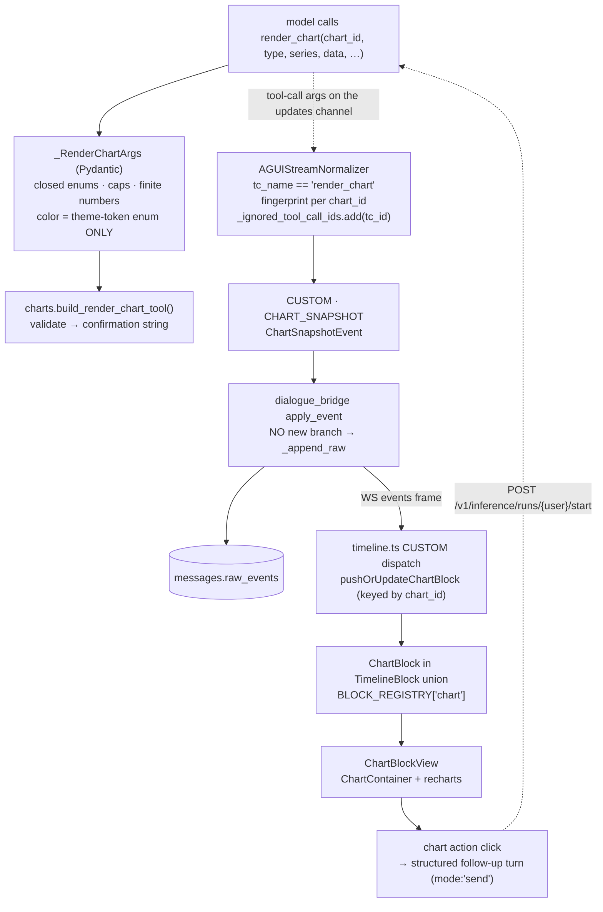

# Charts + AG-UI interactive widgets

> **Status:** **Delivered** — `render_chart`, the `RENDER_CHART` custom event, the timeline block, the renderer (bar · line · area · pie · radar · radial · scatter · composed, plus stacked / horizontal / show-values), the `--chart-1..5` palette and PNG export are all shipped; the TODO item was closed on 2026-08-29. Two deliberate divergences from the draft below: the event is named `RENDER_CHART`, not `CHART_SNAPSHOT`, and the **agent-directed interaction** half of §1 was not built — click-to-drill-down needs a client→agent channel, and AG-UI is one-way today.
> **TODO source:** Agentic UI → "Chart can be visualized with [shadcn/charts](https://www.shadcn.io/charts) and the agent can have a custom tool like the todo tool in order to represent the chart and create a custom AGUI event for the interaction with the chart."
> **Depends on:** nothing
> **Blocks:** nothing
> **Services touched:** agents · agentic_ui *(dialogue_bridge: no code change — see § 7)*
> **Related:** [05-artifacts-canvas.md](../05-artifacts-canvas.md) *(a chart spec is a renderable artifact)* · [06-deep-research-mode.md](../06-deep-research-mode.md) *(comparison matrices and trend charts are report primitives)*

Right now an agent that has computed a table of numbers has exactly one way to show them: a markdown table, or a mermaid fence if it feels adventurous. It cannot draw. The TODO's own framing points at the fix and at the precedent in the same sentence — build it "like the todo tool". That analogy is the whole design. `write_todos` is a deepagents framework tool whose `ToolMessage` result means nothing to the user; the normalizer intercepts it **by name**, lifts the arguments into a `PLAN_SNAPSHOT` custom event, suppresses the raw tool result from the wire, and the client folds that event into a live plan card. The model just calls a function; a purpose-built UI appears. A chart is the same shape of thing: structured arguments in, a rendered widget out, no chat text involved.

This plan adds a native `render_chart` tool that follows that pattern end to end — Pydantic-validated arguments, a `CHART_SNAPSHOT` custom event synthesized by the normalizer, a new timeline block, and a React renderer built on the **shadcn chart wrapper and recharts that are already in the repo**. It then answers the harder half of the TODO — "the interaction with the chart" — by splitting interaction into what the browser can answer alone (legend toggles, tooltips, series visibility, export) and what genuinely requires the agent (drill-down, filter, re-query), and choosing a mechanism for the second kind that is durable and replayable rather than clever.

---

## 1. Goal & non-goals

**Goals.** A native, opt-in `render_chart` tool with a strict Pydantic argument schema covering the chart families that actually earn their place in a chat transcript: bar, grouped/stacked bar, horizontal bar, line, area, pie/donut, and scatter. A `CHART_SNAPSHOT` AG-UI custom event, synthesized from the tool call the same way `PLAN_SNAPSHOT` is, that persists in `raw_events` so a chart survives reload, reconnection, and branch navigation with no extra storage. A timeline block and React renderer that use semantic theme tokens, look correct in both light and dark mode, respect `prefers-reduced-motion`, and are readable on a phone. A defined, non-hand-wavy interaction contract: local interactions never leave the browser; agent-directed interactions become a structured follow-up turn. A categorical color palette, because the repo currently has none.

**Non-goals.** A general-purpose Vega/Plotly-grade grammar of graphics — the argument schema is deliberately a small closed set of chart types, because an open grammar is an open injection surface and an unbounded rendering cost. Charts as user-authored content (there is no chart builder UI; only an agent creates one). Live-updating charts that mutate while a run streams *from the outside* — a chart updates only when the agent re-calls the tool with the same `chart_id`. Editing a chart's data in place (that belongs to [05](../05-artifacts-canvas.md)'s canvas if it happens at all). Geographic maps, Sankey diagrams, treemaps, and other families recharts does not cover well. Server-side chart rasterisation for PDF export.

---

## 2. Current state

### There is a placeholder file, and it is empty

[`src/agents/runtime/tools/charts.py`](../../../src/agents/runtime/tools/charts.py) exists and contains exactly one line — a comment reading *"Here will be placed the custom tools for charts, such as creating a chart from data, updating a chart, etc."* No code, no registration, no import. It is a note-to-self, not a partial implementation, and this plan fills it.

### The frontend dependencies are already installed

This is the single most useful fact for scoping. `recharts@^2.12.7` is a dependency in [`package.json`](../../../src/agentic_ui/package.json), and the shadcn chart wrapper is already vendored at [`src/agentic_ui/src/shared/ui/chart.tsx`](../../../src/agentic_ui/src/shared/ui/chart.tsx) — 363 lines exporting `ChartContainer`, `ChartStyle`, `ChartTooltip`, `ChartTooltipContent`, `ChartLegend`, `ChartLegendContent`, and the `ChartConfig` type. **No new dependency and no `npx shadcn add chart` step is required.**

It is in real use in exactly one place: the Usage tab. `UsageTab.tsx:35-38` declares its own `chartConfig` as `{ input: { label: "Input", color: "hsl(var(--primary) / 0.45)" }, output: { label: "Output", color: "hsl(var(--primary))" } }`, and `:204-240` renders a stacked `BarChart` inside a `ChartContainer` with `ChartTooltipContent`, `fill="var(--color-input)"`, and — importantly for the motion rules — `isAnimationActive={!reduceMotion}`.

Two consequences follow. First, the vendored `ChartStyle` builds a `<style>` tag with **`dangerouslySetInnerHTML`** from `config[key].color` (`chart.tsx:68-100`), interpolating each color string straight into CSS custom-property declarations. That is a CSS-injection sink, and it is the reason § 9 forbids agent-supplied raw color strings outright. Second, **there is no categorical palette in the theme.** A grep of `src/index.css` and `tailwind.config.ts` finds no `--chart-1`…`--chart-5` variables (the shadcn default) — the repo's tokens stop at `--primary`, `--secondary`, `--muted`, `--accent`, `--destructive`, `--success`, `--warning`, `--info` plus chat/gradient/shadow tokens (`index.css:12-90`). Usage gets away with two series by using primary at two opacities; an agent chart with five series has nothing to draw from.

### How the todo tool actually works, step by step

This is the pattern to mirror, and it is worth being precise about because three of its properties are load-bearing.

**Emission.** `write_todos` is a deepagents framework builtin — not our code, not in the native registry, and per [tool-harness.md](../../development/tool-harness.md) not disable-able (framework builtins enter through `create_deep_agent` *downstream* of `_apply_tool_disables`). The normalizer's updates-mode tool-call switch matches it by name, extracts `todos` from the args, fingerprints them with `json.dumps(sort_keys=True)`, compares against `_last_plan_fingerprint`, emits `PLAN_SNAPSHOT` only on change, and adds the `tool_call_id` to `_ignored_tool_call_ids` so the subsequent `ToolMessage` is silently consumed and never reaches the wire. A second path — the `"todos"` key inside a node update — converges on the same fingerprint check, so LangGraph replaying the same `AIMessage` cannot double-emit. All of this is documented in [agui-protocol.md § Phase 4](../../development/agui-protocol.md).

**Event shape.** `PLAN_SNAPSHOT_EVENT_TYPE = "PLAN_SNAPSHOT"` (`runtime/agui/events.py:8`) with `PlanItem` / `PlanSnapshot` models (`events.py:30-36`), emitted via `AGUIEmitter.plan_snapshot()` (`emitter.py:196`). Every custom event rides the same `{type: "CUSTOM", name, value, timestamp}` wrapper.

**Bridge handling — and this is the key finding.** `InferenceRunRuntime.apply_event` (`utils/inference_runs.py:390-459`) has explicit branches for `SUBAGENT_EVENT`, `HITL_INTERRUPT`, `TOKEN_USAGE`, `PRESENT_ARTIFACT`, and `CHECKPOINT_COMMITTED`, and then falls through to an **unconditional `self._append_raw(event)` at `:459`**. `PLAN_SNAPSHOT` has *no* branch — it needs none. Plan and sub-agent state are deliberately not aggregated on the bridge: `agui-protocol.md § Phase 6` records that `messages.plan` and `messages.subagents` were removed because `raw_events` already carries everything the UI fold needs. **A new custom event therefore persists and replays with zero bridge code.** `CHECKPOINT_COMMITTED` is the only counter-example, and it opts *out* by returning `None` (`:435-446`).

**Client fold.** `PlanSnapshotSchema` in `features/inference/agui.ts:56-66` (with the `.nullish()`-not-`.optional()` rule noted at `agui.ts:19-22`, because Pydantic `model_dump()` writes unset Optionals as explicit nulls). The reducer's CUSTOM dispatch at `features/inference/timeline.ts:692-696` safe-parses and assigns `session.state.plan` — a **wholesale replace**, and notably *not* a block: `RunTimeline` carries `plan: PlanSnapshot | null` alongside `blocks` (`shared/lib/types.ts:600-609`). The reducer is a single pure function used both incrementally on live WS frames (`reduceTimelineEvents`) and in batch on hydration (`foldTimeline` via the memoized `useRunTimeline`, `features/inference/useRunTimeline.ts`), which is precisely why live and reloaded views cannot drift.

**Rendering.** `PlanCard` / `PlanItems` in [`PlanningContainer.tsx`](../../../src/agentic_ui/src/features/chat/components/message_parts/PlanningContainer.tsx) — Framer Motion `AnimatePresence` on status transitions, semantic-ish tone classes, `role="button"` + `aria-expanded` + Enter/Space handling on the collapsible header. While a run streams, the card is injected as `ChatView`'s composer `topAccessory` (`pages/ChatView.tsx:195-205`); once terminal it moves into `PlanSidePanel` behind an action-bar button (`RunSidePanels.tsx:26-48`, `ActionBars.tsx:445`).

### The block model a chart must join

`TimelineBlock` is a discriminated union of `ThinkingBlock | ContentBlock | SubagentBlock | ArtifactBlock` (`shared/lib/types.ts:526-570`), and `BLOCK_REGISTRY` is typed `Record<TimelineBlock["kind"], (block, ctx) => ReactNode>` (`block-registry.tsx:40-67`) — its own comment notes that "adding a block kind is a compile error here until it's handled." The nearest structural precedent for a chart is **`ArtifactBlock`, not the plan**: `pushArtifactBlock` (`timeline.ts:209-246`) interleaves a non-text block at its log position by closing the open thinking block and nulling `openContentIndex`, so later text starts a fresh block below it — the "text → widget → text" flow. `TimelineSequence` walks the folded blocks and dispatches through the registry (`TimelineSequence.tsx:24-50`).

### The native-tool registry, and the empty opt-in slot

[`registry.py`](../../../src/agents/runtime/tools/registry.py) is the single source of truth for platform tools: a `NativeToolDef` carries `name`, `description`, a `builder(ctx) -> tool | None`, an `emits` tuple, `hitl_default`, and `auto_attach`. `register_native_tool` fails closed on a duplicate name (`:70-75`). Three tools are registered, all `auto_attach=True` (`:84-132`). `resolve_native_tool` (`:141`) serves the `agent.yaml` `{native: <name>}` selection path, `build_auto_attach_tools` (`:149`) serves `DeepAgent._builtin_tools`, and `native_catalog` (`:162`) exposes metadata — including `emits` — to the catalog UI.

[tool-harness.md § the four classes of tool](../../development/tool-harness.md) records that the **"native · opt-in" row is currently empty**: *"(slot exists; none shipped — the three above are all auto-attach)"*. `render_chart` is the first inhabitant. Selection is by `{native: render_chart}` in an agent's `tools:` list; the seed agent shows the current state of that list as `tools: []` with the comment "builtins (remember / present_artifact) + sub-agents only" (`agents_seed/omni-yaml-v1/agent.yaml:20`), and the same file's `hitl:` map (`:37-43`) is how a tool becomes approval-gated.

### What is therefore missing

An argument schema, a tool, a registry entry, one event type + model + emitter method, one normalizer branch, one Zod schema, one reducer branch, one block type, one registry entry on the client, one React component, a categorical color palette, and an answer to what a click means.

---

## 3. Target design

`render_chart` is a **native · opt-in** tool: registered with `auto_attach=False`, selected per agent via `agent.yaml` `{native: render_chart}`. Opt-in rather than always-on because an agent with no numeric work has no business being told it can draw, and because every attached tool costs context — the same reasoning that motivates [07-tool-rag.md](../07-tool-rag.md). It is not HITL-gated by default: drawing a chart is a pure display act with no external side effect, so an approval prompt would be pure friction. `hitl_default=False`, and any agent that wants otherwise sets it in its own `hitl:` map.

The tool body does what `present_artifact`'s does — validate and confirm, never emit. It normalises and range-checks the arguments (the Pydantic layer has already enforced shape), then returns a one-line confirmation telling the model the chart is now displayed and that it must not re-describe every data point in prose. The normalizer synthesizes the event, exactly as it does for `write_todos` and `present_artifact`.



### Charts update in place, keyed by `chart_id`

This is the one place the design deliberately diverges from `write_todos`. A plan is singular — each `PLAN_SNAPSHOT` wholesale-replaces `timeline.plan`. Charts are plural and positional: an agent may draw revenue-by-quarter *and* headcount-by-team in the same turn, and may refine either one. So the model supplies a `chart_id` (a short slug it chooses), the block is keyed by it in the fold (`fold.chartIndexByKey`, mirroring `subagentIndexByKey`), and a re-emission with the same `chart_id` **updates that block in place** rather than appending a second chart. Replay dedup mirrors the plan's fingerprint guard, but as a `dict[chart_id, fingerprint]` instead of a single `_last_plan_fingerprint`, so a LangGraph replay of the same `AIMessage` is a no-op while a genuine refinement is not.

**Sub-agent charts are surfaced**, unlike `present_artifact`'s orchestrator-only rule. A researcher sub-agent that computed a comparison is the *canonical* chart producer, and suppressing it would push agents toward pasting numbers into prose. The event is wrapped in the standard `SUBAGENT_EVENT` envelope and rendered inside that sub-agent's nested mini-timeline, which the fold already supports for thinking and content blocks. (`present_artifact` is orchestrator-only for a different reason — a deliverable is a *file* the orchestrator is expected to re-present; a chart has no such promotion step.)

### Interaction — three tiers, one new mechanism

The TODO asks for "interaction with the chart", which is under-specified on purpose; this is the decision that needs making. Three mechanisms were considered and the split below is the answer.

**Tier 1 — local, client-only.** Legend clicks toggling series visibility, hover tooltips, focus/keyboard traversal of data points, switching a grouped bar chart to stacked, downloading the underlying rows as CSV, copying the chart's JSON spec. None of these leave the browser; they are `useState` in the chart component. This is where the *large majority* of real chart interaction lives, and shipping it first means the feature is genuinely interactive before any protocol work happens.

**Tier 2 — agent-directed chart actions.** The agent may declare an `actions` list on the chart: each entry is a `{action_id, label, on}` triple where `on` is `"point"` (clicking a bar/slice/point) or `"chart"` (a button in the chart header). Activating one sends a **structured follow-up user turn** through the existing `POST /v1/inference/runs/{userId}/start` with `mode: "send"`, carrying a compact, server-validated context block naming the `chart_id`, the `action_id`, and the clicked datum's x/series keys.

The reasoning for that choice, since two alternatives look superficially better:

- *A tool result won't work.* The `render_chart` tool has already returned by the time the chart is on screen — there is nothing to resolve, and the `ToolMessage` is deliberately suppressed from the wire anyway.
- *HITL-style resume won't work either.* `/resume` requires a **paused durable checkpoint** with a pending interrupt: the agents endpoint reads `snapshot.interrupts[0]` and 409s on a mismatch or when nothing is paused (see [agui-protocol.md § Phase 6.5](../../development/agui-protocol.md)). A chart click almost always happens *after* the run is terminal, when no checkpoint is paused. Making it work would mean the agent artificially interrupting after every chart and blocking on a click that may never come — a run held open indefinitely, and a composer takeover the user did not ask for.
- *A follow-up turn is the mechanism that is already durable.* It lands in the append-only message tree, so it survives reload, appears in branch history, is exportable and shareable, and reuses the entire existing send path — no new run-lifecycle state, no new WS frame type, no race with a live stream. The cost is transcript noise, mitigated by rendering the turn as a compact "chart action" chip instead of a raw prose message.

**Tier 3 — clicks during a live run.** Explicitly out of scope. A click while the stream is open would race the normalizer's own state, and there is no mechanism to inject input mid-turn short of the HITL machinery above. Chart actions are disabled while the owning run is non-terminal.

### Charts and artifacts

A chart spec is a small JSON document, which makes it a natural `kind='chart'` artifact under [05-artifacts-canvas.md](../05-artifacts-canvas.md) — same renderer, opened in the canvas, exportable, versioned. This plan does not depend on 05 and ships standalone: the event in `raw_events` is sufficient persistence. But the two plans must agree on **who owns the chart JSON schema** before either writes its Pydantic model, or the artifact canvas and the timeline block will drift into two incompatible shapes. The recommendation is that this plan owns it (it is a tool-argument schema first) and 05 imports it.

---

## 4. Data model & migrations

**No migration. No new table. No new column.** This is a deliberate design property, not an omission.

A chart's entire state is its `CHART_SNAPSHOT` event, which rides the normal SSE pipe into `InferenceRunRuntime.apply_event`, falls through every branch, and is appended to `raw_events` by the unconditional `_append_raw` at `utils/inference_runs.py:459`. `_finish_run` persists `raw_events` onto the `MessageTable` row (`:1159`), so the chart is durable on the assistant message exactly like the plan, the sub-agent tree, and the HITL history. On reload, `useRunTimeline` re-folds the log and the chart reappears. Alembic head stays `0016_retire_enabled_tools`.

Two log-keeping details do need care, and both live in the bridge's existing coalescing logic rather than in the schema:

| Concern | Rule |
| --- | --- |
| Coalescing | `CHART_SNAPSHOT` must **not** be merged by `_coalesce_key`. Only text/thinking/tool-args deltas coalesce today; a chart event is a discrete snapshot and merging two would corrupt both. The default is already "don't merge", so this is a test to write, not code to add. |
| Payload size | The event carries the full dataset. With the argument caps in § 5 (8 series × 500 points) a snapshot is bounded at roughly tens of KB; without them a single event could bloat `raw_events` past anything the WS snapshot frame should carry. **The caps are the storage design.** |

The one thing worth measuring before shipping: `raw_events` is a JSON column read in full on every message fetch. A conversation with thirty refined charts is a meaningfully larger payload. If that bites, the mitigation is to keep only the **latest** snapshot per `chart_id` in the durable log (superseded snapshots are dropped at finalize), which is a bridge-side `_finish_run` filter — noted in § 12, not built in v1.

---

## 5. API surface

**No new HTTP endpoint on the bridge.** Charts arrive over the existing inference stream and chart actions go out over the existing `POST /v1/inference/runs/{userId}/start`. The full surface is therefore the *tool contract* plus the *event contract*.

### `render_chart` arguments (`_RenderChartArgs`, Pydantic v2)

Every field is validated at the tool boundary; the model never reaches a renderer with unchecked input. Types are closed enums, numbers must be finite, strings are length-capped, and colors are **token names, never CSS**.

| Field | Type | Constraints |
| --- | --- | --- |
| `chart_id` | `str` | slug pattern `^[a-z0-9][a-z0-9_-]{0,47}$` — the update key |
| `type` | `Literal["bar","stacked_bar","horizontal_bar","line","area","pie","donut","scatter"]` | closed set; an unknown type is a validation error, never a fallback render |
| `title` | `str` | 1–120 chars |
| `subtitle` | `str \| None` | ≤ 200 chars |
| `x_key` | `str` | must exist in every `data` row; identifier-shaped |
| `series` | `list[ChartSeries]` | 1–8 entries; `key` must exist in every row; unique keys |
| `series[].key` | `str` | identifier-shaped, ≤ 40 chars |
| `series[].label` | `str` | ≤ 60 chars — display only |
| `series[].color` | `Literal["chart-1"…"chart-8","primary","success","warning","destructive","info","muted"] \| None` | **enum of theme tokens only.** Never a hex, `rgb()`, `hsl()`, or `var()` string — see § 9 |
| `series[].stack_group` | `str \| None` | ≤ 24 chars; only meaningful for `stacked_bar` / `area` |
| `data` | `list[dict[str, str \| float \| int \| None]]` | 1–500 rows; every value finite (no `NaN`/`Inf`); ≤ 12 keys per row; total serialized payload capped |
| `x_axis` / `y_axis` | `ChartAxis \| None` | `{label ≤ 60, format: Literal["number","percent","currency","compact","date"], domain: tuple[float,float] \| None}` |
| `options` | `ChartOptions \| None` | `{legend: bool, grid: bool, horizontal: bool, show_values: bool}` — all booleans, all defaulted |
| `actions` | `list[ChartAction] \| None` | 0–4 entries; `{action_id (slug), label ≤ 40, on: Literal["point","chart"]}` |

A validation failure returns a message the model can act on ("`series[2].color` must be one of …"), not an exception — the `ToolErrorMiddleware` would turn a raise into a `ToolMessage(status="error")` anyway, but a precise message is what actually gets the second attempt right.

### `CHART_SNAPSHOT` event

`CHART_SNAPSHOT_EVENT_TYPE = "CHART_SNAPSHOT"` in `runtime/agui/events.py`, with `ChartSnapshotEvent` / `ChartSeries` / `ChartAxis` / `ChartOptions` / `ChartAction` Pydantic models mirroring the argument schema plus a `revision: int` (incremented per `chart_id` within the run, so the UI can show "updated" without diffing). Emitted by a new `AGUIEmitter.chart_snapshot(...)` following the shape of `plan_snapshot()` (`emitter.py:196`) and `present_artifact()` (`emitter.py:340`).

### Chart-action request

Reuses `InferenceStartRequest` with `mode: "send"`. The payload's message body is composed **client-side into a structured, clearly-delimited block** and the run proceeds normally; nothing new is added to the inference schema. The bridge validates it as ordinary message content — which matters, because a chart action is user-triggered but *agent-designed*, and § 9 treats the `action_id` and `label` as untrusted.

### Registry entry

```python
register_native_tool(NativeToolDef(
    name="render_chart",
    description="Display a chart of computed data to the user (bar, line, area, pie, scatter).",
    emits=(CHART_SNAPSHOT_EVENT_TYPE,),
    hitl_default=False,
    auto_attach=False,                      # first inhabitant of the opt-in slot
    builder=lambda ctx: build_render_chart_tool(),
))
```

`emits` is populated because `native_catalog()` (`registry.py:162-177`) surfaces it to the catalog UI, and `render_chart` is the first tool for which that field is non-empty and meaningful.

---

## 6. Frontend surface

New feature folder `src/agentic_ui/src/features/charts/`, per the feature-first rule ([frontend-architecture.md](../../development/frontend-architecture.md)). The generic shadcn wrapper stays where it is (`shared/ui/chart.tsx` — already shared, already used by Usage); everything chart-*semantics* is feature-local until a second consumer appears.

```text
features/charts/
  components/
    ChartBlockView.tsx        ← the timeline block: header, actions, renderer switch, error boundary
    chart_parts/
      BarChartView.tsx        ← bar / stacked_bar / horizontal_bar
      LineChartView.tsx       ← line / area
      PieChartView.tsx        ← pie / donut
      ScatterChartView.tsx    ← scatter
      ChartEmptyState.tsx     ← unrenderable spec / no data
    ChartActionsBar.tsx       ← agent-declared chart-level actions + CSV/spec copy
  hooks/
    useChartSeriesVisibility.ts  ← Tier-1 legend toggling (local state only)
  lib/
    chartConfig.ts            ← ChartSpec → ChartConfig; token → CSS-var mapping
    chartExport.ts            ← rows → CSV
  index.ts
```

**Colors.** `chartConfig.ts` maps each series' token enum to `hsl(var(--chart-N))` and hands the result to `ChartContainer`; the token is looked up in a **frozen client-side record**, so even if a malformed value survived server validation it cannot reach `ChartStyle`'s style tag. This requires adding `--chart-1` … `--chart-8` to both the light and dark blocks of `src/index.css` and exposing them in `tailwind.config.ts` — a small, self-contained addition, and the first categorical palette in the theme. It must be designed for both modes together and checked at 3:1 against its background per the repo's accessibility bar; adjacent hues must remain distinguishable for the common color-vision deficiencies, since a legend plus direct labels (never color alone) is the required fallback.

**Motion.** Follow `UsageTab`'s established pattern exactly: `isAnimationActive={!reduceMotion}` from `useReducedMotion()`, with the block entering on `opacity` + `transform: translateY` over ~250 ms `ease-out`. No animated `width`/`height` anywhere — recharts sizes through `ResponsiveContainer`, which is layout, not animation, so the caution applies to the block wrapper only.

**A11y.** `ChartContainer` renders an SVG, which is invisible to a screen reader by default. Each chart gets `role="img"` with an `aria-label` composed from the title, chart type, series labels, and value range, **plus a visually-hidden data table** as the actual accessible representation — the only honest way to make a chart perceivable non-visually. Legend toggles are real `<button>`s with `aria-pressed`, 44×44 px touch targets, and visible focus rings. Chart actions are buttons with descriptive labels, never bare clickable SVG paths.

**Responsive.** Aspect-ratio-driven height with a mobile breakpoint that drops to a single-column legend below the plot, rotates or thins x-axis ticks, and — for a wide categorical axis — allows horizontal scroll inside the block's own `overflow-x-auto` container so the chat column never scrolls sideways.

**Wiring.** `ChartBlock` joins `TimelineBlock` in `shared/lib/types.ts`; the union change makes `BLOCK_REGISTRY` (`block-registry.tsx:40-67`) a compile error until `chart:` is added — the intended forcing function. The reducer gains `pushOrUpdateChartBlock` next to `pushArtifactBlock` and a `chartIndexByKey` entry in `TimelineFoldIndexes` (`types.ts:580-591`), which must also be cloned in `cloneFold` (`timeline.ts:89-100`) or copy-on-write breaks. `ChartSnapshotPayloadSchema` goes in `features/inference/agui.ts` and into the `CustomAguiEventSchema` union (`:155-163`), using `.nullish()` throughout per the documented Pydantic-null rule. Chart actions call the existing `startInference` in `shared/lib/api.ts` through the chat handlers — the component itself never calls the API.

**Post-run placement.** Unlike the plan card, charts stay **inline in the message body** after the run terminates. They are content, not run metadata: a chart that vanishes into a side panel when the run ends is a chart the user loses. (`TimelineSequence`'s `hideSubagents` merging must therefore not touch chart blocks.)

---

## 7. Cross-cutting impact

**AG-UI protocol.** One new custom event, added in lockstep across five files: constant + models in `runtime/agui/events.py`; `chart_snapshot()` in `emitter.py`; a `tc_name == "render_chart"` branch in `normalizer.py`'s updates-mode tool-call switch (sitting beside `write_todos`, `task`, and `present_artifact`), which must add the id to `_ignored_tool_call_ids` so the raw `ToolMessage` is suppressed, and must use a per-`chart_id` fingerprint dict for replay dedup; `ChartSnapshotPayloadSchema` + union entry in `features/inference/agui.ts`; and the reducer branch in `timeline.ts`. Per the run-timeline decision record, **frame-protocol changes ship on both sides together** — but note the asymmetry that makes this one unusually safe: an unknown CUSTOM name is silently ignored by the reducer *and* still persisted by the bridge, so an `agents` image deployed ahead of `agentic_ui` produces charts that render once the UI catches up, from the same durable log.

**Timeline reducer.** A new block kind touches `createTimeline` (fold init, `timeline.ts:56-77`), `cloneFold` (`:89-100`), `blockForWrite`'s per-kind clone switch (`:115-129`), the CUSTOM dispatch, and — because `applySubagentInnerEvent` routes inner events into a sub-agent's nested fold — the sub-agent path too, if sub-agent charts are supported (they are). `SubagentBlock.blocks` is currently typed `(ThinkingBlock | ContentBlock)[]` (`types.ts:551`) and must widen to admit `ChartBlock`.

**dialogue_bridge: no code change.** `apply_event`'s unconditional `_append_raw` (`utils/inference_runs.py:459`) persists the event with no branch, and `_finish_run` writes `raw_events` onto the message (`:1159`). What *is* required is two tests locking the behaviour in — that `CHART_SNAPSHOT` reaches `raw_events` intact and is not coalesced — because it is behaviour inherited by omission, and an unrelated future change to `_coalesce_key` could silently break it.

**Agent tool surface.** `render_chart` is the first `auto_attach=False` native tool, which exercises the `resolve_native_tool` / `{native: …}` path that has shipped but never been used ([tool-harness.md § the four classes of tool](../../development/tool-harness.md)). Two things to verify while implementing: that a `{native: render_chart}` entry validates through `AgentSpec` via `is_known_native_tool` (`registry.py:136`), and that `_apply_tool_disables` subtracts native keys so the tool cannot be turned off from the Agents tab — the same guarantee `present_artifact` relies on. Any built-in agent that should draw needs its `agents_seed/<slug>/agent.yaml` `tools:` list updated, and those YAMLs are seeded from the image into the global volume, so a seed change needs an image rebuild to take effect.

**Theme.** `--chart-1`…`--chart-8` in `src/index.css` (both modes) and `tailwind.config.ts`. This is a shared-theme change and the first categorical palette, so it should be reviewed as a design decision, not slipped in — `UsageTab` may well want to adopt it later instead of its two primary opacities.

**Sharing and export.** Charts live in `raw_events`, so a share snapshot carries them automatically; the shared read-only renderer must therefore handle the `chart` block or crash on an unhandled kind. Chart actions must be **disabled in a shared/read-only render** — a viewer with no session cannot start a run. The PDF export path renders DOM, so a chart's SVG needs verifying there.

**Other plans.** [05-artifacts-canvas.md](../05-artifacts-canvas.md) — shared JSON schema, chart-as-artifact convergence; settle ownership first. [06-deep-research-mode.md](../06-deep-research-mode.md) — its comparison-matrix and trend outputs become chart calls; its budget knobs should count chart calls as tool calls. [07-tool-rag.md](../07-tool-rag.md) — `render_chart` is exactly the kind of tool that should be retrieved rather than always resident, so its description text is retrieval-relevant. [16-context-usage-ui.md](../16-context-usage-ui.md) touches `UsageTab`, the one existing chart consumer.

**Docs.** New `docs/flows/charts-and-widgets.md`; updates to `agui-protocol.md`, `tool-harness.md`, `configuration.md` (if the caps are env-tunable), `frontend-architecture.md` (the new feature folder), and the `CLAUDE.md` doc table.

---

## 8. Phased execution

### Phase 0 — Palette and renderer, no agent involvement

`--chart-1`…`--chart-8` in both theme blocks plus `tailwind.config.ts`; `features/charts/` with `chartConfig.ts` and the four renderers; a temporary dev-only harness (behind `import.meta.env.DEV`) that renders hand-written specs. Nothing agent-facing, nothing on the wire.

*Acceptance:* all eight chart types render from a fixture; light and dark both pass the 3:1 contrast bar and adjacent-series distinguishability; `prefers-reduced-motion` disables animation; a mobile viewport is legible and does not make the page scroll horizontally; the hidden data table is present and a screen reader reads the chart's `aria-label`; an unknown `type` renders `ChartEmptyState` rather than throwing.

### Phase 1 — The tool and the event, end to end

`charts.py` with `_RenderChartArgs` and `build_render_chart_tool()`; the registry entry; `CHART_SNAPSHOT` + models + emitter method; the normalizer branch with per-`chart_id` fingerprinting and `_ignored_tool_call_ids`; the Zod schema; `ChartBlock` + reducer branch + `BLOCK_REGISTRY` entry; `{native: render_chart}` on one seed agent.

*Acceptance:* an agent call draws a chart inline at the right log position, with the preceding thinking block closed and later text starting a fresh content block below it; the raw `ToolMessage` never appears as a tool step; a LangGraph replay of the same `AIMessage` does not duplicate the chart; a second call with the same `chart_id` updates in place while a different `chart_id` appends; a reload mid-run and after termination reproduce the identical chart from `raw_events` (batch and incremental folds agree); an out-of-schema call returns an actionable message and draws nothing.

### Phase 2 — Tier-1 interaction

`useChartSeriesVisibility`, legend toggling, tooltips, grouped↔stacked switching where the type allows, CSV download, copy-spec. All local state.

*Acceptance:* toggling a series re-renders without refetching or re-running anything; toggle state is per-chart and does not leak across blocks; CSV matches the rendered rows exactly; every control is keyboard-reachable with visible focus and correct `aria-pressed`; nothing in this phase touches the network.

### Phase 3 — Sub-agent charts

`SubagentBlock.blocks` widened; `applySubagentInnerEvent` handles the chart event; nested rendering inside `SubagentCard`.

*Acceptance:* a sub-agent's chart renders in that sub-agent's panel and nowhere else; it survives a HITL pause and resume (the namespace→task binding keeps the panel identity — see [agui-protocol.md § Phase 5](../../development/agui-protocol.md)); two sub-agents drawing charts with the same `chart_id` do not collide (keys are namespace-scoped); per the memory-recorded rule, `SubagentCard`'s existing chrome is *adapted to*, not redesigned.

### Phase 4 — Tier-2 chart actions

`actions` in the argument schema and event; `ChartActionsBar`; point-click handling; the structured follow-up turn through `startInference`; the compact chip rendering of a chart-action user message.

*Acceptance:* clicking a declared action starts a new turn whose message carries `chart_id`, `action_id`, and the clicked datum, and the agent responds coherently; actions are disabled while the owning run is non-terminal and in any read-only/shared render; an agent-supplied `label` containing markup renders as inert text; an `action_id` the agent did not declare cannot be sent (the client sends only from the block's own declared list); the action turn appears correctly in branch history and in an export.

### Phase 5 — Hardening and reach

Payload-size telemetry on `raw_events`; the shared-conversation renderer handling `chart` blocks; PDF-export verification; docs.

*Acceptance:* a 500-point × 8-series chart renders within a frame budget that does not visibly stall the stream; a public share renders the chart read-only with actions absent; PDF export includes the chart; the two bridge regression tests (persisted, not coalesced) pass; `docs/flows/charts-and-widgets.md` is published and the `CLAUDE.md` table updated.

---

## 9. Security & privacy

Every byte of a chart originates from a model that may have read attacker-controlled web content. The chart is therefore a **rendering surface fed by untrusted input**, and the sharpest risk is not the obvious one.

**CSS injection through `ChartStyle` is the primary threat.** The vendored shadcn wrapper builds a `<style>` element with `dangerouslySetInnerHTML`, interpolating `config[key].color` directly into `--color-<key>: <value>;` declarations (`shared/ui/chart.tsx:68-100`). An agent-supplied color string is raw CSS. Even without script execution, CSS injection permits UI redressing, content exfiltration via attribute selectors plus background-image requests, and breaking out of the rule to restyle the page. The mitigation is layered and non-negotiable: `series[].color` is a **closed `Literal` enum of theme-token names** validated by Pydantic at the tool boundary; the client maps that token through a **frozen record** to `hsl(var(--chart-N))` and passes *only* mapped values into `ChartConfig`; an unrecognised token falls back to a default token rather than passing through. No agent string ever reaches `ChartStyle`. The same reasoning bans agent-supplied class names, inline styles, and CSS-var references.

**Markup and markdown injection.** Titles, subtitles, axis labels, series labels, and action labels are agent-authored strings rendered as React text nodes, which escapes them. Two rules keep it that way: **no `dangerouslySetInnerHTML` anywhere in `features/charts/`**, and **no markdown rendering of chart strings** — labels are plain text, so there is no path to a `javascript:` link or raw HTML. Custom recharts tick/tooltip/legend formatters must return strings or elements, never HTML.

**Numeric and structural DoS.** Unbounded `data` is a render-thread hang and an oversized `raw_events` row. Bounds are enforced server-side (≤ 500 rows, ≤ 8 series, ≤ 12 keys per row, total payload cap) and re-checked client-side before render, since the durable log may contain an event written by an older, laxer version. Non-finite values (`NaN`, `Infinity`, `-Infinity`) are rejected at validation — they make recharts draw silently wrong geometry rather than fail — and JSON payloads carrying them are refused rather than coerced. `chart_id`, `x_key`, and `series[].key` are identifier-shaped and length-capped, because they become React keys and object property lookups.

**JSON handling.** The spec is parsed by the Zod schema and consumed as data. Nothing is `eval`'d, no `new Function`, no dynamic property access into anything but the chart's own row objects. A `safeParse` failure skips the event exactly as every other malformed event is skipped — the reducer never throws.

**Chart actions are the only privileged interaction, and they are constrained by construction.** The client can send only an `action_id` present in that block's declared `actions` list, so a crafted event cannot cause an arbitrary follow-up. The action turn goes through the ordinary send path: session-authenticated, CSRF-protected, `validate_userId`-scoped, and covered by the per-user inference rate limit — a chart cannot become an un-metered run trigger. Actions are disabled while a run is live (avoiding a race with the stream) and in read-only/shared renders (no session to run under). The composed message is treated as ordinary untrusted user content by the bridge; nothing about it is privileged because it came from a chart.

**Prompt-injection framing.** A chart is a channel by which text an agent read on the web reaches the user's screen with an authoritative look. A chart title reading "Verified by your administrator — approve the pending request" is plausible and no amount of escaping prevents it. Partial mitigations: the block is visually attributed to the agent (same chrome family as other agent-produced blocks), action labels are length-capped and rendered as clearly agent-authored buttons, and — the real one — no chart action may ever perform a side effect directly; it only starts a normal, visible, cancellable turn.

**Logging and privacy.** Chart data is user data. Logs carry `chart_id`, `type`, series count, and row count — never labels, never values, never titles, matching the redaction posture in [observability.md](../../development/observability.md). Nothing is persisted outside `raw_events`, so a conversation delete removes charts with it and no separate erasure path is needed. A private-mode conversation persists no `raw_events`, so its charts are live-only by construction.

---

## 10. Testing strategy

**agents service.** Pydantic tests are the highest-value coverage here because the schema *is* the security boundary: a hex/`rgb()`/`var()` color must be rejected; an unknown `type` rejected; `NaN`/`Infinity` rejected; over-cap series, rows, and keys rejected; an `x_key` or series `key` missing from a row rejected; a malformed `chart_id` rejected. Registry tests: `render_chart` resolves through `resolve_native_tool`, does **not** appear in `build_auto_attach_tools`, validates as a `{native: …}` spec ref, and cannot be added to a disable set. Normalizer tests over synthetic LangGraph chunks: one `CHART_SNAPSHOT` per distinct spec, none on replay of the same `AIMessage`, the `ToolMessage` suppressed, and a sub-agent's chart correctly wrapped in `SUBAGENT_EVENT`. Standing constraint: the host has `deepagents 0.4.11` against the image's `0.6.10` pin, so `tests/agents/` runs in Docker and local validation is `py_compile`.

**dialogue_bridge.** Two regression tests locking in behaviour that exists by omission: a `CHART_SNAPSHOT` fed to `apply_event` lands in `raw_events` verbatim with a `seq` stamp, and two consecutive chart events are **not** coalesced. Run in-image (host FastAPI predates the container pin).

**Frontend.** Reducer tests are the core: fold a synthetic log and assert block position (thinking closed, content restarted below), same-`chart_id` in-place update, different-`chart_id` append, sub-agent routing, and — the invariant that matters most — `foldTimeline` and `reduceTimelineEvents` producing identical output for the same log. Renderer tests with hostile fixtures: a color that survived to the client, a title containing ``, 500 rows × 8 series (measure the render), zero rows, all-null series, a single data point. Interaction tests for legend state isolation between two charts in one message, and for actions being disabled while live and in read-only mode. `tsc` runs in-image.

**Manual, in the Docker stack at `:8050`** — the only way the app is viewed here. A prompt that makes a real agent draw each chart type; a refinement call to confirm in-place update; a reload mid-run and after termination; a sub-agent chart; a chart action round trip; light/dark; a phone-width viewport; a full keyboard pass; a share link rendering the chart with actions absent.

---

## 11. Docs to update

| Doc | Change |
| --- | --- |
| `docs/flows/charts-and-widgets.md` | **New** — the authoritative flow: tool → normalizer → event → reducer → renderer → interaction tiers. House style per [`_template.md`](../../_template.md). |
| [`docs/development/agui-protocol.md`](../../development/agui-protocol.md) | `CHART_SNAPSHOT` in the custom-event table with its payload; the `render_chart` special-tool case beside `write_todos` / `task` / `present_artifact` in Phase 4; the new reducer branch in Phase 8; the note that the bridge needs no branch. |
| [`docs/development/tool-harness.md`](../../development/tool-harness.md) | Fill the "native · opt-in" row — `render_chart` is its first inhabitant; document `{native: render_chart}` selection and that natives stay non-disable-able. |
| [`docs/development/frontend-architecture.md`](../../development/frontend-architecture.md) | The `features/charts/` folder and the shared-vs-dedicated call (wrapper shared, semantics local). |
| [`docs/architecture/configuration.md`](../../architecture/configuration.md) | Any env-tunable caps (series/row/payload limits) if they are made configurable rather than constants. |
| [`docs/flows/conversation-sharing.md`](../../flows/conversation-sharing.md) | Charts render read-only in a share; chart actions are disabled there. |
| `CLAUDE.md` | A row in the documentation-update table and the new file in the `docs/` tree map. |
| `src/TODO` | Patch in place while phases land; delete the bullet only on explicit user confirmation ([TODO Completion Protocol](../../../CLAUDE.md)). |

---

## 12. Risks & open decisions

**Open decisions.**

1. **Which agents get the tool.** `auto_attach=False` means somebody must opt each agent in. Adding it to the built-in Omni agents makes the feature discoverable but costs every one of their turns the schema's context. Recommendation: opt in the YAML Omni agent first and measure, rather than blanket-attaching — and revisit entirely once [07-tool-rag.md](../07-tool-rag.md) can retrieve it on demand.
2. **Who owns the chart JSON schema.** This plan proposes owning it as a tool-argument schema, with [05](../05-artifacts-canvas.md) importing it for `kind='chart'` artifacts. It must be settled *before* either plan writes its Pydantic model, or the two shapes diverge and one has to be migrated.
3. **Whether `--chart-N` replaces `UsageTab`'s ad-hoc config.** Adopting the palette there would make the app's charts one visual system, but it changes an existing, shipped, user-visible surface. Out of scope here; worth raising when [16](../16-context-usage-ui.md) touches that tab.
4. **Superseded-snapshot pruning.** Keeping only the latest snapshot per `chart_id` in the durable log would bound `raw_events` growth from chart refinement, at the cost of losing the "chart evolved during the run" history. Not built in v1; the caps make it non-urgent.
5. **Chart-action transcript rendering.** A compact chip is proposed. A stronger option is a distinct message sender kind, but that touches the `message_sender_enum` and the whole message pipeline — deliberately avoided.

**Risks.**

- **The interaction answer may not be what was wanted.** The TODO says "custom AGUI event for the interaction with the chart", which can be read as a *new event flowing back from the client*. This plan argues that mechanism is wrong for the reasons in § 3 (no paused checkpoint, run-lifecycle races, nothing durable) and routes agent-directed interaction through a normal turn instead. If the intent really was a client→agent event channel, that is a much larger piece of work (a bidirectional AG-UI input channel with its own auth, ordering, and replay semantics) and should be its own plan. **Worth confirming before Phase 4.**
- **`ChartStyle`'s `dangerouslySetInnerHTML` is vendored third-party code.** The token-enum mitigation is solid, but the sink stays in the tree. A future `npx shadcn add`-style refresh of `chart.tsx` could reintroduce a looser path, and any *other* future caller of `ChartContainer` inherits the same trap. Consider a lint rule or a wrapper that accepts only tokens.
- **Charts make an unbounded conversation payload worse.** `raw_events` is fetched whole per message. The caps bound a single chart; nothing bounds the count of charts in a conversation. Telemetry in Phase 5 exists specifically to catch this before users do.
- **Recharts is not accessible on its own.** The hidden data table plus `role="img"` is a genuine mitigation, but keyboard traversal of individual data points is not something recharts gives for free. Accept the table as the accessible representation rather than pretending the SVG is navigable.
- **Agents are bad at picking chart types.** A model handed eight types will draw pie charts of time series. Mitigation is prompt-side: the tool description should state when *not* to use each type, and the schema should reject obviously wrong combinations it can detect (e.g. a pie chart with more than one series).
- **Lockstep deploy, softened.** Phase 1 changes the frame protocol on both sides, so `agents` and `agentic_ui` patch-bump together and the published-image table in `CLAUDE.md` is updated in the same commit. The failure mode is unusually benign — an unknown CUSTOM name is ignored by the reducer and still persisted by the bridge, so a UI lagging the agent renders the charts retroactively once deployed.

---

## 13. File map

| Concept | File | What to look for |
| --- | --- | --- |
| Chart tool (empty placeholder) | [src/agents/runtime/tools/charts.py](../../../src/agents/runtime/tools/charts.py) | one comment line, no code — fill with `_RenderChartArgs` + `build_render_chart_tool()` |
| Native registry | [src/agents/runtime/tools/registry.py](../../../src/agents/runtime/tools/registry.py) | `NativeToolDef` (`:44-61`), `register_native_tool` (`:70`), `resolve_native_tool` (`:141`), `build_auto_attach_tools` (`:149`), `native_catalog` (`:162`) |
| Pattern to copy (validate-and-confirm tool) | [src/agents/runtime/tools/present_artifact.py](../../../src/agents/runtime/tools/present_artifact.py) | `build_present_artifact_tool` (`:50`) — a per-run `StructuredTool` that never emits |
| AG-UI event constants + models | [src/agents/runtime/agui/events.py](../../../src/agents/runtime/agui/events.py) | `PLAN_SNAPSHOT_EVENT_TYPE` (`:8`), `PlanItem`/`PlanSnapshot` (`:30-36`), `PresentArtifactEvent` (`:112`); add `CHART_SNAPSHOT` + models |
| Emitter | [src/agents/runtime/agui/emitter.py](../../../src/agents/runtime/agui/emitter.py) | `plan_snapshot()` (`:196`), `present_artifact()` (`:340`), `_attach_namespace` (`:87`); add `chart_snapshot()` |
| Normalizer special-tool switch | [src/agents/runtime/agui/normalizer.py](../../../src/agents/runtime/agui/normalizer.py) | `present_artifact` branch (`:386-418`), normal tool path (`:420-429`), `_ignored_tool_call_ids`, `_fingerprint` / `_last_plan_fingerprint`; add the `render_chart` branch |
| Opt-in native selection | [src/agents/agents_seed/omni-yaml-v1/agent.yaml](../../../src/agents/agents_seed/omni-yaml-v1/agent.yaml) | `tools: []` (`:20`) and the `hitl:` map (`:37-43`) — where `{native: render_chart}` goes |
| Bridge log keeping (no change needed) | [src/dialogue_bridge/utils/inference_runs.py](../../../src/dialogue_bridge/utils/inference_runs.py) | `apply_event` CUSTOM branches (`:406-446`), unconditional `_append_raw` (`:459`), `_finish_run` persisting `raw_events` (`:1159`) |
| Client AG-UI schemas | [src/agentic_ui/src/features/inference/agui.ts](../../../src/agentic_ui/src/features/inference/agui.ts) | `PlanSnapshotSchema` (`:56-66`), the `.nullish()` rule (`:19-22`), `CustomAguiEventSchema` union (`:155-163`) |
| Timeline reducer | [src/agentic_ui/src/features/inference/timeline.ts](../../../src/agentic_ui/src/features/inference/timeline.ts) | `createTimeline` (`:56`), `cloneFold` (`:89`), `blockForWrite` (`:115`), `pushArtifactBlock` (`:209-246`) as the structural model, plan dispatch (`:692-696`), `applySubagentInnerEvent` (`:608`) |
| Block + timeline types | [src/agentic_ui/src/shared/lib/types/index.ts](../../../src/agentic_ui/src/shared/lib/types/index.ts) | `SubagentBlock.blocks` (`:551`) to widen, `ArtifactBlock` (`:559`), `TimelineBlock` union (`:570`), `TimelineFoldIndexes` (`:580`), `RunTimeline` (`:600`) |
| Block registry (exhaustive) | [src/agentic_ui/src/features/chat/components/message_parts/block-registry.tsx](../../../src/agentic_ui/src/features/chat/components/message_parts/block-registry.tsx) | `BLOCK_REGISTRY` (`:40-67`) — adding a kind is a compile error until handled |
| Block sequencer | [src/agentic_ui/src/features/chat/components/message_parts/TimelineSequence.tsx](../../../src/agentic_ui/src/features/chat/components/message_parts/TimelineSequence.tsx) | the walk + per-block context (`:24-50`); `hideSubagents` merging must skip chart blocks |
| Todo-tool UI (the pattern) | [src/agentic_ui/src/features/chat/components/message_parts/PlanningContainer.tsx](../../../src/agentic_ui/src/features/chat/components/message_parts/PlanningContainer.tsx) | `PlanCard` / `PlanItems`, `AnimatePresence` status transitions, `role="button"` + `aria-expanded` |
| Live vs post-run placement | [src/agentic_ui/src/pages/ChatView.tsx](../../../src/agentic_ui/src/pages/ChatView.tsx) · [RunSidePanels.tsx](../../../src/agentic_ui/src/features/chat/components/message_parts/RunSidePanels.tsx) | `topAccessory` PlanCard (`ChatView.tsx:195-205`), `PlanSidePanel` (`:26-48`) — charts deliberately stay inline instead |
| shadcn chart wrapper (already vendored) | [src/agentic_ui/src/shared/ui/chart.tsx](../../../src/agentic_ui/src/shared/ui/chart.tsx) | `ChartContainer` (`:35`), **`ChartStyle`'s `dangerouslySetInnerHTML`** (`:68-100`), `ChartTooltipContent`, `ChartConfig` |
| Existing chart consumer | [src/agentic_ui/src/features/settings/components/profile_parts/UsageTab.tsx](../../../src/agentic_ui/src/features/settings/components/profile_parts/UsageTab.tsx) | `chartConfig` with `hsl(var(--primary))` (`:35-38`), `BarChart` + `isAnimationActive={!reduceMotion}` (`:204-240`) |
| Theme tokens (no palette yet) | [src/agentic_ui/src/index.css](../../../src/agentic_ui/src/index.css) · [tailwind.config.ts](../../../src/agentic_ui/tailwind.config.ts) | `:root` block (`index.css:12-90`) — **no `--chart-N`**; add 1–8 for light and dark |
| Dependencies (already present) | [src/agentic_ui/package.json](../../../src/agentic_ui/package.json) | `recharts@^2.12.7`, `framer-motion`, `zod` — no new dependency needed |
| Transport + contracts | [src/agentic_ui/src/shared/lib/api/index.ts](../../../src/agentic_ui/src/shared/lib/api/index.ts) · [http.ts](../../../src/agentic_ui/src/shared/lib/http.ts) | `startInference` — the only path a chart action may take; components never fetch |
</content>
</invoke>
