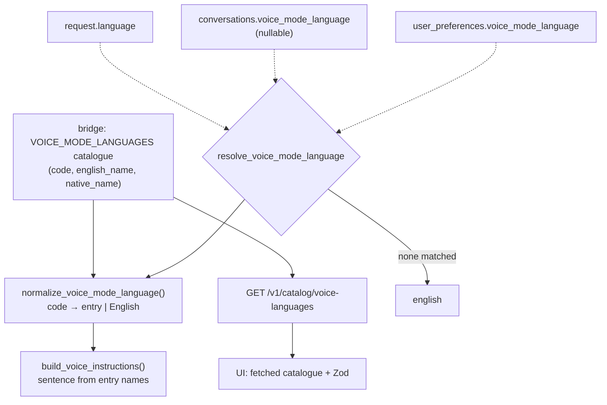

# Dynamic voice language, per conversation

> **Status:** **Delivered** — the four hard-coded lists are gone: the bridge owns an 18-language catalogue (`supported_voice_mode_languages`) behind one instruction template, and the session detects the language the user actually speaks and follows it mid-conversation, with the stored preference acting as the opening language only. The TODO item was closed on 2026-08-29. **Not built:** the per-conversation column and its resolution chain — the language remains a single user-wide preference, which the user judged sufficient.
> **TODO source:** Bugs / Fixes → "Voice mode language is a hard-coded english/greek allow-list (`VOICE_MODE_LANGUAGES` in `consts.ts` + the `normalize_voice_mode_language` set and `build_voice_instructions` map in `dialogue_bridge/utils/voice.py`) and only a single user-wide preference — make it dynamic (the model speaks the full realtime/Whisper language set; the language is just injected as an instruction, so no API limit) and wire it per-conversation so each conversation can carry its own spoken language, not one global default."
> **Depends on:** nothing
> **Blocks:** nothing
> **Services touched:** dialogue_bridge · agentic_ui · agents *(phase 4 only)*
> **Related:** [14-profile-panel-completion.md](../14-profile-panel-completion.md) *(the VoiceTab picker lives in the same settings panel; General → UI language is a separate stub)* · [03-projects-and-workspaces.md](../03-projects-and-workspaces.md) *(a workspace tier would sit between user preference and conversation in the same resolution chain)*

Voice mode can speak two languages today, and the reason is not a platform limit — it is four hard-coded lists that must be edited in lockstep. The realtime model itself has no such restriction: the language never reaches OpenAI as a parameter, only as one English sentence inside the instructions string (`"Use Greek as the default language for this live voice conversation."`). Adding Japanese is, at the level of the model, a string change. At the level of this codebase it is a change in `consts.ts`, in `utils.ts`, in a Python `set`, and in a Python `dict` whose subscript will `KeyError` if you forget it.

This plan replaces those four lists with one bridge-owned catalogue that the frontend fetches, so "dynamic" means *one edit in one place* rather than *the user can type anything* — the instruction is still assembled from curated display names, never from the client's string, which is what keeps prompt injection off the table. It then makes the choice **per conversation**: a nullable column on `conversations` that falls back to the user preference when unset, so every existing conversation inherits today's global default with no backfill and no visible change.

---

## 1. Goal & non-goals

**Goals.** A single authoritative language catalogue on the bridge — BCP-47 code, English name, native name — served to the UI so the frontend stops carrying a duplicate. Instruction assembly that derives its sentence from the catalogue entry instead of a per-language dict, so adding a language cannot crash. Fail-closed validation at every boundary, defaulting to English, with the client's string used only to *select* a catalogue entry and never interpolated into the prompt. A nullable `conversations.voice_mode_language` that means "inherit the user preference" when NULL. An endpoint to set it, and a language picker **in the live voice bar** where the user actually is when they notice the language is wrong — not only buried in settings. The settings picker stays, re-labelled as the default for new conversations.

**Non-goals.** Full UI localisation — this changes the language the *agent speaks*, not the language of the interface (that is the General → UI language stub owned by [14-profile-panel-completion.md](../14-profile-panel-completion.md)). Auto-detecting the spoken language from the user's audio; the model already handles a mid-conversation switch on its own (`utils/voice.py:69` tells it to). Per-message language. Translating conversation history. Text-mode (non-voice) response language. A user-authored language catalogue — the list is curated code, not user data.

---

## 2. Current state

### The allow-list is four lists in three files

**Frontend catalogue** — [`shared/lib/consts.ts:89-96`](../../../src/agentic_ui/src/shared/lib/consts/index.ts):

```ts
export const VOICE_MODE_LANGUAGES = [
  { id: "english", label: "English", native: "English" },
  { id: "greek", label: "Greek", native: "Ελληνικά" },
] as const;

export type VoiceModeLanguage = (typeof VOICE_MODE_LANGUAGES)[number]["id"];

export const DEFAULT_VOICE_MODE_LANGUAGE: VoiceModeLanguage = "english";
```

Note the ids are English **language names**, not BCP-47 codes — `"english"`, not `"en"`. That is the wire format today (it is what lands in `user_preferences.voice_mode_language`), so any move to codes is a data-format change, not just a rename.

**Frontend normalizer** — `shared/lib/utils.ts:71-76`, `normalizeVoiceModeLanguage`, lower/trim then membership-test against the const, falling back to `DEFAULT_VOICE_MODE_LANGUAGE`. Same fail-closed shape as `normalizeRealtimeVoice` (`:64-69`).

**Bridge normalizer** — [`utils/voice.py:25-27`](../../../src/dialogue_bridge/utils/voice.py):

```python
def normalize_voice_mode_language(language: str | None) -> str:
    selected = (language or "english").strip().lower()
    return selected if selected in {"english", "greek"} else "english"
```

**Bridge instruction map** — `utils/voice.py:60-63`, inside `build_voice_instructions` (`:54-74`):

```python
language_instruction = {
    "english": "Use English as the default language for this live voice conversation.",
    "greek": "Use Greek as the default language for this live voice conversation.",
}[normalize_voice_mode_language(language)]
```

This is the fragile one. It is a **dict subscript**, not a `.get()`. It is safe only because the normalizer guarantees a key — so widening the `set` at `:27` without also widening the dict at `:60` turns every session in the new language into a `KeyError` and a 500. The two lists are eight lines apart and have no test binding them together.

**Voices, by contrast, are already env-tunable.** `VoiceSettings` ([`core/settings.py:463-485`](../../../src/dialogue_bridge/core/settings.py)) exposes `realtime_model` (`:466`, default `"gpt-realtime"`), `default_realtime_voice` (`:467`), and `supported_realtime_voices` as a `frozenset` parsed from CSV (`:468-471`, `_parse_voices` at `:479-485`). **There is no language counterpart** — no `supported_voice_mode_languages`, no `default_voice_mode_language`. Language is the one voice setting that is hard-coded in a util.

### Validation is weaker than it looks

`RealtimeVoiceSessionIn` (`schemas/__init__.py:706-712`) declares `language: Optional[str] = None` — no `Literal`, no `Field` constraint, no `max_length`, no validator. `UserPreferences.voiceModeLanguage` (`:344-348`) is likewise a plain `str = Field(default="english")`; the only validator in the whole model is `_normalize_personality` (`:350-357`). **All enforcement is the one-line `set` membership test in `utils/voice.py:27`.**

That is currently sufficient — an arbitrary string falls through to `"english"` and is never interpolated anywhere. It stops being sufficient the moment someone "makes it dynamic" by passing the raw string into the instruction template, which is the obvious wrong implementation of this TODO and the reason § 3 is explicit about the selection-not-interpolation rule.

`RealtimeVoiceSessionOut` (`:715-719`) is `sdp`, `model`, `voice` — **no language**. The client cannot learn what the server actually resolved, and the Zod transform confirms it (`shared/lib/schemas.ts:202-210` returns `{ sdp, model, voice }`).

### Resolution is user-wide, once, at session start

`preferred_voice_mode_language(db, user_id, requested_language)` (`utils/voice.py:85-90`): requested value wins if truthy, else `UserPreferencesTable.voice_mode_language`, else `"english"`. The column is `models.py:134` — `Column(String, nullable=False, server_default="english")`, created in `0001_baseline.py:109`.

The session route ([`router/voice.py:41-83`](../../../src/dialogue_bridge/router/voice.py)) resolves it at `:64`, bakes it into instructions at `:70`, and includes it in `metadata` at `:75` — and `metadata` is where it dies: `create_realtime_session_with_agents` (`utils/voice.py:93-160`) forwards `{sdp, model, voice, instructions, metadata}` to the agents service, and `agents/router/voice.py:134-201` reads only `req.instructions` (`:148`). The agents service **never sees a language field at all**; `audio.input.transcription` (`:152`) is configured with a model and no language hint.

**`ConversationTable` (`models.py:140-184`) has no language column** — nothing in the schema is per-conversation. And the frontend makes it worse: `useRealtimeVoiceSession.start()` sends `{agentId, sdp, voice, language}` at `:139-144` and **does not send `conversationId`**, even though both `RealtimeVoiceSessionRequest` (`types.ts:223`) and `RealtimeVoiceSessionIn` (`:709`) support it. So today the bridge resolves `conversation = None` and `build_voice_instructions` runs with no recent history either. Sending `conversationId` is a prerequisite of this plan, and fixes the missing-history side effect for free.

### The frontend surfaces

**Settings picker** — [`VoiceTab.tsx:209-299`](../../../src/agentic_ui/src/features/settings/components/profile_parts/VoiceTab.tsx). Not a `Select`: it reuses the `VoiceSelector` ai-element (a Radix `Dialog` + `cmdk` `Command`) as a trigger button plus a **searchable command dialog** — trigger at `:225-246` showing `selectedLanguage.label` and `.native`, `VoiceSelectorInput placeholder="Search languages..."` at `:251`, items mapped at `:255-293` with a `value` interpolating both the label and the native name so search matches either. The inline comment at `:217-219` says this was deliberate: *"a trigger showing the current selection + a searchable command dialog, rather than a plain dropdown."* **This control was built for a long list and is currently showing two items** — it needs no redesign, only more data.

**Handler** — `features/settings/handlers/preferences.ts:174-178`, a no-op guard then `persistPrefs(snapshotPrefs({ voiceModeLanguage: nextLanguage }), …)`. The load-bearing comment at `:78-80`: *"The PUT endpoint is a FULL replacement: every save must carry every field."* `PUT /v1/preferences/{userId}` (`router/preferences.py:49-117`) confirms it — `voice_mode_language` is touched at `:64`, `:77`, `:90`, `:105`, `:116`, and read at `:43`. Six bridge-side touch points per preference field.

**Live voice bar** — the voice bar is a *mode* of `ChatInputBar.tsx`, not its own file: the `mode === "voice"` branch at `:565-658`, whose control row (`:576`) holds exactly four things — end (`:577-596`, `PhoneOff`), mute (`:598-617`), a textarea for typing into the live session (`:619-637`), and send (`:639-653`). **No voice picker and no language picker exist there.** `VoiceModeBody.tsx` (the orb) is purely presentational (`:6-11`). A language control inserted at `:576` displaces nothing.

**Mid-session switching is blocked.** `useRealtimeVoiceSession.start()` guards on `status !== "closed"` (`:86`), and the hook's returned surface (`:204-214`) has no `language` state and no setter. It *can* send raw frames over the `"oai-events"` data channel — `interrupt()` at `:177-182` sends `response.cancel`, `sendText()` at `:184-200` sends items — so a `session.update` path exists in principle but is unused. `docs/flows/voice-mode.md:312` records the current behaviour as a sharp edge: *"Voice preference is resolved once at session start."*

### Migration chain

Linear, head confirmed: `0016_retire_enabled_tools` (`down_revision = "0015_personalization"`, and nothing references `0016` as a predecessor). **Revision ids do not match filenames for 0011, 0012, and 0015** — cite the id string. No migration has ever added a column to `conversations`; `0013_attachment_origin.py:47-48` is the nearest plain-nullable-column precedent, and `0015_personalization_prefs.py` is the docstring style reference.

---

## 3. Target design

Three moves, in order: **one catalogue**, **template-derived instructions**, **per-conversation override**.



### One catalogue, on the bridge

A module-level tuple in `utils/voice.py` (data, not config — it does not belong in `core/settings.py`, which holds env-driven values):

```python
VOICE_MODE_LANGUAGES: tuple[VoiceModeLanguageEntry, ...] = (
    VoiceModeLanguageEntry(code="en", english_name="English", native_name="English"),
    VoiceModeLanguageEntry(code="el", english_name="Greek", native_name="Ελληνικά"),
    ...
)
```

Scoped to roughly the languages the realtime and Whisper models handle credibly — on the order of 50, not 7000. The bridge serves it on the existing catalog router (`GET /v1/catalog/voice-languages`, alongside `/agents` at `router/catalog.py:24` and `/tools` at `:39`), and the frontend fetches it instead of hard-coding it. That collapses four lists into one and makes "add a language" a single-file change with no lockstep edit and no `KeyError` risk.

**Codes become BCP-47.** The stored value moves from `"english"`/`"greek"` to `"en"`/`"el"`, because a code is what a transcription hint needs (phase 4) and because language *names* are not stable identifiers. Migration handles the two existing values; `normalize_voice_mode_language` accepts both forms during the transition by matching a legacy-name alias on each entry, so a preference row written before the migration still resolves.

### The instruction is assembled, never interpolated

`build_voice_instructions` stops indexing a dict and starts formatting from the resolved entry:

```python
entry = resolve_language_entry(language)  # always returns an entry; English on no match
language_instruction = (
    f"Use {entry.english_name} ({entry.native_name}) as the default language "
    "for this live voice conversation."
)
```

**This is the security property, and it is the whole answer to "how is dynamic bounded".** The client's string is only ever a *lookup key*. It selects a curated entry or it selects nothing (→ English). No client-controlled text reaches the model instruction, so widening the catalogue from 2 to 50 languages does not widen the injection surface by one byte. Defence in depth on top of that: `RealtimeVoiceSessionIn.language` gains `Field(None, max_length=16, pattern=r"^[a-zA-Z-]{2,16}$")` and `UserPreferences.voiceModeLanguage` gains a `field_validator` mirroring `_normalize_personality` (`:350-357`), so a malformed value is rejected or normalised at the schema boundary rather than relying solely on the util.

### Per-conversation, inheriting by NULL

`conversations.voice_mode_language`, `String`, **nullable**, no server default. `NULL` means *inherit the user preference* — which is precisely why there is no backfill and why every existing conversation keeps behaving exactly as it does today. Resolution becomes:

| Order | Source | Meaning |
| --- | --- | --- |
| 1 | `RealtimeVoiceSessionIn.language` | explicit one-off for this session |
| 2 | `conversations.voice_mode_language` | this conversation's language, if set |
| 3 | `user_preferences.voice_mode_language` | the user's default for new conversations |
| 4 | `"en"` | fail-closed |

`preferred_voice_mode_language(db, user_id, requested)` is replaced by `resolve_voice_mode_language(db, user_id, conversation, requested)` — same fail-closed shape, one more link in the chain. The settings picker's label changes from "Spoken language" to make its scope honest ("Default spoken language — new conversations"); the per-conversation value is set from the voice bar.

### Where the user picks it

The voice bar's control row (`ChatInputBar.tsx:576`) gets a fifth control: a `Languages`-icon button opening the same `VoiceSelector` command dialog the settings tab already uses — built for search, now with something to search. Choosing a language does two things: persists the per-conversation value, and applies it to the *live* session. Applying it live means a `session.update` frame over the `"oai-events"` data channel carrying rebuilt instructions (the hook already sends raw frames at `:188-196`), because the alternative — `close()` then `start()` — drops the WebRTC connection, re-prompts for the microphone, and burns one of the 15-per-minute session budget slots. Phase 3 ships `session.update`; § 12 records the fallback.

The resolved language is echoed back on `RealtimeVoiceSessionOut` so the picker can display what the server actually chose rather than what the client hoped for.

---

## 4. Data model & migrations

| Table | Column | Type | Null | Default | Purpose |
| --- | --- | --- | --- | --- | --- |
| `conversations` | `voice_mode_language` | `String` | **yes** | — | BCP-47 code for this conversation's spoken language. `NULL` = inherit `user_preferences.voice_mode_language`. |

No index: it is read on the session-create path by primary key and never filtered or ordered on.

**Alembic slot:** `0017_conversation_voice_language`, `down_revision = "0016_retire_enabled_tools"`.

The same migration converts the existing preference values to codes, which is the one piece of data mutation here and must be in the same revision as the schema change (per the CLAUDE.md rule that backfills ship atomically with their DDL):

```python
op.add_column("conversations", sa.Column("voice_mode_language", sa.String(), nullable=True))
op.execute("UPDATE user_preferences SET voice_mode_language = 'en' WHERE voice_mode_language = 'english'")
op.execute("UPDATE user_preferences SET voice_mode_language = 'el' WHERE voice_mode_language = 'greek'")
op.execute("UPDATE user_preferences SET voice_mode_language = 'en' WHERE voice_mode_language NOT IN ('en','el')")
```

The third statement normalises anything unexpected rather than leaving a value that only resolves correctly by falling through the normalizer — the column is `nullable=False` with `server_default="english"` (`models.py:134`, from `0001_baseline.py:109`), so it always holds *something*. `downgrade()` reverses the mapping and drops the new column. **This is not destructive** — no user content is touched — but it does rewrite a preferences column, so the docstring must say so in the `0015`/`0016` verdict-line style.

> **Revision-number collision.** [16-context-usage-ui.md](../16-context-usage-ui.md) also claims `0017`. Whichever plan lands second renumbers and re-points `down_revision`; if both land in parallel branches, `alembic merge` per the CLAUDE.md workflow.

---

## 5. API surface

| Method + path | Purpose | Deps | Response |
| --- | --- | --- | --- |
| `GET /v1/catalog/voice-languages` | serve the catalogue to the UI | `validate_userId`-free (it is static reference data, same trust level as `/tools`) | `list[VoiceLanguage]` — `{code, englishName, nativeName}` |
| `PATCH /v1/conversations/{user_id}/{conversation_id}/voice-language` | set / clear this conversation's language | `validate_userId` + `validate_convId` + `require_csrf_protection` | `UpdateConversationResponse`-style `ConversationSummary` |

**No per-route rate limiter on the PATCH.** The precedent is exact: `renameConversation` (`router/conversations.py:421-442`) and the archive/unarchive routes (`:445-463`, `:466+`) carry `require_csrf_protection` plus the two validators and **no** limiter, relying on the global per-identity budget (`rate_limit.py:38-41`). A language write is one `UPDATE` with no paid upstream call, so it belongs in that class — unlike session creation, which takes `voice_session_rate_limit` (15 per 60s per user, `rate_limit.py:115-120` / `settings.py:541-542`) precisely because it opens a paid OpenAI Realtime session. Keep `{user_id}` in the path so `user_path_identity` (`rate_limit.py:78-81`) keys the global budget correctly.

Request body: `{ "language": string | null }` — `null` clears the override back to inheritance, which is a first-class state and not an error.

Schema changes:

| Contract | Change | File |
| --- | --- | --- |
| `RealtimeVoiceSessionIn.language` | `Field(None, max_length=16, pattern=…)` | `schemas/__init__.py:712` |
| `RealtimeVoiceSessionOut` | `+ language: str` (the resolved code) | `schemas/__init__.py:715-719` |
| `UserPreferences.voiceModeLanguage` | `+ field_validator` fail-closed to `"en"` | `schemas/__init__.py:344-348` |
| `ConversationSummary` / conversation DTOs | `+ voiceModeLanguage: Optional[str]` | `schemas/__init__.py` |
| **new** `VoiceLanguage` | `{code, englishName, nativeName}` | `schemas/__init__.py` |
| **new** `ConversationVoiceLanguageIn` | `{language: Optional[str]}` | `schemas/__init__.py` |

---

## 6. Frontend surface

| Concern | Where | Change |
| --- | --- | --- |
| Catalogue | `shared/lib/consts.ts:89-96` | **delete** `VOICE_MODE_LANGUAGES`; keep `DEFAULT_VOICE_MODE_LANGUAGE = "en"` as the fail-closed constant. `VoiceModeLanguage` widens from a literal union to `string` (a fetched catalogue cannot be a compile-time union) — call this out in review, it is the one type-safety regression in the plan and it is unavoidable. |
| Contract | `shared/lib/schemas.ts` | `VoiceLanguageSchema` + list schema (the file currently has **no** preferences schema at all — preferences are hand-mapped in `api.ts:454-484`; the new catalogue endpoint should be Zod-validated like the other fetches) |
| API | `shared/lib/api.ts` | `getVoiceLanguages()`; `setConversationVoiceLanguage(userId, conversationId, language)` with `csrf: true`; `createRealtimeVoiceSession` body gains `conversationId` |
| Normalizer | `shared/lib/utils.ts:71-76` | `normalizeVoiceModeLanguage(value, catalogue)` — membership test against the fetched list, fail-closed to `"en"` |
| Types | `shared/lib/types.ts` | `VoiceLanguage`; `voiceModeLanguage?: string \| null` on the conversation type; `RealtimeVoiceSessionResponse` gains `language` |
| Settings picker | `features/settings/.../VoiceTab.tsx:209-299` | feed from the fetched catalogue; relabel to "Default spoken language" and adjust the helper at `:213-215` to say it applies to new conversations |
| Voice bar picker | `features/chat/components/ChatInputBar.tsx:576` | new `Languages`-icon trigger + `VoiceSelector` dialog; new props `voiceLanguage`, `voiceLanguages`, `onSelectVoiceLanguage`, wired from `pages/ChatView.tsx:141-185` |
| Session hook | `features/voice/hooks/useRealtimeVoiceSession.ts` | send `conversationId` at `:139-144`; hold the resolved `language` in state; add `setLanguage()` that sends a `session.update` frame; expose both on the returned surface (`:204-214`) |
| Shell wiring | `features/voice/hooks/useChatVoiceMode.ts:35-40`, `pages/ChatPage.tsx:546-552` | pass the conversation's language (falling back to the preference) instead of only `resolvedPreferences.voiceModeLanguage` |

UI rules: the trigger is icon-only in the voice bar, so it needs an `aria-label` (e.g. `"Spoken language"`) and a 44×44px target; the current language should be visible without opening the dialog on wider viewports (the code, or a short label) so the state is not hidden behind a click; the `cmdk` dialog already handles keyboard navigation and search, and searching must match both the English and native name as `VoiceTab.tsx:259` already does.

---

## 7. Cross-cutting impact

**dialogue_bridge.** Six touch points for the preference field (`preferences.py:43`, `:64`, `:77`, `:90`, `:105`, `:116`) plus the resolution helper, the catalogue, the instruction builder, the new PATCH route, and the conversation DTOs. `router/voice.py:58` already loads the conversation when `conversationId` is present, so the per-conversation read costs no extra query.

**agentic_ui.** One deleted const, one new fetch, one widened type, two pickers.

**agents.** Nothing in phases 1–3 — the service only ever sees the pre-baked `instructions` string (`agents/router/voice.py:148`). Phase 4 optionally adds `language` to `RealtimeSessionRequest` so `audio.input.transcription` (`:152`) can carry a hint.

**Trust boundary.** Unchanged. The catalogue endpoint is static reference data on the same footing as `/v1/catalog/tools`; the PATCH is an owned-resource mutation behind CSRF and `validate_convId`.

**Docs.** `voice-mode.md` needs real surgery, not a line edit — its `### Languages` section (`:296-298`), its duplicate statement at `:194`, the mermaid payload node at `:149-150`, and the "resolved once at session start" sharp edge at `:312` all become wrong. Its File Map (`:322-339`) is *already* stale (it points at `src/agents/main.py` and the pre-refactor `src/agentic_ui/src/hooks/` and `src/lib/` paths, and misattributes the normalizers to `api.ts`); fix it in the same pass.

**Plan interactions.** [14-profile-panel-completion.md](../14-profile-panel-completion.md) owns the General → **UI** language stub, which is a different axis — worth cross-linking in the settings copy so the two are not confused. [03-projects-and-workspaces.md](../03-projects-and-workspaces.md) would insert a workspace tier into § 3's resolution chain between preference and conversation; the chain is deliberately written as an ordered fallback so that insertion is additive.

---

## 8. Phased execution

### Phase 1 — One catalogue, safe instructions, more languages

Bridge catalogue + `resolve_language_entry` + template-derived instruction + BCP-47 codes + schema validators + `GET /v1/catalog/voice-languages`. Frontend deletes its const and fetches. Migration `0017` (the preference-value conversion half). Settings picker widens. **No per-conversation behaviour yet** — this phase alone closes the "hard-coded allow-list" half of the TODO.

**Acceptance:** the catalogue has ≥40 entries and adding one is a single-file edit; a session started with a newly added language produces the correct instruction sentence and **cannot** `KeyError`; `language="'; DROP"` / `"<script>"` / a 10KB string are all rejected at the schema boundary or resolve to English, and in no case does any part of the submitted string appear in the instructions sent upstream; existing users' `"english"`/`"greek"` rows resolve correctly after migration; the settings dialog's search matches both English and native names.

### Phase 2 — Per-conversation storage and resolution

`conversations.voice_mode_language` (the column half of `0017`); `resolve_voice_mode_language` with the four-step chain; `PATCH …/voice-language`; `voiceModeLanguage` on the conversation DTOs; `language` echoed on `RealtimeVoiceSessionOut`; **`conversationId` sent from `useRealtimeVoiceSession.start()`**.

**Acceptance:** two conversations for the same user can hold different languages simultaneously; a conversation with `NULL` uses the preference, and changing the preference changes it; setting `{"language": null}` restores inheritance; a `PATCH` for another user's conversation returns 404/403 via `validate_convId` and never leaks its existence; the session response reports the resolved code; recent-history context now appears in the instructions (the side-effect fix from sending `conversationId`).

### Phase 3 — The picker where it matters

Voice-bar language control; `setLanguage()` on the hook sending `session.update` with rebuilt instructions; persistence of the per-conversation value on selection.

**Acceptance:** switching language mid-session changes the spoken language **without** dropping the WebRTC connection, re-prompting for the microphone, or consuming a `voice_session_rate_limit` slot; the choice survives ending and restarting voice mode in the same conversation; the control is keyboard-reachable, labelled, and 44×44px on mobile; the trigger reflects the server-resolved language, not the optimistic one, once the response lands.

### Phase 4 — Transcription hint (optional)

`language` on `RealtimeSessionRequest`, forwarded to `audio.input.transcription` in `agents/router/voice.py:145-156`.

**Acceptance:** transcription accuracy is not *worse* than the no-hint baseline for English; the field is omitted (not empty-string) when unresolved; the agents service still starts and works if the bridge sends no `language` (backward-compatible field).

---

## 9. Security & privacy

**The injection question, answered structurally.** "Dynamic" here does not mean "the client supplies a language string that we put in a prompt." The client supplies a **lookup key**; `resolve_language_entry` maps it to a curated entry or to English; the instruction sentence is formatted from that entry's `english_name` and `native_name`, both of which are constants in our source. There is therefore no path from request body to model instruction, and the catalogue can grow to any size without changing the threat model. Any future refactor that formats the *raw* input into the instruction — even "just for unknown languages" — reintroduces prompt injection into a string that also carries the agent's identity and the last eight conversation turns, and must be rejected in review.

**Validation is layered and fail-closed.** Schema `pattern` + `max_length` at the boundary (currently absent — `schemas/__init__.py:712` is a bare `Optional[str]`), a `field_validator` on the preference, and the resolver's own membership test. Three layers, each independently sufficient, each defaulting to English. A `.get()`-shaped resolver replaces the dict subscript at `utils/voice.py:60-63`, so a catalogue/instruction mismatch degrades to English instead of a 500.

**Authorization.** The PATCH goes through `validate_userId` + `validate_convId`, the same pair the rename and archive routes use, so a conversation id belonging to another user is not writable and not distinguishable from a nonexistent one. CSRF is required, matching every other state-mutating route. The catalogue GET returns no user data.

**No new secrets, no new logging risk.** A language code is not PII in any meaningful sense and `router/voice.py:78` already logs `voice_mode_language`; the code form is equally safe. Transcript persistence (`router/voice.py:86-136`) is untouched — this plan does not change what audio or text is stored.

**Rate limiting.** Deliberately *not* adding a per-route limiter to the PATCH (§ 5 explains the precedent) — but note the corollary: the phase-3 mid-session `session.update` path must not be implemented as close+start, because that *would* consume the paid-session limiter and give a user a way to burn their own 15/minute budget by toggling a dropdown.

---

## 10. Testing strategy

**Bridge (pytest, in-image).** The existing suite already pins the current behaviour and will need updating: `tests/dialogue_bridge/test_voice_speech_more.py:107-113` asserts `normalize_voice_mode_language("Greek") == "greek"` and `("french") == "english"`, and `tests/dialogue_bridge/test_voice.py:44` asserts `metadata["voice_mode_language"] == "greek"`. Rewrite to codes and add: every catalogue entry produces a non-empty instruction and none raises (the parametrised test that makes the old `KeyError` class impossible); a property-style test that no submitted string appears in the built instruction; the four-step resolution chain in all four states including `NULL` inheritance; a cross-user PATCH is rejected; `{"language": null}` clears.

**Migration.** Apply `0017` against a DB seeded with `"english"`, `"greek"`, and a junk value; assert `en`, `el`, `en`. Assert `downgrade()` restores the names and drops the column. `alembic check` clean afterwards (model and migration in the same commit).

**Frontend (`tsc` in-image).** `normalizeVoiceModeLanguage` against a fetched catalogue: known code, unknown code, empty, non-string. A test that the voice-bar picker's optimistic value is replaced by the server-resolved one.

**Manual, in the Docker stack at :8050.** Set conversation A to Greek and B to Japanese, confirm each speaks correctly and neither leaks into the other. Switch language mid-session and confirm no microphone re-prompt. Confirm an untouched pre-existing conversation still speaks the preference language. Keyboard-only through the voice bar. 375px width.

---

## 11. Docs to update

| Doc | Change |
| --- | --- |
| [`docs/flows/voice-mode.md`](../../flows/voice-mode.md) | **primary.** Rewrite `### Languages` (`:296-298`) and the duplicate at `:194` around the catalogue + resolution chain; update the mermaid payload node (`:149-150`) and the `### Voice Instructions` list (`:183`); replace the "resolved once at session start" sharp edge (`:312`) with the `session.update` behaviour; extend the normalization sharp edge (`:318`) to language; **fix the stale File Map** (`:322-339` — `src/agents/router/voice.py` not `main.py`, `features/voice/hooks/`, `shared/lib/`, normalizers in `utils.ts` not `api.ts`) |
| [`docs/flows/user-preferences.md`](../../flows/user-preferences.md) | `:80` (column row), `:108` (schema field), `:211`, `:245`, `:265` (the `"english"`/`"greek"` resolution walkthrough), `:319`, `:325` — and state that the preference is now the *default for new conversations*, not the effective value |
| [`docs/flows/conversation-management.md`](../../flows/conversation-management.md) | the new PATCH route alongside rename/archive |
| [`docs/architecture/database-schema.md`](../../architecture/database-schema.md) | `conversations.voice_mode_language` in the ER diagram and column table; update `:235` for the code format |
| [`docs/flows/catalog.md`](../../flows/catalog.md) | the new `voice-languages` catalogue endpoint |
| [`docs/development/dialogue-bridge-reference.md`](../../development/dialogue-bridge-reference.md) | `:162`'s preferences-table summary mentions `voice_mode_voice`/`_language` — note the new conversation-level tier |
| `docs/plans/README.md` | flip status when phases land |

---

## 12. Risks & open decisions

**Open decision — BCP-47 codes, or keep the English names?** § 3 chooses codes, which costs a data migration on a preferences column. Keeping `"english"`/`"greek"`-style names avoids the migration entirely and is strictly less work — but names are not identifiers (there is no single right name for several languages), and phase 4's transcription hint wants a code. Recommendation: migrate now, while there are two values and a single-digit number of affected rows, rather than after the catalogue has 50 entries in the wild.

**Risk — the literal-union type is lost.** `VoiceModeLanguage` is currently `"english" | "greek"`, derived from an `as const` array. A fetched catalogue cannot produce a compile-time union, so it becomes `string`, and the compiler stops catching a typo'd language id. Mitigation: the runtime normalizer is the guard (it already is, for the same reason the *backend* normalizer exists), and it must be applied at every read site — which the existing code already does consistently (`api.ts:471`, `VoiceTab.tsx:55`, `preferences.ts:75`). The alternative — a build-time generated union from a checked-in JSON catalogue — keeps type safety but reintroduces the duplication this plan exists to remove.

**Open decision — how big should the catalogue be?** "The full realtime/Whisper language set" is ~99 languages for Whisper, with wildly uneven quality, and the realtime model's spoken coverage is narrower than its transcription coverage. A 99-entry list makes the picker a haystack and quietly promises quality we cannot deliver in the tail. Recommendation: ~40-50 well-supported languages, ordered by likely use, and revisit rather than aim for completeness on day one. This is a product call, not an engineering one.

**Risk — `session.update` may not do what we want.** Phase 3 assumes an in-session instructions update takes effect on subsequent turns. If the realtime API ignores or partially applies it, the fallback is `close()` + `start()`, which costs a microphone re-prompt, a reconnect, and one `voice_session_rate_limit` slot — and would need the `status !== "closed"` guard at `useRealtimeVoiceSession.ts:86` relaxed to allow a deliberate restart. Verify with a spike before committing phase 3's acceptance criteria; if it fails, the honest fallback is to make the voice-bar picker set the *conversation* value and tell the user it applies from the next session, which is still a large improvement over settings-only.

**Risk — the two-tier picker confuses people.** Settings holds a default; the voice bar holds a per-conversation override. Users who change the setting mid-conversation and hear no change will read it as a bug. Mitigation: the settings helper text must say "new conversations", and the voice bar is the only control that changes the current one. Consider showing the effective language in the voice bar even when the override is unset.

**Risk — the four-list drift is replaced by a two-place drift.** The catalogue lives on the bridge and the frontend fetches it, which is one source of truth — *unless* someone re-adds a local fallback list "for offline" or "for the loading state". The loading state should render the picker disabled, not a hard-coded stub.

**Risk — instruction language and transcription language diverge.** Until phase 4, the model is *told* to speak Greek while the transcription model runs with no hint. Recognition of the user's Greek may be worse than the agent's Greek output, which reads as a broken feature even though the instruction half works. Worth knowing before someone files it as a phase-2 regression.

---

## 13. File map

| Concept | File | What to look for |
| --- | --- | --- |
| Frontend catalogue (to delete) | [src/agentic_ui/src/shared/lib/consts/index.ts](../../../src/agentic_ui/src/shared/lib/consts/index.ts) | `VOICE_MODE_LANGUAGES` `:89-92`, `VoiceModeLanguage` `:94`, `DEFAULT_VOICE_MODE_LANGUAGE` `:96` |
| Frontend normalizer | [src/agentic_ui/src/shared/lib/utils.ts](../../../src/agentic_ui/src/shared/lib/utils.ts) | `normalizeVoiceModeLanguage` `:71-76`, `normalizeRealtimeVoice` `:64-69` |
| Preferences mapping | [src/agentic_ui/src/shared/lib/api/index.ts](../../../src/agentic_ui/src/shared/lib/api/index.ts) | `mapUserPreferences` `:454-484` (`:471`), `updateUserPreferences` `:505-514`, `createRealtimeVoiceSession` `:1044-1055` |
| Session response schema | [src/agentic_ui/src/shared/lib/schemas.ts](../../../src/agentic_ui/src/shared/lib/schemas.ts) | `RealtimeVoiceSessionResponseSchema` `:202-210` (no `language`) |
| Settings picker | [src/agentic_ui/src/features/settings/components/profile_parts/VoiceTab.tsx](../../../src/agentic_ui/src/features/settings/components/profile_parts/VoiceTab.tsx) | language row `:209-299`, design comment `:217-219`, item mapping `:255-293` |
| Picker primitive | [src/agentic_ui/src/shared/ui/ai-elements/voice-selector.tsx](../../../src/agentic_ui/src/shared/ui/ai-elements/voice-selector.tsx) | `VoiceSelector` `:59-93`, `Item` `:158` |
| Preferences handler | [src/agentic_ui/src/features/settings/handlers/preferences.ts](../../../src/agentic_ui/src/features/settings/handlers/preferences.ts) | full-replacement comment `:78-80`, `snapshotPrefs` `:81-92`, handler `:174-178` |
| Voice bar (picker home) | [src/agentic_ui/src/features/chat/components/ChatInputBar.tsx](../../../src/agentic_ui/src/features/chat/components/ChatInputBar.tsx) | voice branch `:565-658`, control row `:576`, end `:577-596`, mute `:598-617` |
| Session hook | [src/agentic_ui/src/features/voice/hooks/useRealtimeVoiceSession.ts](../../../src/agentic_ui/src/features/voice/hooks/useRealtimeVoiceSession.ts) | restart guard `:86`, `start()` payload `:139-144` (**no `conversationId`**), raw frames `:188-196`, surface `:204-214` |
| Shell wiring | [src/agentic_ui/src/app/useChatWorkspace.tsx](../../../src/agentic_ui/src/app/useChatWorkspace.tsx) | `useChatVoiceMode` args `:546-552`, settings handlers `:1661-1662` |
| Bridge catalogue + instructions | [src/dialogue_bridge/utils/voice.py](../../../src/dialogue_bridge/utils/voice.py) | `normalize_voice_mode_language` `:25-27`, `build_voice_instructions` `:54-74` (**dict subscript `:60-63`**), `preferred_voice_mode_language` `:85-90` |
| Session route | [src/dialogue_bridge/router/voice.py](../../../src/dialogue_bridge/router/voice.py) | limiter `:47`, conversation load `:58`, language resolve `:64`, instructions `:70`, metadata `:75` |
| Preferences routes | [src/dialogue_bridge/router/preferences.py](../../../src/dialogue_bridge/router/preferences.py) | GET `:16-46` (`:43`), PUT `:49-117` (`:64`, `:77`, `:90`, `:105`, `:116`) |
| Conversation PATCH precedent | [src/dialogue_bridge/router/conversations.py](../../../src/dialogue_bridge/router/conversations.py) | `renameConversation` `:421-442` (CSRF, no limiter) |
| Schemas | [`src/dialogue_bridge/schema/__init__.py`](../../../src/dialogue_bridge/schema/__init__.py) | `UserPreferences` `:305-348` (`:344-348`), `_normalize_personality` `:350-357`, `RealtimeVoiceSessionIn` `:706-712`, `Out` `:715-719` |
| Columns | [src/dialogue_bridge/core/database/models.py](../../../src/dialogue_bridge/core/database/models.py) | `voice_mode_language` `:134`, `UserPreferencesTable` `:108-137`, `ConversationTable` `:140-184` |
| Voice settings | [src/dialogue_bridge/core/settings.py](../../../src/dialogue_bridge/core/settings.py) | `VoiceSettings` `:463-485`, session limiter values `:541-542` |
| Rate limiters | [src/dialogue_bridge/core/security/rate_limit.py](../../../src/dialogue_bridge/core/security/rate_limit.py) | `user_path_identity` `:78-81`, `voice_session_rate_limit` `:115-120` |
| Agents realtime endpoint | [src/agents/router/voice.py](../../../src/agents/router/voice.py) | route `:128-133`, session config `:145-156` (instructions passthrough `:148`, transcription `:152`) |
| Migration head | [src/dialogue_bridge/core/database/migrations/versions/0016_retire_enabled_tools.py](../../../src/dialogue_bridge/core/database/migrations/versions/0016_retire_enabled_tools.py) | `revision` `:34`, `down_revision` `:35` |
| Migration style | `…/versions/0015_personalization_prefs.py`, `…/0013_attachment_origin.py` | docstring shape; nullable `add_column` `:47-48` |
| Migration slot | `src/dialogue_bridge/core/database/migrations/versions/0017_conversation_voice_language.py` | *new*; `down_revision = "0016_retire_enabled_tools"` |
| Existing tests to rewrite | `tests/dialogue_bridge/test_voice_speech_more.py`, `tests/dialogue_bridge/test_voice.py` | `:107-113` name assertions; `:44` metadata assertion |
