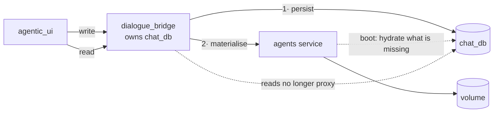

# 21 — Make Postgres the source of truth for user-created content

**Status:** Partially shipped — **Part A** (custom agents, §2) and **Part B** (custom skills,
pool and assignments, §3) are in, behind migration `0019_persist_user_content`. **Part C**
(memory, §4) shipped as a store in `agent_runtime` instead — no mirror, no
tombstones, no reconciliation; see [agent-memory](../../flows/agent-memory.md).
**Touches:** `dialogue_bridge` (new tables, new ownership), `agents` (loses read/CRUD surface, gains a hydrator), `agentic_ui` (unchanged contracts)
**Background:** [state & storage map](../../draft/state-and-storage-map.md) §6–§7

Three object types a user creates — **custom agents**, **custom skills**, and
**agent memory** — exist in exactly one place: the agents-service volume. That
volume has no backup and no mirror, so losing it destroys content no `pg_dump`
can bring back, and it is what pins the agents service to a single replica.

This plan inverts the ownership: **Postgres holds the truth, the volume becomes
a materialised cache rebuilt on boot.** It was scoped as three parts, easiest
first, because each one proves more of the same machinery. Two shipped here; the
third (memory) moved to [plan 22](22-two-way-workspace-sync.md) once it became
clear all three wanted the same reconciliation rather than one each.

---

## 1. The one shape, three times



Four rules that apply to all three parts:

1. **Write order is persist-then-materialise.** Postgres commits first. If the
   agents call then fails, the row exists and the next hydrate fixes the volume —
   the reverse order loses the write.
2. **Reads stop proxying.** The bridge already owns `chat_db`, so a list/detail
   read becomes a query. This is where agents-service code is deleted.
3. **Hydration is idempotent and per-boot**, not a one-time migration. A fresh
   container, a wiped volume and a second replica all take the same path.
4. **The volume stays authoritative *within a run*.** The agent reads its mounted
   files; nothing changes at inference time. We are changing who *owns* the
   bytes, not how the agent reads them.

---

## 2. Part A — custom agents

The easiest, because **the bridge is already in the write path**.

`create_custom_agent` today proxies the definition to the agents service and then
upserts the `agents` row (`utils/user_agents.py:214`). The row exists; it just
holds metadata. We add the definition beside it and flip the read direction.

### 2.1 Schema

```sql
-- One row per file of a user-authored agent definition.
agent_definition_files(
  id, agent_id → agents.id ON DELETE CASCADE,
  path        text NOT NULL,     -- 'agent.yaml', 'AGENT.md', 'subagents/x.md'
  content     text NOT NULL,     -- UTF-8; the extension allowlist has no binary
  updated_at  timestamptz,
  UNIQUE (agent_id, path)
)
```

Text, not bytea: the server-side allowlist is `.md/.txt/.yaml/.yml`, so base64
would be dead weight. Caps (20 files / 256 KiB / 1 MiB) are already enforced at
validation and carry over unchanged.

### 2.2 Flow changes

| Operation | Today | After |
| --- | --- | --- |
| Create | proxy → agents writes volume → upsert row | validate (proxy) → **write rows** → materialise → upsert row |
| Update | proxy → agents rewrites folder | **replace rows** → materialise |
| Delete | proxy → agents removes folder → deactivate row | delete rows (cascade) → materialise removal → deactivate row |
| **List** | proxy to agents | **query `chat_db`** |
| **Detail** | proxy to agents | **query `chat_db`** |
| Validate | proxy to agents | **unchanged** — the spec rules live there |

Validation deliberately stays in the agents service. It is the only component
that knows the model allowlist, the native-tool registry and the reserved slugs;
duplicating it in the bridge would recreate the `REQUIRED_GATES` drift class.

### 2.3 Deleted from the agents service

`GET /agents/users/{u}/custom` and `GET .../custom/{slug}` lose their only
caller. Keep the **write** endpoints — they become the materialiser's API —
and keep validation.

### 2.4 Hydration

On agents-service boot, for each user with definition rows whose volume folder is
missing or stale, write the files. Compare on a content hash so a warm volume is
a no-op. Runs before `refresh_registry()`, same slot the global seeder uses.

---

## 3. Part B — custom skills

Same shape as A, with one extra: **there is no row at all today.** A custom skill
is `SKILL.md` plus any scripts, referenced from `manifest.json`, all on the
volume.

### 3.1 Schema

```sql
user_skills(
  id, user_id → users.id ON DELETE CASCADE,
  name text NOT NULL, description text, category text,
  origin      text NOT NULL DEFAULT 'user',   -- 'user' | 'agent'  (create_skill)
  created_by_agent text NULL,
  created_at  timestamptz,
  UNIQUE (user_id, name)
)

user_skill_files(id, skill_id → user_skills.id ON DELETE CASCADE,
                 path, content, UNIQUE (skill_id, path))
```

The pool's *membership* is a third table, because a pool entry can point at a
**global** skill the user added (no files of its own) as well as a custom one:

```sql
user_skill_pool(user_id, skill_name, type)   -- type: 'global' | 'custom'
user_agent_skills(user_id, agent_slug, skill_name)   -- tier ③ assignment
```

Those two are pure *selections* — small, and the thing a user notices losing
first. They belong to this part rather than a fourth one.

### 3.2 The reads that get deleted

`utils/skills.py` in the bridge is currently proxy-and-cache over the agents
service: `list_user_skills`, `get_user_skill_detail`, `get_user_agent_skills`.
All three become queries.

**The Redis skill caches then largely lose their reason to exist.**
`skills:user:<u>:registry` and `skills:user:<u>:agent:<a>` exist to avoid a
cross-service hop that will no longer happen. Removing them **also fixes the
known `create_skill` staleness bug** — there is no cache to invalidate. Keep
`skills:global` (the catalogue is genuinely remote and rarely changes).

That is a real simplification, not a side effect: one bug and two caches deleted
by making the data local.

---

## 4. Part C — memory (superseded)

**The design in this section was never built.** Memory was folded into
[22 · Two-way workspace sync](22-two-way-workspace-sync.md) and then moved out
of it again; what shipped is a Postgres-backed store in `agent_runtime` with no
volume copy at all — see
[docs/flows/agent-memory.md](../../flows/agent-memory.md) for the built behaviour
and [22 §10](22-two-way-workspace-sync.md) for why the sync shape was dropped. What was here — a bespoke
`/v1/internal/agent-memory/entries` endpoint pair, its own tombstone design, and
a reconciliation pass built only for memory — turned out to be a private copy of
machinery that three object types needed. Plan 22 built that machinery once, so
memory reduces to a table plus a section on payloads that already exist.

Two conclusions from this section did survive, and are carried forward there:

- **The write order inverts for memory.** `/memories/` is the runtime read path,
  so the volume is written first and the database second — the opposite of Parts
  A and B, and not a preference (the agent's next `read_file` must see what it
  just wrote).
- **Reconciliation had to be two-way from the start.** §6 predicted this as a
  consequence of Part C; it landed as plan 22 Phases 2–4, and the orphan bug it
  fixed turned out to affect agents and skills too, not just memory.

One observation worth keeping, because it is easy to trip over and belongs to no
other doc:

> **`/v1/internal/memory/search` is a misnomer.** It performs semantic search
> over the user's past *conversation messages* via `chat_db`'s pgvector index —
> `message_embeddings`, not agent memory. The two share a prefix and nothing
> else. Renaming it to `/v1/internal/conversations/search` is a one-line change
> on both sides with no back-compat concern (internal only), and worth folding
> into the memory work so the two stop being confusable.

---

## 5. Sequencing

| Part | Ships | Depends on |
| --- | --- | --- |
| **A · custom agents** | Tables + write path + read cutover + hydrator | — |
| **B · custom skills** | Tables (incl. pool + assignments) + read cutover + cache removal | A's hydrator pattern |
| **C · memory** | a store in `agent_runtime`, no volume copy | nothing — the split it would reconcile does not exist |

Each part is independently deployable and leaves the app working, because the
volume keeps serving the agent throughout — we are adding an owner, not moving
the runtime's data source.

---

## 6. Sharp edges

- **Migration of existing content.** Users already have agents, skills and
  memories on the volume with no rows. First boot after each part must
  back-fill *volume → Postgres*, and it must be idempotent — that is the same
  reconciliation Part C needs anyway, so build it as a two-way sync from the
  start rather than a one-shot import. **This is what actually happened**: Parts
  A and B shipped with five separate one-way adoption paths, none of which could
  see content the database had never heard of, and plan 22 replaced all five with
  the two-way exchange this edge called for.
- **`agents.owner_user_id` stays the discriminator.** `NULL` = platform. The new
  tables hang off user-authored rows only; platform definitions stay in the
  image where they belong.
- **A save rewrites the whole folder.** The existing builder contract deletes any
  file it did not re-send. The Postgres write must mirror that exactly — replace
  the file set, not merge into it — or the two stores diverge on edit.
- **Deleting an agent must not cascade conversations.** Today delete deactivates
  the row precisely because `conversations.agent_id` cascades. The definition
  rows may hard-delete; the `agents` row still only deactivates.
- **Do not move validation to the bridge.** §2.2.
- **`create_skill` writes to pool + assignment, never to tier ④.** The new tables
  must preserve that distinction or a runtime tool call gains the ability to edit
  an agent's definition.
- **Caps are enforced twice or not at all.** File count/size limits currently live
  in the agents service validator; the bridge now writes first, so it must
  enforce them before insert.

---

## 7. What this unlocks

Once A–C land, the agents service holds no user state that cannot be rebuilt
from Postgres on boot. That makes it **stateless enough to run more than one
replica** — currently impossible, because a second container would have an empty
volume.

Worth naming as a goal now, because it changes a design choice: the hydrator has
to be a safe, idempotent, per-boot reconciliation rather than a migration script
run once by hand.

---

## 8. File map

| Concern | File |
| --- | --- |
| Bridge tables + migration | `src/dialogue_bridge/core/database/models.py`, `core/database/migrations/versions/` |
| Custom agent orchestration (already bridge-side) | `src/dialogue_bridge/utils/user_agents.py` |
| Skill proxy + cache (to become queries) | `src/dialogue_bridge/utils/skills.py`, `utils/skills_cache.py` |
| Reverse-channel precedent | `src/dialogue_bridge/router/internal_memory.py` |
| The `remember` tool | `src/agents/harness/tools/remember.py` |
| Memory read helpers | `src/agents/harness/memory/store.py` |
| Path authority for materialisation | `src/agents/harness/filesystem/layout.py` |
| Agent definition CRUD (write side kept) | `src/agents/harness/abstractions/user_agents.py` |
| Skill registry (write side kept) | `src/agents/harness/skill_registry/user_registry.py` |
| Boot sequence for the hydrator | `src/agents/main.py` (lifespan, before `refresh_registry()`) |
