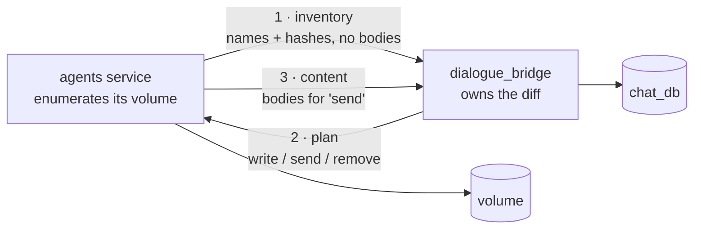
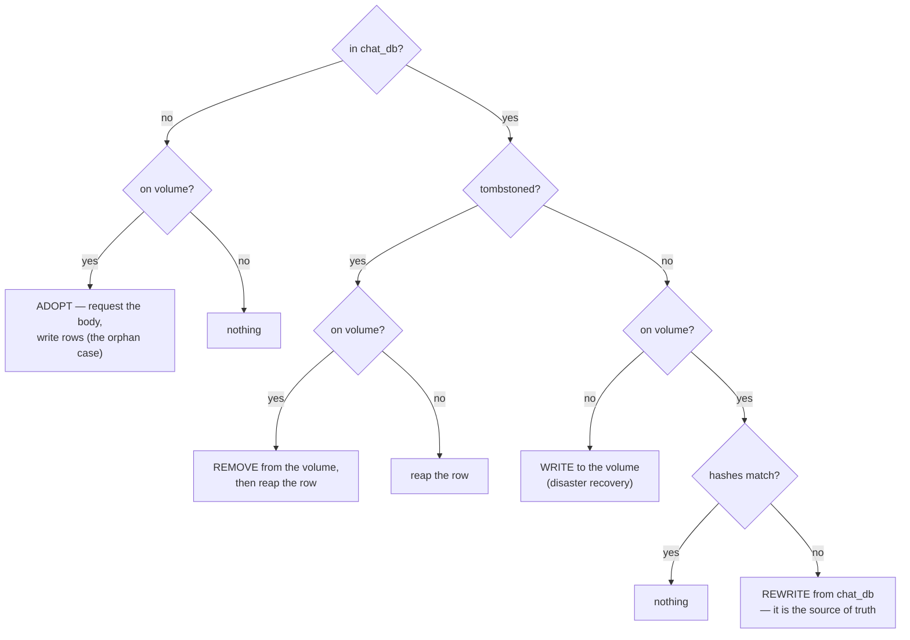

# 22 — Two-way workspace sync

**Status:** Complete as scoped — Phases 0–4 shipped. Phase 5 (memory) was **dropped from this plan**: it ships separately in `agent_runtime` with no volume copy (§10). Not deployed
**Touches:** `dialogue_bridge` (new sync router, tombstone column, delete-order change), `agents` (sync client replaces the hydrator), `agentic_ui` (unchanged — no contract moves)
**Depends on:** [21 · Persist user content in Postgres](21-persist-user-content-in-postgres.md) Parts A and B, which are shipped
**Blocks:** nothing. 21 Part C (memory) was briefly folded in here and then moved out again — see §10
**Background:** [state & storage map](../../draft/state-and-storage-map.md) §6–§7

Parts A and B of plan 21 made `chat_db` the owner of custom agents and custom
skills, with the agents-service volume as a cache. What they did not build is a
*general* way for the two stores to agree. Instead there are five separate
adoption paths, each with its own trigger, and one boot hydrator that only runs
in one direction. Between them they cannot see content the database has never
heard of — which is exactly the state a half-failed create leaves behind.

This plan replaces all six with a single bidirectional reconciliation: the agents
service reports what is on its volume, the bridge diffs that against `chat_db`,
and the reply says what to write, what to send, and what to delete.

---

## 1. Why

### 1.1 A half-failed create is unrecoverable from the UI

Writes call the agents service first (it is what validates), then persist. If the
persist fails, the volume holds content `chat_db` has no row for. Nothing finds
it again:

| Failure | Result | Recovery today |
| --- | --- | --- |
| Agent — definition rows fail after the catalog row committed | Row exists without a definition | **Self-heals** — the builder's read triggers `_adopt_definition_from_upstream` |
| Agent — the catalog row itself fails | Folder on the volume, nothing in `chat_db` | **None.** Adoption is triggered *from a row*; there is no row |
| Skill — persist fails, user's pool was empty | Nothing in `chat_db` | **Self-heals** — `pool_needs_adoption` is true, so the next listing adopts |
| Skill — persist fails, user already had skills | Nothing in `chat_db` | **None.** `pool_needs_adoption` is false, so the listing never looks upstream |

The two "none" rows are worse than invisible. Retrying the same name hits the
agents service's conflict check — `409 You already have an agent named 'x'`
([`router/user_agents.py:119`](../../../src/agents/router/user_agents.py)) or
`409 A skill with that name already exists` — so the user can neither see it, nor
recreate it, nor delete it. Only a manual volume edit clears it.

### 1.2 Adoption is five mechanisms pretending to be one

| Path | Trigger | Blind to |
| --- | --- | --- |
| `user_agents._adopt_definition_from_upstream` | builder opens an agent whose row has no spec | agents with no row |
| pool adoption in `skills.list_user_skills` | `pool_needs_adoption` — the pool is *entirely* empty | anything added to a non-empty pool |
| `skills._adopt_all_agent_assignments` | same pass | same |
| file-body adoption in `skills.get_user_skill_detail` | a skill is opened | skills not in the pool |
| `workspace_hydrator` | boot, `chat_db` → volume only | everything on the volume |

Three trigger conditions, five call sites, one direction of travel. Consolidating
them is the larger prize here; the bug fix falls out of it.

---

## 2. The shape



Four rules:

1. **The bridge owns the diff.** It has the database and the authority. The agents
   service reports what it sees and applies what it is told — which keeps
   filesystem knowledge out of the bridge and schema knowledge out of the agents
   service.
2. **There is one initiator, not two.** The data flows both ways, but only the
   agents service can enumerate the volume, so it opens the exchange. The bridge's
   opposite-direction need is a single object on demand, and the per-object GET
   endpoints already cover that.
3. **Bodies move only when asked for.** The inventory carries names, paths and a
   content hash. Most passes transfer nothing.
4. **The volume stays authoritative within a run.** Nothing here changes what an
   agent reads at inference time.

---

## 3. The invariant this turns on

A sync that sees *"`chat_db` has it, the volume does not"* cannot act until it
knows which of these happened:

- the volume lost it — **write it back**
- it was just deleted and `chat_db` has not caught up — **must not write it back**

The inventory cannot distinguish them. Only a tombstone can, and without one a
two-way sync silently un-deletes content users deleted. Flipping the delete order
does not help — it moves the resurrection to the other direction.

### 3.1 Agents already have a tombstone

`delete_custom_agent` sets `is_active = False` and `definition_spec = None`, and
`internal_workspace.py` filters on `is_active == True`. The existing comment
names the reason:

> keeping it would leave the hydrator able to resurrect a deleted agent's folder

The soft delete exists for a different reason — `conversations.agent_id` cascades,
so the row must survive — but it doubles as exactly the marker sync needs.

### 3.2 Skills do not

`skill_store.remove_from_pool` hard-deletes across `user_skill_pool`,
`user_skills` and `user_agent_skills`. Nothing records that the removal was
deliberate, so a sync would re-adopt a deleted skill from the volume on its next
pass.

**One nullable column closes it.** This is the whole schema cost of the plan.

### 3.3 Delete order changes to match

```
today:   upstream DELETE  →  drop rows        (a failed drop leaks a live row)
after:   tombstone+commit →  upstream DELETE  →  reap rows
```

The user's delete then succeeds from their side the moment the tombstone commits —
the object is hidden immediately — and sync finishes the volume half whenever the
agents service is reachable. That is better behaviour, not just safer state.

---

## 4. The diff

Six outcomes, evaluated per object:



`REWRITE` is the one that needs care, and §5 removes almost every way of reaching
it.

---

## 5. Phase 0 — close the double-commit window ✅ shipped

Independent of everything else, and worth landing first because it shrinks the
sync's job.

`create_custom_agent` and `update_custom_agent` commit **twice**:

```python
row = await _upsert_row(db, user_id, summary or {})   # commits
row.definition_spec = payload.get("spec") or {}
await _store_definition(db, row.id, payload)
await db.commit()                                      # commits again
```

A failure between them leaves the catalog row current and the definition stale —
the volume holds v2, `chat_db` holds v1, both present, hashes differ. That is the
`REWRITE` branch, and taking it would revert the user's edit to the older
version.

Collapsing these into one transaction removes the window entirely. `_upsert_row`
stops committing and the caller owns the single commit. After that, `REWRITE` is
reachable only by out-of-band volume edits, where "`chat_db` wins" is
unambiguously correct.

**Acceptance:** an injected failure in `_store_definition` leaves *no* catalog row
for a create, and an unchanged row for an update. Existing tests still pass.

---

## 6. Phase 1 — the skill tombstone ✅ shipped

```sql
ALTER TABLE user_skill_pool ADD COLUMN deleted_at timestamptz NULL;
```

Migration `0020_skill_pool_tombstone`. Keep the revision id short —
`alembic_version.version_num` is `varchar(32)`.

- `remove_from_pool` splits into `tombstone_pool_entry` (sets `deleted_at`) and
  `reap_pool_entry` (the old hard delete). The stale-row prune in
  `get_user_skill_detail` calls the reap directly — the folder is already gone
  upstream, so there is no pending removal for a tombstone to protect.
- **Assignments are dropped at tombstone, not at reap.** `list_agent_skills`
  reads `user_agent_skills` directly rather than through the pool, so deferring
  them would show a removed skill as still enabled on an agent. The skill's
  *content* does wait for the reap, so a failed volume delete stays
  reconcilable.
- Every read filters `deleted_at IS NULL` — `list_pool`, `get_custom_skill` and
  `internal_workspace`'s pool query. A missed predicate resurrects a deleted
  skill in the UI or, on the internal endpoint, has the hydrator write it back.
- **`pool_needs_adoption` is the exception: it counts tombstoned rows.** They are
  proof the pool has already been seen, and excluding them would make a user
  whose only skill was deleted look un-adopted — the next listing would re-import
  the manifest from the volume and resurrect it. `adopt_pool` and
  `adopt_agent_skills` skip tombstoned names for the same reason.
- Re-adding a skill of the same name clears the tombstone rather than inserting a
  second row, mirroring how a dormant agent row reactivates.

**Acceptance:** delete a skill, confirm it disappears from the Skills tab and from
`get_user_agent_skills`; confirm the row still exists with `deleted_at` set;
re-add the same name and confirm one row, not two.

---

## 7. Phase 2 — the sync router ✅ shipped

New `dialogue_bridge/router/internal_sync.py`. Same trust model:
`require_internal_caller` plus the nginx edge deny on `/api/v1/internal/`.

Mounted alongside `internal_workspace` for one phase — the deployed agents
service still called the old endpoints, so removing them in Phase 2 would have
broken the hydrator on any deploy where the two services did not move together.
Phase 3 retired `internal_workspace.py` and `workspace_hydrator.py` together
with their last caller.

```
POST /v1/internal/sync/{user_id}/inventory
  body  { agents:      [{slug, hash}],
          skills:      [{name, type, hash}],
          assignments: {agent_slug: [skill_name]} }
  reply { write:   [ full objects chat_db holds that the volume lacks ],
          send:    [ names the bridge wants bodies for ],
          remove:  [ names carrying a tombstone ],
          assignments: {agent_slug: [skill_name]} }

POST /v1/internal/sync/{user_id}/content
  body  { agents: [{slug, spec, files}], skills: [{name, ..., files}] }
```

**Hashing.** One hash per object over its sorted `(path, content)` pairs, with
newlines normalised. It must be computed identically on both sides, so the
function lives in one place conceptually and is duplicated deliberately with a
comment naming the coupling — the same treatment `_HITL_FLOOR` gets.

**Why two calls.** A single call would have to carry every file body on every
pass. Metadata-first keeps a no-op sync to two small requests, which is what
almost every pass is.

**Platform agents are excluded from `write`.** `agents.owner_user_id IS NULL`
means the definition ships in the image; sync never materialises those. Their
*assignments* are still in scope — `user_agent_skills` is slug-keyed precisely so
platform agents are covered.

**Acceptance:** a user with content on both sides produces an empty plan. Deleting
a row produces `write`. Deleting a volume folder produces `write`. Adding a folder
the DB has never seen produces `send`. A tombstone produces `remove`.

---

## 8. Phase 3 — the sync client ✅ shipped

`agents/utils/workspace_sync.py` replaces `workspace_hydrator.py`.

**User enumeration is a union, and this is easy to get wrong.**
`/v1/internal/workspace/users` returns users the *bridge* has content for. A user
whose content exists only on the volume — the orphan case this plan exists to fix
— is not in that list. The client must enumerate `layout.users_root()` as well and
sync the union.

Runs at boot and on an interval. The boot pass keeps the existing retry budget and
the reason for it: compose declares `dialogue_bridge depends_on: agents`, so this
service always starts first and the reverse edge would be a dependency cycle.

**Acceptance — verified live against the local stack.** Planting a custom-agent
folder with no `chat_db` row (the orphan a half-failed create leaves) and
restarting produced `sent=1` and a full row — spec and definition file — where
before it was invisible and un-recreatable. Tombstoning that row and restarting
produced `workspace_sync_agent_removed` and `removed=1`, finishing a deletion
whose volume half had never landed. A settled workspace reports
`written=0 removed=0 sent=0`.

---

## 9. Phase 4 — delete the adoption paths ✅ shipped

With sync complete, all five paths in §1.2 are redundant. Remove them, and with
them `pool_needs_adoption` and the `_fetch_*_upstream` helpers that only adoption
used.

**The timing gap, and why no on-demand trigger was built.** Lazy adoption used
to cover the window between a deploy and the first sync pass. The sketch offered
two answers: run sync early enough in boot, or have a read that finds nothing ask
for a sync of that user and re-read. The second was **rejected as
over-engineering** — it needs a bridge → agents → bridge callback, and the window
it protects is transient (bounded by the retry backoff, seconds in practice) and
only affects content that pre-dates the store, which is a one-time migration per
environment. A user who loads Settings inside that window sees their pool a
moment late; a reload fixes it.

**The stale-prune moved rather than disappeared.** A pool entry the agents
service 404s used to be reaped when somebody opened it. Reconciliation now
handles the same state — a custom row with no stored files and no folder on the
volume is dropped — and handles it better, because it does not depend on anyone
opening the skill. The other half of that branch is now a *write*: if `chat_db`
holds the files, a missing folder is restored rather than the row deleted, which
a read could never do.

**Acceptance — verified live.** The five call sites are gone and the suite passes
with new tests asserting that a pool listing, an assignment read, a skill detail
and an agent definition all resolve without any outbound HTTP. Against the
running stack, a settled workspace (5 skills on the volume, 5 in `chat_db`) plans
`write=0 send=0 remove=0` — which also proves the two services' content hashes
agree — while an empty inventory correctly offers to restore all five.

---

## 10. Phase 5 — memory (not built; memory left this plan)

**Memory is not an object type in this exchange, and never became one.** It ships
independently, in `agent_runtime`, with no volume copy at all — see
[docs/flows/agent-memory.md](../../flows/agent-memory.md) for what was actually
built. This plan therefore **finishes at Phase 4**.

The reasoning is worth keeping, because the shape here looked right twice before
it was wrong.

Memory was folded into this plan from
[21 · Part C](21-persist-user-content-in-postgres.md) on a sound argument: it
needed a reconcile endpoint and a tombstone design, both of which Phases 2–4
turn into shared infrastructure, so a third object type would have been a table
plus a payload section.

What that missed is *why* the machinery exists at all. The exchange, the
inventory protocol and the cross-service content hash are all there because the
database and the volume sit on **opposite sides of a service boundary** — the
bridge owns `chat_db`, the agents service owns the volume. Memory has no such
split: the agent writes it, mid-run, and the agents service already owns a
database of its own. Putting memory in `agent_runtime` removes the boundary
rather than reconciling across it, and every piece of machinery it would have
reused becomes unnecessary:

| | in this plan | as built |
| --- | --- | --- |
| Two stores to reconcile | inventory + plan + content exchange | one store |
| Cross-service content hash | required, load-bearing | none |
| Tombstones | required (a delete is ambiguous) | none — a delete is a delete |
| Boot pass | hydration, forever | none |
| Volume folder | the runtime read path | **does not exist** |

`/memories/` became a virtual route: deepagents' `StoreBackend` over a custom
`BaseStore` implementation, so the agent still reads `AGENTS.md` and
`entries/<name>.yml` while there is no filesystem underneath. A custom store
rather than LangGraph's `AsyncPostgresStore` because that one is a generic
`(prefix, key, value jsonb)` table, which would have made the provenance columns
— the whole point of §11's injection-surface finding — unindexed JSON.

Two things this plan got right and memory kept: **the write order inverts**
(the volume, or rather the store, is the runtime read path, so a failed persist
must never raise mid-run), and **provenance belongs in the first migration**
because it cannot be backfilled.

---

## 11. Sharp edges

- **Sync gains delete authority.** Today's hydrator is additive and cannot destroy
  anything; a tombstone bug now deletes user content instead of leaving clutter.
  This is the single most dangerous change in the plan. A threshold refusing large
  removal batches was considered and **deliberately rejected**: a partial
  reconciliation is not a reconciliation, and a cap converts a correctness bug
  into a silent, permanent divergence rather than a visible one. The protection
  is therefore entirely in the tombstone predicates — each is pinned by a test —
  plus the removal count that `workspace_sync_planned` logs on every pass.
- **Every read must filter `deleted_at IS NULL`.** A missed predicate resurrects
  deleted skills in the UI, and it will not fail a test that only checks the happy
  path.
- **The hash must be stable across services.** Sorted paths, normalised newlines,
  UTF-8. An unstable hash makes every pass rewrite every file.
- **`REWRITE` reverts on stale data.** Phase 0 is what makes `chat_db` reliably
  newer. Do not reorder it after Phase 2.
- **Do not move validation to the bridge.** The agents service owns the model
  allowlist, native-tool registry and reserved slugs. Duplicating them is what
  produced the `REQUIRED_GATES` drift that once rejected every agent save.
- **`create_skill` writes pool + assignment, never agent defaults.** Sync must
  preserve that: tier ④ is part of an agent's definition and a runtime tool call
  must not gain the ability to edit it.
- **Deleting an agent still only deactivates the row.**
  `conversations.agent_id` cascades.
- **`get_db` does not commit on close.** Any unit of work after an inner commit
  needs an explicit one — this silently discarded every agent definition once
  already.

---

## 12. Sequencing

| Phase | Ships | Independent? |
| --- | --- | --- |
| **0 · single commit** ✅ | one transaction per write | yes — land it alone |
| **1 · skill tombstone** ✅ | `deleted_at` + delete-order change | yes |
| **2 · sync router** ✅ | inventory/content endpoints + the diff | needs 1 |
| **3 · sync client** ✅ | boot + interval, user union | needs 2 |
| **4 · delete adoption** ✅ | five paths removed | needs 3 |
| **5 · memory** | — dropped; ships separately in `agent_runtime` (§10) | — |

Phases 0–3 fix the orphan bug. Phase 4 is the simplification the plan exists
for, and is where the plan ends.

---

## 13. What this unlocks

Once Phase 4 lands, the agents service holds no user state that cannot be rebuilt
from Postgres, and no state Postgres cannot learn about. That is the condition for
running **more than one replica** — currently impossible, because a second
container comes up with an empty volume and nothing would ever reconcile it.

---

## 14. File map

| Concern | File |
| --- | --- |
| Tombstone column + migration | `dialogue_bridge/core/database/models.py`, `core/database/migrations/versions/` |
| Sync endpoints + the diff | `dialogue_bridge/router/internal_sync.py` (replaces `internal_workspace.py`) |
| Diff logic + hashing | `dialogue_bridge/utils/workspace_sync.py` (new) |
| Skill storage + tombstone reads | `dialogue_bridge/utils/skill_store.py` |
| Agent write path (Phase 0) | `dialogue_bridge/utils/user_agents.py` |
| Adoption paths to delete (Phase 4) | `dialogue_bridge/utils/skills.py` |
| Sync client + user union | `agents/utils/workspace_sync.py` (replaces `workspace_hydrator.py`) |
| Volume enumeration | `agents/harness/filesystem/layout.py` |
| Write side, unchanged | `agents/harness/abstractions/user_agents.py`, `harness/skill_registry/user_registry.py` |
| Memory (Phase 5) | `agents/harness/tools/remember.py`, `harness/memory/store.py` |
