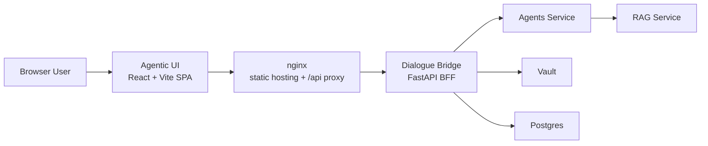
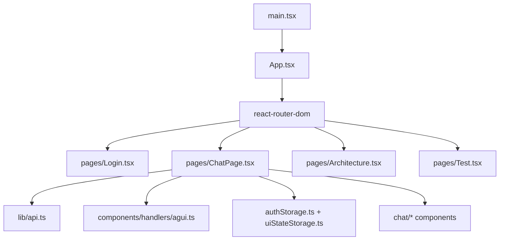
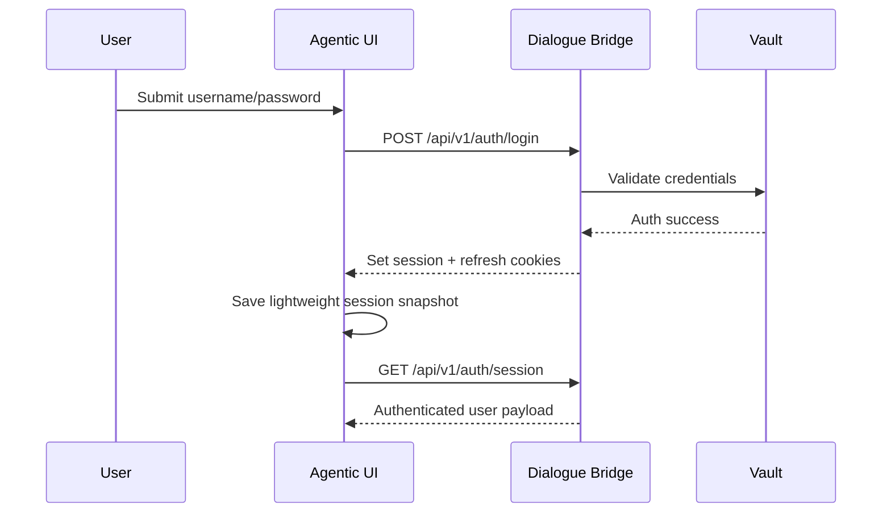
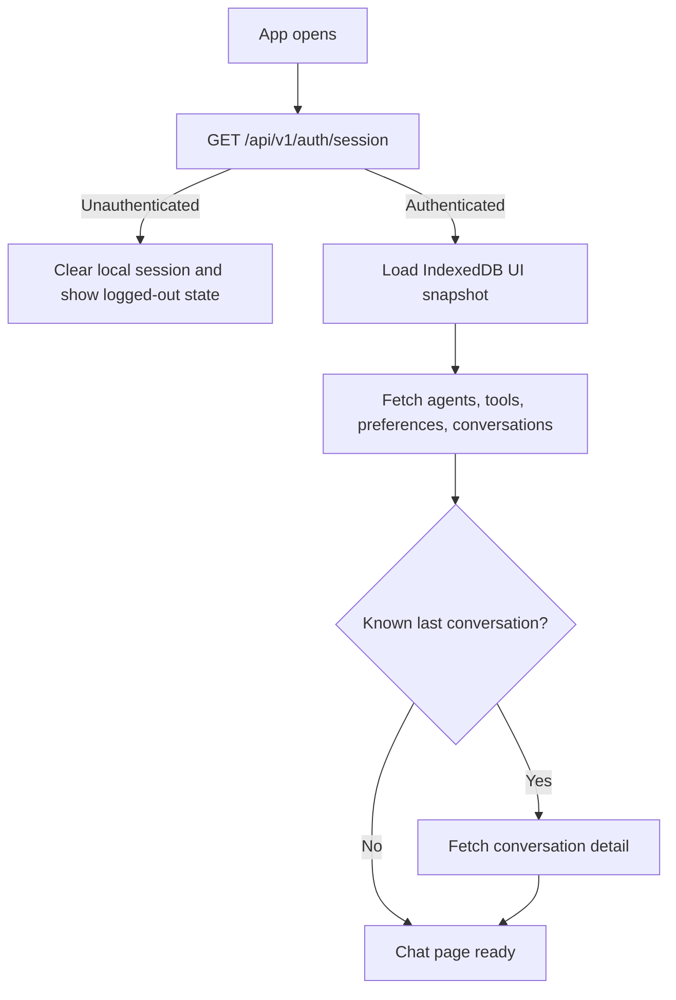
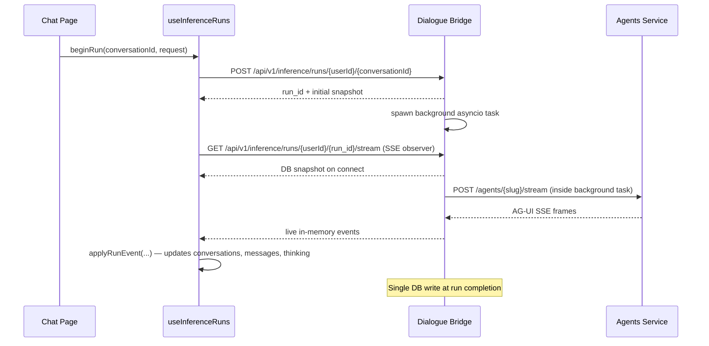
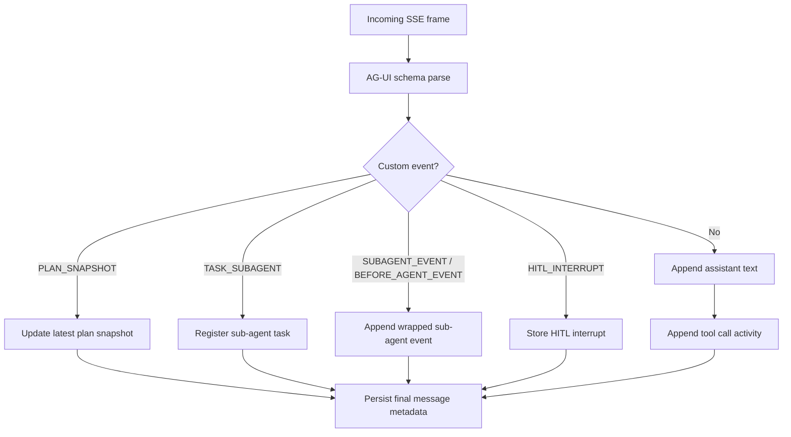
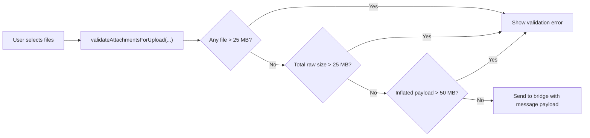
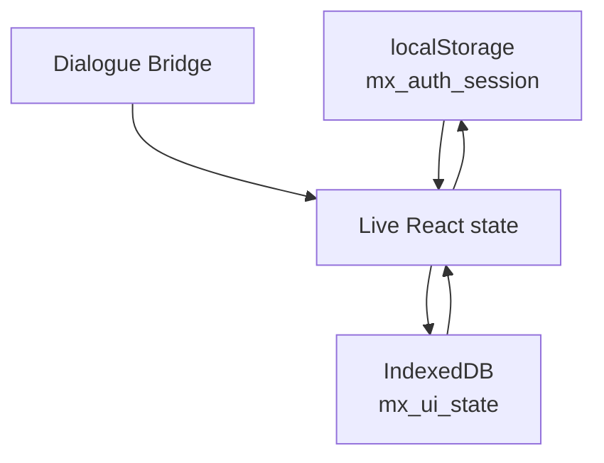
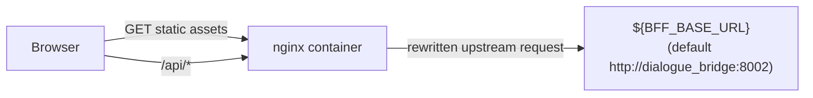

# Agentic UI

`agentic_ui` is the browser-facing frontend for mAgenticX. It is a React 18 + Vite single-page application that renders the chat workspace, authenticates through the dialogue bridge, streams AG-UI events over Server-Sent Events, and exposes agent-specific interaction features such as planning traces, sub-agent activity, branching, file attachments, voice dictation, archive flows, and conversation reporting.

The UI does not call the agents service, the RAG service, Chroma, or Postgres directly. Every backend request goes through the dialogue bridge under `/api/v1/*`, with nginx acting as the production reverse proxy inside the UI container.

## Responsibilities

- Authenticate users against the bridge and keep bridge-issued session cookies fresh.
- Render the main chat experience, including agent selection, conversation history, message editing, branching, and private-mode state.
- Stream AG-UI inference events and normalize them into visible assistant output, thinking timelines, tool activity, plan snapshots, and sub-agent traces.
- Validate files before upload and hand attachment persistence to the bridge.
- Support voice dictation and drop the resulting transcript back into the message composer.
- Support conversation archive and unarchive flows across the sidebar, header actions, and profile panel.
- Support conversation-level reporting, with optional targeting of a specific assistant message from the AI action bar.
- Provide a registry-driven keyboard shortcut system for global chat actions, composer send flows, and dismissible overlays.
- Manage server-owned detached inference runs that survive navigation and browser refresh — hydrating active runs on page load and reconnecting the SSE observer without restarting the run.
- Cache lightweight UI state locally so reloads feel faster without storing the entire conversation transcript in the browser.

## System Position



## Runtime Architecture

At runtime, the UI is mostly a state orchestration layer around the chat page. `App.tsx` wires global providers, the router selects the active page, and `ChatPage.tsx` coordinates session rehydration, data fetching, SSE streaming, persistence, and the main interaction state.



## Routes

The app defines a small set of browser routes:

- `/` renders `ChatInterface`, the production chat workspace.
- `/login` renders the credential-based login flow.
- `/architecture` renders an in-product architecture explainer page.
- `/test` renders an internal AG-UI/sub-agent replay playground.
- Any unknown route falls back to `NotFound`.

## Main UI Logic

`src/pages/ChatPage.tsx` is the operational center of the frontend. It owns the current conversation, draft message text, attachments, selected agent, preferences, active plan snapshots, dictation state, sidebar state, conversation pagination state, archived conversation pagination state, report-dialog state, and the currently streamed assistant response.

The page delegates behavior to modular handlers instead of placing all business logic inline:

- `handlers/auth.ts` handles login/logout side effects and post-auth bootstrap.
- `handlers/inference.ts` prepares sends, creates optimistic placeholders, and starts the AG-UI stream.
- `handlers/agui.ts` parses the incoming event stream and turns it into UI state plus persisted assistant messages.
- `handlers/preferences.ts` computes enabled tool state and saves user preferences.
- `handlers/attachments.ts` manages file picking, paste flows, validation, and download behavior.
- `handlers/shortcuts.ts` maps shared shortcut IDs onto page-owned actions, while `hooks/useKeyboardShortcuts.ts` attaches the global listener.
- `handlers/messages.tsx`, `handlers/agents.ts`, and branching/retry/edit handlers cover conversation-level user actions.

## Authentication and Session Model

The UI uses the dialogue bridge as the sole auth surface. It does not store backend tokens directly. Instead:

- the bridge sets session and refresh cookies
- the UI calls `/api/v1/auth/session` to restore browser state
- the UI periodically refreshes the server session via `/api/v1/auth/session/refresh`
- local storage keeps only a lightweight session snapshot for UX continuity

`src/lib/authStorage.ts` stores:

- `userId`
- `expiresAt`
- serialized `user`
- `lastConversationId`
- `selectedAgent`
- `isPrivateMode`

That local snapshot is a UX cache, not the source of truth. The bridge session remains authoritative.



## Bootstrap and Rehydration

`useAuthRehydrateEffect(...)` is the startup path for an already-open browser session. It:

1. Calls `restoreSession()` against the bridge.
2. Clears local browser state if the server session is gone.
3. Loads the IndexedDB UI snapshot when available.
4. Fetches agents, tools, preferences, and conversation summaries.
5. Rehydrates the last opened conversation if an ID is known.

The hook uses the local and IndexedDB caches as accelerators, but server responses still win.



## Data Access Layer

`src/lib/api.ts` centralizes all network traffic and uses `withSessionRequest(...)` from `src/lib/utils.ts` to include credentials and CSRF protection. The UI expects the backend to be exposed under `/api/v1`.

Main endpoint groups:

- Auth
  - `/auth/login`
  - `/auth/session`
  - `/auth/session/refresh`
  - `/auth/logout`
- Catalog
  - `/catalog/agents`
  - `/catalog/tools`
- Preferences
  - `/preferences/{userId}`
- Conversations
  - `/conversations/{userId}`
  - `/conversations/{userId}/archived`
  - `/conversations/{userId}/{conversationId}`
  - `/conversations/{userId}/{conversationId}/title`
  - `/conversations/{userId}/{conversationId}/archive`
  - `/conversations/{userId}/{conversationId}/unarchive`
  - `/conversations/{userId}/{conversationId}/report`
- Messages
  - `/messages/{userId}/{conversationId}`
  - `/messages/{userId}/{conversationId}/{messageId}`
  - like/dislike endpoints
- Attachments
  - `/attachments/download/{userId}/{conversationId}/{messageId}/{blobId}`
- Inference
  - `/inference/runs/{userId}/{conversationId}` — create and start a detached run
  - `/inference/runs/{userId}?status=active` — list active runs for hydration
  - `/inference/runs/{userId}/{runId}/stream` — SSE observer for a run
  - `/inference/runs/{userId}/{runId}/cancel` — cancel a run
- Speech
  - `/speech/dictation/{userId}`
  - `/speech/read-aloud/{userId}/{conversationId}/{messageId}`

## AG-UI Streaming Model

The most important runtime path is the detached inference run. Instead of opening a direct SSE proxy, the UI calls `beginRun(conversationId, request)` on the globally-instantiated `useInferenceRuns` hook. This:

1. calls `POST /api/v1/inference/runs/{userId}/{conversationId}` on the bridge
2. receives a `run_id` and initial snapshot — the server has already spawned the background asyncio task
3. opens a separate SSE observer connection via `observeRunId(runId)` that reads from `/api/v1/inference/runs/{userId}/{run_id}/stream`

The observer receives a DB snapshot immediately on connect (for reconnect resilience), then receives lightweight in-memory events published by `InferenceRunManager` as the background task progresses. Every incoming event is routed through `applyRunEvent(event)`, which updates `runsByConversation`, the conversation list, and UI state in a single handler.

If the browser navigates away or refreshes, the run continues on the server. On remount, `useInferenceRuns` calls `getActiveInferenceRuns()` to hydrate any runs still in progress and reopens the observer.

Supported event categories include standard AG-UI events and app-specific custom events:

- run lifecycle
  - `RUN_STARTED`
  - `RUN_ERROR`
- thinking lifecycle
  - `THINKING_START`
  - `THINKING_TEXT_MESSAGE_CONTENT`
  - `THINKING_END`
- tool activity
  - `TOOL_CALL_START`
  - `TOOL_CALL_ARGS`
  - `TOOL_CALL_RESULT`
- text streaming
  - `TEXT_MESSAGE_START`
  - `TEXT_MESSAGE_CHUNK`
  - `TEXT_MESSAGE_CONTENT`
  - `TEXT_MESSAGE_END`
- custom agentic extensions from `src/lib/agui.ts`
  - `PLAN_SNAPSHOT`
  - `TASK_SUBAGENT`
  - `SUBAGENT_EVENT`
  - `BEFORE_AGENT_EVENT`
  - `HITL_INTERRUPT`



## Plan and Sub-Agent Rendering

The UI is explicitly designed to show agentic traces, not just plain chat output. Two custom event families matter here:

- `PLAN_SNAPSHOT` updates the visible task plan cards shown above the transcript.
- `TASK_SUBAGENT`, `SUBAGENT_EVENT`, `BEFORE_AGENT_EVENT`, and `HITL_INTERRUPT` build a structured sub-agent model that the UI can render after or during the run.

This means the frontend is not merely rendering raw SSE lines. It is normalizing multiple event types into stable UI concepts.



## Conversation and Branching Model

The UI supports branch-aware conversations rather than a single linear transcript. `useBranchingHandlers(...)` computes:

- the currently active message path
- child-message alternatives
- the visible message set for the current branch

This allows retries, edits, and alternate continuations without flattening everything into one timeline. `ChatBody` renders the active branch while `ChatHeader` and action handlers expose branch-sensitive controls.

## File Attachments

Attachment validation happens on the client before the UI sends any payload to the bridge. The limits are defined in `src/lib/uploadGuards.ts`:

- `MAX_SINGLE_FILE_MB = 25`
- `MAX_TOTAL_FILES_MB = 25`
- `PROXY_LIMIT_MB = 50`

The final check accounts for base64 expansion so browser-side validation stays aligned with the nginx body limit.

The current production proxy limit is `50M`, not `600M`.



## Dictation Flow

The composer includes voice dictation support through `react-voice-visualizer`. The UI captures audio locally, posts it to the bridge’s dictation endpoint, and inserts the returned transcript into the draft input.

The browser never sends audio directly to the agents service.

## Keyboard Shortcuts

Keyboard shortcuts are defined centrally in `src/lib/shortcuts.ts`. The runtime splits them into:

- global shortcuts handled by `src/hooks/useKeyboardShortcuts.ts`
- page-level action mapping handled by `src/handlers/shortcuts.ts`
- composer-local keys handled directly inside `ChatInputBar` and inline edit textareas

The current shortcut set covers:

- sidebar toggle
- new chat
- search
- profile panel and shortcuts help
- composer focus
- attachment picker
- voice dictation start
- agent picker
- private-mode toggle when allowed
- `Esc` dismissal of active overlays, dictation, and inline edit state
- `Enter` or `Ctrl/Cmd+Enter` to send from the composer or inline edit textarea
- `Shift+Enter` for newline

Current global shortcuts:

- `Ctrl/Cmd+B` toggle sidebar
- `Ctrl/Cmd+Shift+X` new chat, with `Ctrl/Cmd+N` kept as an opportunistic browser-dependent alias
- `Ctrl/Cmd+K` open search
- `Ctrl/Cmd+L` focus composer
- `Ctrl/Cmd+U` open the attach files and photos picker
- `Ctrl/Cmd+M` start dictation
- `Ctrl/Cmd+Shift+A` open the agent picker
- `Ctrl/Cmd+Shift+P` toggle private mode when the current chat allows it
- `Ctrl/Cmd+,` or `Ctrl/Cmd+.` open the profile panel
- `Ctrl/Cmd+/` open the profile panel directly on the Shortcuts tab
- `Esc` close active overlays, cancel dictation, close menus/dropdowns, or cancel inline edit state

The profile panel includes a `Shortcuts` tab that renders from the same shared shortcut registry used by the runtime listener.

Browser caveats matter here:

- some browser shortcuts cannot be reliably overridden from a web app, especially `Ctrl/Cmd+N`
- because of that, the web UI exposes a browser-safe fallback for new chat: `Ctrl/Cmd+Shift+X`
- the profile panel shortcut also supports `Ctrl/Cmd+.` as a safer fallback alongside `Ctrl/Cmd+,`

## Local Persistence Model

The frontend uses two different browser storage layers:

- `localStorage`
  - session-shaped metadata in `authStorage.ts`
- `IndexedDB`
  - UI snapshot metadata in `uiStateStorage.ts`

The IndexedDB snapshot intentionally stores lightweight metadata instead of full conversation bodies:

- selected agent
- private mode
- active profile tab
- sidebar open state
- last conversation ID
- available tools
- agent catalog
- conversation summaries
- user preferences

Images and full transcripts are not used as the durable local source of truth.



## Presentational Composition

The chat experience is split into focused surfaces under `src/components/chat`:

- `ChatHeader`
  - agent selector
  - private-mode toggle
  - conversation actions for archive, unarchive, report, and delete
- `ChatSidebar`
  - conversation list
  - pagination plus archive, report, rename, and delete affordances
  - profile entry point
  - shows a `Loader` spinner in place of the 3-dot dropdown for conversations with an active streaming run
- `ProfilePanel`
  - user profile
  - theme selection
  - MCP tool preference toggles
  - archived conversations tab with paginated lazy loading and unarchive support
  - shortcuts reference tab rendered from the shared shortcut registry
  - links to auxiliary views
- `ChatBody`
  - transcript rendering
  - loading states
  - branch-aware message display
  - AI message action bar with conversation-aware report affordance
  - pin-to-bottom scroll behavior with wheel-event unpinning during streaming
  - animated "jump to bottom" button when scrolled away from the latest message
  - `scrollResetKey` prop resets scroll position on conversation switch
- `ChatInputBar`
  - composer
  - attachment strip
  - dictation controls
  - send/stop actions

## Styling and UI Stack

The UI stack is based on:

- React 18
- Vite
- TypeScript
- Tailwind CSS
- Radix UI primitives
- `@tanstack/react-query`
- `next-themes`
- `lucide-react`
- `react-markdown`, `remark-gfm`, `rehype-highlight`, and `rehype-katex`

The app also includes additional motion, markdown, and playground-oriented dependencies, but the core production path remains the chat runtime described above.

## Production Proxy and Container Behavior

The Docker image is a two-stage build:

1. `node:20-alpine` builds the Vite bundle.
2. `nginx:1.25-alpine` serves the static assets and proxies `/api/` traffic.

`nginx.conf.template` is the operational boundary between the browser and the bridge:

- rewrites `/api/...` before proxying to `${BFF_BASE_URL}`
- overwrites client IP headers with nginx `$remote_addr` before forwarding to the bridge
- injects `X-Internal-Proxy-Secret ${TRUSTED_PROXY_SECRET}`
- disables request and response buffering for large uploads and SSE
- sets `client_max_body_size 50M`



## Configuration

Important runtime values:

- `BFF_BASE_URL`
  - upstream base URL for proxied API traffic
  - Docker default: `http://dialogue_bridge:8002`
- `TRUSTED_PROXY_SECRET`
  - shared secret added to proxied requests for bridge-side trust checks

Development settings of note:

- Vite dev server listens on port `8080`
- `vite.config.ts` binds host `::`
- production nginx listens on port `80`

## Directory Map

Key files and folders:

- `src/main.tsx`
  - bootstraps the app, router, and root error boundary
- `src/App.tsx`
  - registers providers and browser routes
- `src/pages/ChatPage.tsx`
  - main orchestration page
- `src/pages/Login.tsx`
  - login and session-restore entry point
- `src/components/chat/`
  - presentational chat surfaces
- `src/components/handlers/`
  - stateful domain logic for auth, inference, preferences, attachments, retries, and branching
- `src/hooks/`
  - session effects, scrolling behavior, thinking progress, and layout helpers
- `src/hooks/useInferenceRuns.ts`
  - global detached run manager — hydration on mount, beginRun, stopRun, observeRunId, applyRunEvent
- `src/hooks/useKeyboardShortcuts.ts`
  - global shortcut listener and chat shortcut bridge
- `src/lib/api.ts`
  - bridge API wrapper and SSE transport
- `src/lib/agui.ts`
  - AG-UI event schemas plus custom event definitions
- `src/lib/shortcuts.ts`
  - shortcut registry, labels, and platform-aware key definitions
- `src/lib/authStorage.ts`
  - browser session snapshot persistence
- `src/lib/uiStateStorage.ts`
  - IndexedDB UI snapshot persistence
- `src/lib/uploadGuards.ts`
  - browser-side file limit enforcement
- `src/handlers/shortcuts.ts`
  - runtime mapping from shortcut IDs to page-owned UI actions
- `nginx.conf.template`
  - production reverse proxy behavior
- `Dockerfile`
  - production build and serving image

## Development

```bash
cd src/agentic_ui
npm install
npm run dev
```

The UI expects `/api/v1/*` to resolve to the dialogue bridge. In Docker Compose this is handled by nginx inside the UI container. In standalone local development you need an equivalent proxy arrangement.

## Build and Verification

```bash
npm run build
npm run preview
npm run lint
```

## Extension Points

When extending the UI, the existing seams are:

- add new backend endpoints in `src/lib/api.ts`
- add new AG-UI event schemas in `src/lib/agui.ts`
- normalize new stream behaviors in `components/handlers/agui.ts`
- expose new controls via `ProfilePanel`, `ChatHeader`, or `ChatInputBar`
- persist only lightweight metadata to IndexedDB unless there is a strong reason to widen the browser cache

## Operational Notes

- The UI assumes the dialogue bridge owns authentication, conversation persistence, and attachment persistence.
- SSE rendering depends on buffering being disabled in the reverse proxy path.
- Attachment validation is intentionally stricter in the browser than the raw proxy ceiling when base64 inflation is considered.
- The `/architecture` and `/test` routes are auxiliary pages and not part of the primary chat runtime.
