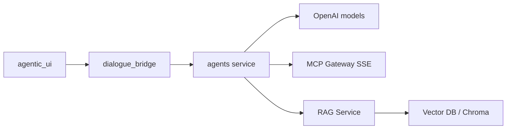
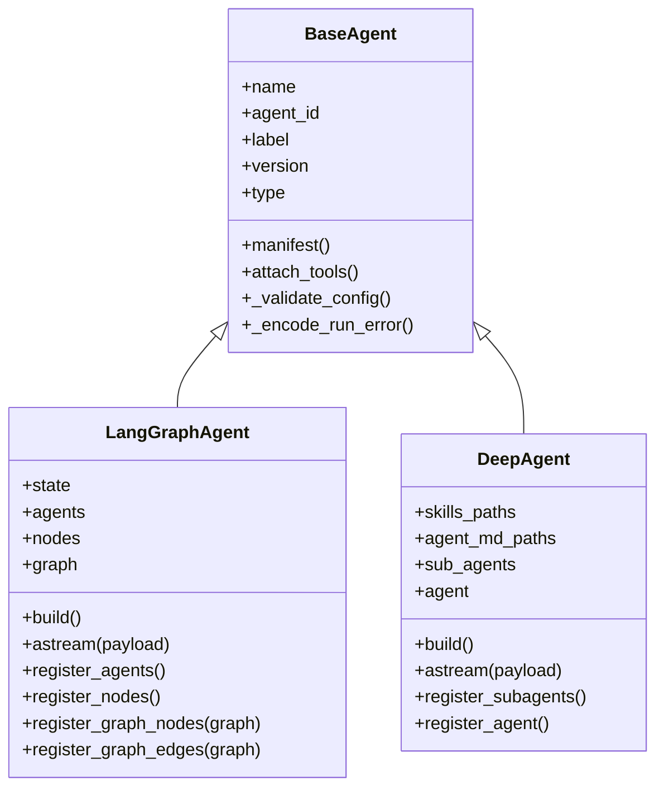
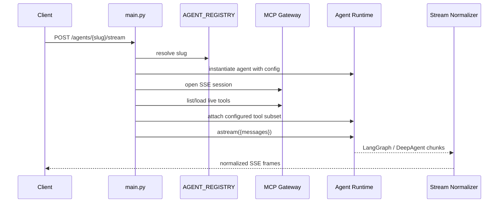
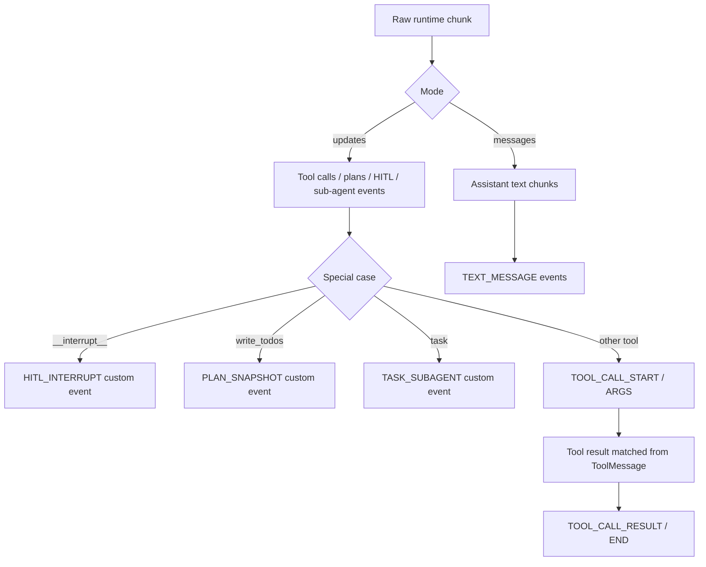
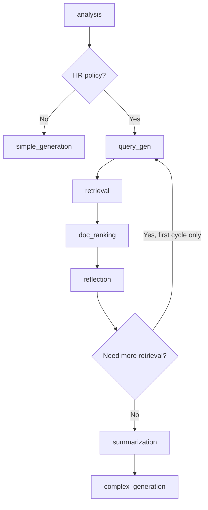
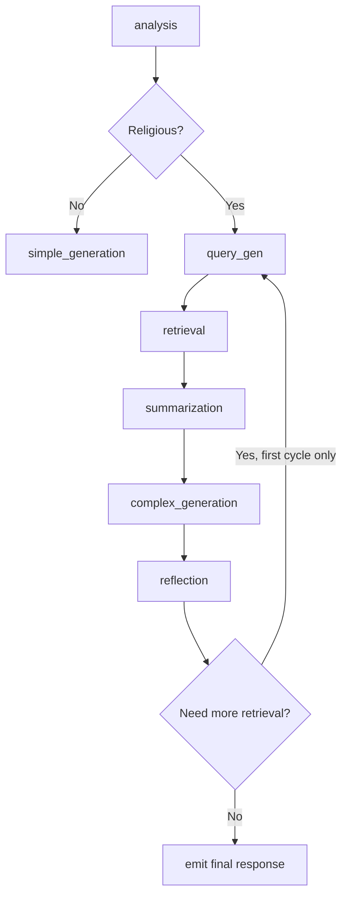
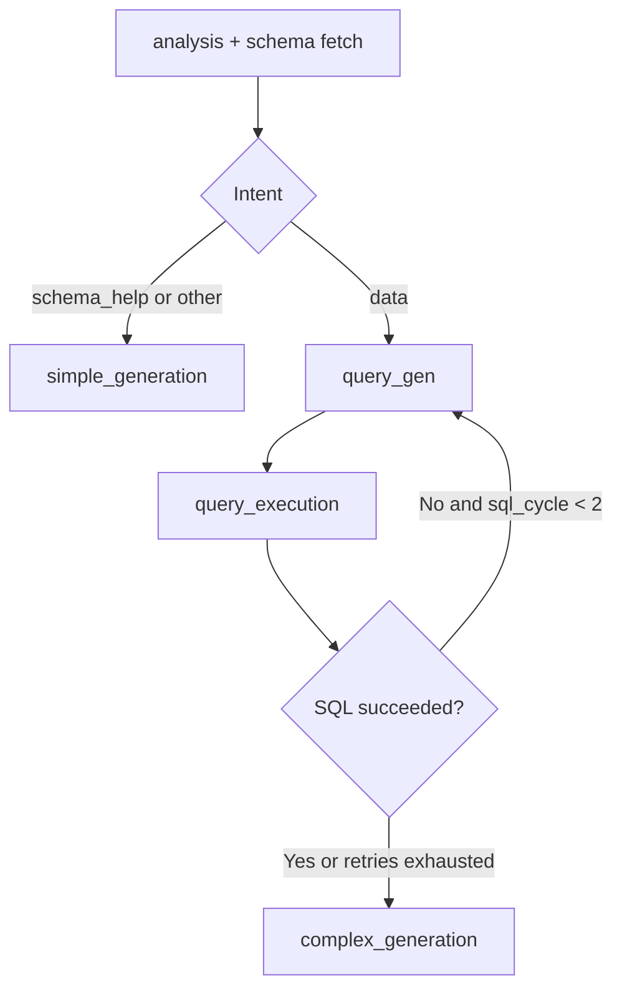
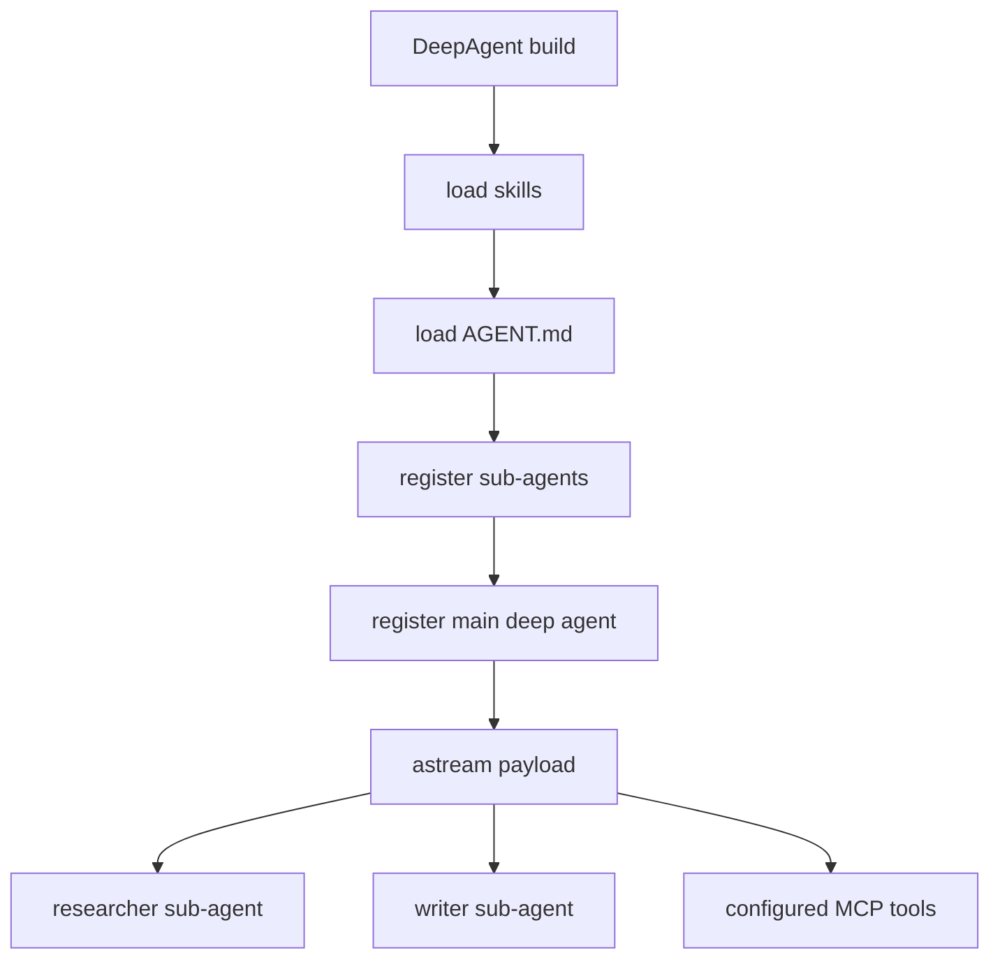
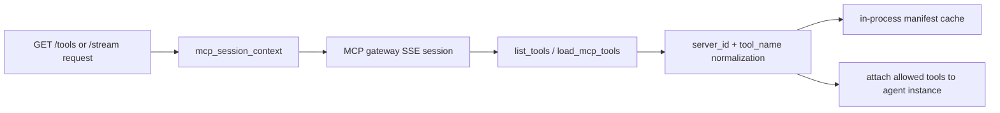

# Agents Service

The `agents` service is the inference and orchestration layer for the project. It exposes a FastAPI API that:

- discovers all registered agent templates at startup
- streams agent execution as AG-UI compatible Server-Sent Events (SSE)
- loads MCP tools on demand for each run
- delegates retrieval and SQL execution to the RAG service
- provides utility endpoints for speech-to-text and conversation title generation

This README documents the current implementation under `src/agents`, not an abstract target architecture.

## 1. What This Service Owns

At a high level, the service owns four concerns:

1. Agent registry and runtime selection.
2. Per-request orchestration and SSE streaming.
3. Tool discovery and MCP session management.
4. Utility inference endpoints that are adjacent to chat: dictation and title generation.

It does not own authentication, chat persistence, or the primary user-facing API. Those responsibilities live in `dialogue_bridge` and the UI.

## 2. System Position



## 3. Service Responsibilities

### Inference and streaming

- `POST /agents/{agent_slug}/stream` is the main entrypoint.
- The service instantiates the requested agent class, opens an MCP session, loads live tools, attaches the allowed tool subset, and streams normalized AG-UI events over SSE.

### Agent discovery

- Agent classes are discovered dynamically from `langgraph_agents` and `deep_agents`.
- Only classes that inherit from `LangGraphAgent` or `DeepAgent` and declare a non-empty `name` are registered.
- `DISABLED_AGENT_SLUGS` removes matching agents from the registry at startup.

### Tool catalog exposure

- `GET /tools` queries the MCP gateway and returns a UI-friendly catalog of available tools.
- Manifests are cached in-process when `MCP_MANIFEST_CACHE_ENABLED=true`.

### Adjacent utility APIs

- `POST /dictate/transcribe` transcribes an uploaded audio file with OpenAI STT.
- `POST /titles/generate` generates multiple short title candidates for a conversation from the first user message.

## 4. Runtime Architecture

### 4.1 Core components



### 4.2 Request lifecycle



### 4.3 Runtime selection model

- `BaseAgent` is the shared contract for config validation, metadata, tool attachment, and error formatting.
- `LangGraphAgent` is used for graph-based domain workflows.
- `DeepAgent` is used for autonomous agents built with `deepagents`.

### 4.4 Important runtime behavior

- If `config.run_config.configurable.thread_id` is missing, a UUID is generated automatically.
- MCP tools are not attached by default. They are attached only if `config.tools` is provided and matches live tool identities.
- Deep agents additionally filter out tool names reserved by the deep-agent runtime such as `task`, `write_todos`, `ls`, `read_file`, and `execute`.
- LangGraph checkpointing uses in-memory savers only. No persistent checkpoint store is configured in this service.
- Stream failures are converted into a `RUN_ERROR` SSE payload instead of a partially broken HTTP response.

## 5. Request and Response Contracts

### 5.1 Streaming request body

`POST /agents/{agent_slug}/stream`

```json
{
  "messages": [
    {
      "role": "user",
      "content": "Show me the top 5 countries by average discount."
    }
  ],
  "config": {
    "tools": [
      {
        "server_id": "tavily",
        "tool_name": "tavily-search"
      }
    ],
    "context": {
      "user_id": "user-123",
      "conversation_id": "conv-456"
    },
    "run_config": {
      "configurable": {
        "thread_id": "thread-789"
      }
    }
  }
}
```

### 5.2 Message normalization

The service accepts chat payloads as `messages`, where each message can contain:

- plain string content
- multimodal content parts such as:
  - `{ "type": "text", "text": "..." }`
  - `{ "type": "image_url", "image_url": "..." }`
  - `{ "type": "image_url", "image_url": { "url": "...", "detail": "high" } }`

System messages supplied by clients are stripped during normalization because each agent injects its own system prompts.

### 5.3 Endpoint surface

| Endpoint | Method | Purpose |
| --- | --- | --- |
| `/agents` | `GET` | Returns registered agent manifests |
| `/tools` | `GET` | Returns cached or live MCP tool manifests |
| `/agents/{agent_slug}/stream` | `POST` | Streams AG-UI SSE for a selected agent |
| `/dictate/transcribe` | `POST` | Transcribes uploaded audio with OpenAI STT |
| `/titles/generate` | `POST` | Generates multiple short conversation title candidates |
| `/suggestions/generate` | `POST` | Generates personalized starter suggestions for a conversation |
| `/speech/read-aloud` | `POST` | Generates TTS audio for an AI response |
| `/realtime/session` | `POST` | Creates an OpenAI Realtime WebRTC session from an SDP offer |

### 5.4 Returned stream format

The stream is `text/event-stream` and carries AG-UI compatible frames such as:

- run lifecycle events
- thinking start/end and thought content
- assistant text start/chunk/content/end
- tool start/args/result/end
- custom events for plan snapshots, sub-agent activity, and HITL interrupts

## 6. AG-UI Streaming Normalization

Raw LangGraph and DeepAgent chunks are not sent directly to clients. They are normalized by `runtime/protocols/agui/normalizer.py`.



### Normalization rules that matter

- `messages` mode is used for assistant text and tool result messages.
- `updates` mode is used for tool intent, plans, sub-agent activity, and interrupts.
- `__interrupt__` is translated into a dedicated `HITL_INTERRUPT` custom event.
- `write_todos` is collapsed into a single plan snapshot event instead of a normal tool lifecycle.
- `task` is collapsed into sub-agent assignment and nested sub-agent stream envelopes.
- Sub-agent namespaces are wrapped into `SUBAGENT_EVENT` envelopes so the UI can correlate nested activity with delegated tasks.

## 7. Agent Registry

The current registry is built from imports in:

- `src/agents/langgraph_agents/__init__.py`
- `src/agents/deep_agents/__init__.py`

Current agents:

| Slug | Runtime | Purpose | Main downstream dependency |
| --- | --- | --- | --- |
| `hr-policies-agent-v1` | LangGraph | HR policy and workplace procedure assistant | RAG retrieve endpoint |
| `orthodox-agent-v1` | LangGraph | Orthodox theology and religious knowledge assistant | RAG retrieve endpoint |
| `retail-agent-v1` | LangGraph | Retail analytics and SQL-backed data assistant | RAG Excel schema/query endpoints |
| `omni-agent-v1` | DeepAgent | General-purpose autonomous research and writing agent | MCP tools and deep-agent internals |

## 8. Concrete Agent Workflows

### 8.1 HR Policies Agent

Purpose:

- routes HR policy questions into retrieval and synthesis
- answers general, non-HR prompts directly
- supports one additional retrieval cycle if reflection says evidence is insufficient



Implementation notes:

- Analyzer prompt is explicitly LSE/HR-policy oriented.
- Retrieval calls `POST {RAG_BASE_URL}/retrieve/{collection_name}`.
- Document ranking filters retrieved documents before summarization.
- Final generation uses a ReAct agent and can use request-approved MCP tools.

### 8.2 Orthodox Agent

Purpose:

- classifies religious vs non-religious requests
- performs retrieval for religious questions
- reflects on the final generated answer and optionally retries retrieval once



Implementation notes:

- Retrieval calls the same RAG service but against the Orthodox collection.
- The reflective loop is capped at one extra retrieval cycle.
- The final response is emitted at the end of the reflection branch rather than directly in `complex_generation`.

### 8.3 Retail Agent

Purpose:

- decides whether a prompt needs schema help, row-level data retrieval, or a generic answer
- fetches the table schema during analysis
- generates SQL, executes it through the RAG service, and retries once on SQL failure



Implementation notes:

- Schema fetch hits `GET {RAG_BASE_URL}/excel/{table_name}/schema`.
- SQL execution hits `POST {RAG_BASE_URL}/excel/{table_name}/query/sql`.
- SQL regeneration uses a dedicated error-aware prompt when the first query fails.
- Final answer generation is a ReAct agent that formats business-facing markdown.

### 8.4 Omni Agent

Purpose:

- provides a more autonomous, general-purpose agent using the `deepagents` framework
- loads an `AGENT.md` instruction file, progressive skills, and two sub-agents



Sub-agents:

- `researcher`: factual research and source gathering
- `writer`: structured writing and file output

Implementation notes:

- The main runtime is built via `create_deep_agent(...)`.
- Skills live under `deep_agents/omni_agent/skills/`.
- AG-UI normalization handles nested sub-agent events coming back from the deep-agent runtime.

## 9. Tool Loading and MCP Integration

### 9.1 MCP tool flow



### 9.2 Important implementation details

- Tool identity is normalized as `server_id/tool_name`.
- When the MCP gateway omits a server prefix, the service applies hardcoded overrides for known tools such as Tavily and Arxiv.
- `GET /tools` returns `ToolManifest` objects with:
  - `server_id`
  - `tool_name`
  - `description`
  - `parameter_count`
- `POST /agents/{slug}/stream` loads live tools again for the actual run, instead of reusing only the cached manifest list.

## 10. Observability and Request Context

The service includes a dedicated observability layer under `src/agents/observability`.

### What it does

- structured event logging with per-request context
- console or JSON formatting
- request/response logging middleware
- exception handler registration
- value sanitization and redaction
- proxy-aware client IP resolution

### Request context fields

The middleware sets contextual values such as:

- `request_id`
- `client_ip`
- `http_method`
- `http_path`
- `status_code`
- `user_id`
- `conversation_id`
- `message_id`
- `agent_slug`

### Redaction behavior

- sensitive keys like `token`, `authorization`, and `cookie` are redacted
- high-volume or private content fields like `messages` and `content` are omitted
- selected identifiers like `client_ip` and `session_id` are HMAC-hashed

### Proxy trust model

The client IP can be taken from forwarded headers only when the request comes from:

- a trusted proxy secret header, or
- a trusted proxy CIDR range

Otherwise, the direct socket IP is used.

## 11. Configuration

Configuration is loaded from environment variables in `core/settings.py` (pydantic-settings; secrets use `SecretStr`).

### 11.1 Core service settings

| Variable | Default | Purpose |
| --- | --- | --- |
| `OPENAI_API_KEY` | none | Required for title generation, dictation, and most workflows |
| `ANTHROPIC_API_KEY` | none | Optional alternate model provider support |
| `RAG_BASE_URL` | `http://rag_service:8001` | Base URL for retrieval and SQL endpoints |
| `MCP_GATEWAY_URL` | `http://mcp_gateway:8005/sse` | MCP gateway SSE endpoint |
| `MCP_MANIFEST_CACHE_ENABLED` | `true` | Enables in-process caching for `/tools` |
| `DISABLED_AGENT_SLUGS` | empty | Comma-separated slugs to exclude from registry |

### 11.2 Utility model settings

| Variable | Default |
| --- | --- |
| `TITLE_MODEL` | `openai:gpt-4o-2024-08-06` |
| `OPENAI_STT_MODEL` | `gpt-4o-transcribe` |

### 11.3 Logging and proxy settings

| Variable | Default | Purpose |
| --- | --- | --- |
| `LOG_LEVEL` | `INFO` | Logging level |
| `LOG_FORMAT` | `console` | `console` or `json` |
| `LOG_TIMEZONE` | `Europe/Athens` | Formatter timezone |
| `LOG_REDACTION_SECRET` | derived fallback | HMAC secret for stable hashes |
| `TRUSTED_PROXY_HEADER_NAME` | `X-Internal-Proxy-Secret` | Secret header name |
| `TRUSTED_PROXY_SECRET` | required | Shared secret for trusted internal callers — service refuses to start if unset |

### 11.4 Workflow-specific namespaces

The service also supports many workflow tuning variables. The naming is consistent:

- `HR_*` for HR collection names, retrieval sizes, and model choices
- `ORTHODOX_*` for Orthodox collection names, retrieval sizes, and model choices
- `RETAIL_*` for source table naming, SQL timeouts, and model choices
- `OMNI_*` for deep-agent model choices

For the authoritative list, read `src/agents/core/settings.py`.

## 12. Directory Map

```text
src/agents/
├── main.py                         FastAPI entrypoint and routes
├── schemas.py                      Request/response schemas and agent definitions
├── core/
│   ├── settings.py                 Environment-driven settings (pydantic-settings)
│   ├── error_handling.py           Provider error handling helpers
│   ├── proxy.py                    Trusted proxy IP resolution
│   └── tls.py                      TLS client setup
├── runtime/
│   ├── base_agent.py               Shared runtime contract
│   ├── langgraph_agent.py          LangGraph runtime wrapper
│   ├── deep_agent.py               DeepAgents runtime wrapper
│   └── protocols/
│       └── agui/
│           ├── emitter.py          AG-UI event encoding helpers
│           ├── events.py           Custom AG-UI event payloads
│           └── normalizer.py       Runtime chunk to SSE normalization
├── utils/
│   ├── agents.py                   Registry discovery
│   ├── mcp_tools.py                MCP catalog and session helpers
│   ├── prompts.py                  Chat payload normalization
│   └── title.py                    Title generation chain
├── langgraph_agents/
│   ├── hr_policies_agent_v1/       HR workflow
│   ├── orthodox_agent_v1/          Orthodox workflow
│   └── retail_agent_v1/            Retail workflow
├── deep_agents/
│   └── omni_agent/                 Deep autonomous agent
├── observability/                  Logging, context, handlers, redaction
├── requirements.txt                Python dependencies
└── Dockerfile                      Container image definition
```

## 13. Local Development

```bash
cd src/agents
python -m venv .venv
source .venv/bin/activate
pip install -r requirements.txt

export OPENAI_API_KEY=sk-...
export RAG_BASE_URL=http://localhost:8001
export MCP_GATEWAY_URL=http://localhost:8005/sse

uvicorn main:app --host 0.0.0.0 --port 8003 --reload
```

Recommended companion services during development:

- `rag_service`
- `mcp_gateway`

Without them:

- retrieval-heavy agents will fail when they try to call the RAG API
- `/tools` and MCP-backed tool runs will fail when they try to open the gateway SSE session

## 14. Docker and Compose

### Dockerfile

The service image:

- starts from `python:3.12-slim`
- installs `build-essential`
- installs dependencies from `requirements.txt`
- copies the full service directory into `/app`
- starts Uvicorn on port `8003`

### Compose wiring

From `src/docker-compose.yaml`:

- the service is exposed on `8003:8003`
- it depends on `rag_service`
- it joins `backend`, `frontend`, and `mcp_net`
- it is configured with:
  - `OPENAI_API_KEY`
  - `RAG_BASE_URL=http://rag_service:8001`
  - `MCP_GATEWAY_URL=http://mcp_gateway:8005/sse`
  - `DISABLED_AGENT_SLUGS`

From `src/docker-compose-mcp.yaml`:

- the MCP gateway is exposed on `8005`
- it runs in SSE mode
- it serves configured MCP servers such as Tavily and Arxiv

## 15. Known Operational Characteristics

These are implementation facts worth knowing before extending the service:

- There is no `/health` endpoint.
- Agent registry discovery happens at import time, not lazily per request.
- `/tools` caches manifests, but live tool instances are still loaded for each stream request.
- LangGraph and deep-agent checkpoints are in memory only.
- The service itself does not persist conversations or user sessions.
- Per-agent prompts and routing behavior are domain-specific and hardcoded in each workflow package.

## 16. Extension Guide

### To add a new LangGraph agent

1. Create a new package under `langgraph_agents/<your_agent>/`.
2. Implement prompts, structured outputs, agent builders, and nodes.
3. Create a class that subclasses `LangGraphAgent`.
4. Export that class from `langgraph_agents/__init__.py`.
5. Ensure the class declares:
   - `name`
   - `agent_id`
   - `label`
   - `version`
   - `description`
   - `icon`

### To add a new DeepAgent agent

1. Create a package under `deep_agents/<your_agent>/`.
2. Add `AGENT.md` and optional `skills/`.
3. Subclass `DeepAgent`.
4. Implement `register_agent()` and optionally `register_subagents()`.
5. Export the class from `deep_agents/__init__.py`.

### To expose a new MCP tool to the UI

1. Make the tool available through the MCP gateway.
2. Confirm it appears through `list_tools()`.
3. If the gateway omits the server prefix and identity collisions matter, add a server override in `utils/mcp_tools.py`.

## 17. Quick File References

- `main.py`: route handlers, MCP session wiring, stream response creation
- `utils/agents.py`: registry discovery and disabled-slug filtering
- `runtime/base_agent.py`: config validation, tool filtering, manifest metadata
- `runtime/langgraph_agent.py`: graph build and LangGraph streaming
- `runtime/deep_agent.py`: deep-agent build lifecycle and streaming
- `runtime/protocols/agui/normalizer.py`: the key translation layer from runtime chunks to UI events
- `core/settings.py`: authoritative environment variable map
