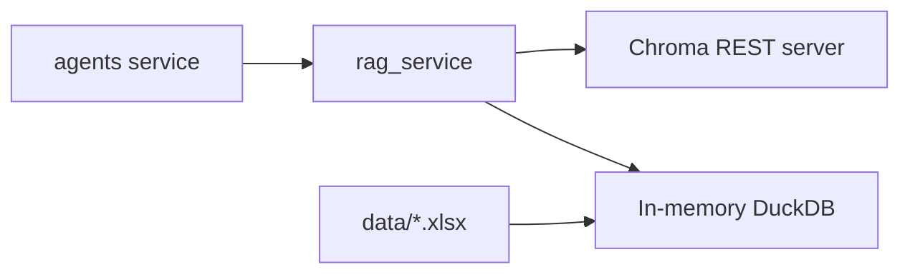
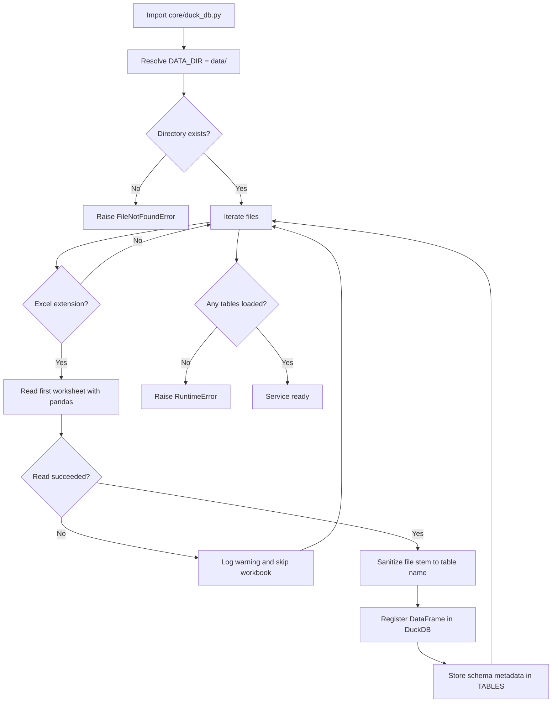
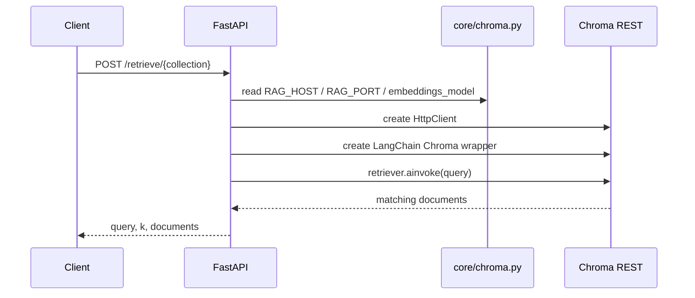

# RAG Service

The `rag_service` is the project's retrieval and tabular analytics backend. It exposes a small FastAPI API used mainly by the `agents` service for:

- semantic retrieval from Chroma collections
- schema inspection for Excel-backed tables
- SQL execution against Excel data loaded into DuckDB

This README documents the current implementation under `src/rag_service`.

## 1. What This Service Owns

The service has two distinct responsibilities:

1. Vector retrieval over Chroma collections using OpenAI embeddings.
2. Read-only analytics over local Excel files loaded into an in-memory DuckDB database.

It does not:

- ingest documents into Chroma
- persist SQL query history
- manage user sessions or authentication
- orchestrate agent logic directly

## 2. System Position



## 3. Service Responsibilities

### 3.1 Vector retrieval

- accepts a natural-language query and `k`
- connects to Chroma over HTTP
- performs retrieval using LangChain's `Chroma` wrapper
- returns matched documents as `{content, metadata}`

### 3.2 Excel schema exposure

- loads Excel files from `data/` at startup
- sanitizes workbook names into safe table names
- exposes table schemas so agents can reason about available columns

### 3.3 SQL execution

- accepts a single read-only `SELECT` or `WITH` SQL statement as request body
- executes it against the in-memory DuckDB database
- returns JSON rows and row count

## 4. Runtime Architecture

```mermaid
flowchart TD
    A[FastAPI request] --> B{Endpoint}
    B -->|/retrieve/{collection}| C[Create Chroma HTTP client]
    C --> D[Wrap with LangChain Chroma]
    D --> E[Retriever ainvoke]
    E --> F[Return matching documents]

    B -->|/excel/{table}/schema| G[Read DuckDB DESCRIBE output]
    G --> H[Return column/type list]

    B -->|/excel/{table}/query/sql| I[Execute SQL in DuckDB]
    I --> J[Convert DataFrame to records]
    J --> K[Return row_count + data]
```

### 4.1 Core modules

| Module | Responsibility |
| --- | --- |
| `main.py` | FastAPI app, routes, and request lifecycle |
| `core/settings.py` | Environment-driven settings (pydantic-settings) |
| `core/chroma.py` | Chroma HTTP client and embeddings setup |
| `core/duck_db.py` | Excel loading and in-memory DuckDB registration |
| `schemas.py` | Request schemas for retrieval and SQL |
| `observability/*` | logging, request context, and exception handling |

## 5. Startup and Data Loading

The Excel side of the service is initialized at startup from `core/duck_db.py`.



### 5.1 Excel loading behavior

- `DATA_DIR` is hardcoded as `data/`.
- Supported file extensions are `.xlsx`, `.xls`, and `.xlsm`.
- Only the first sheet of each workbook is loaded.
- Table names are normalized from the file stem using:
  - replace non-word characters with `_`
  - trim leading/trailing `_`
  - lowercase the result

Example:

```text
Financial Sample.xlsx -> financial_sample
```

### 5.2 In-memory table registry

Loaded tables are tracked in `TABLES`, keyed by sanitized table name.

Each entry currently stores:

- `table_name`
- `schema` as `{column_name: pandas_dtype}`

### 5.3 Failure model

Startup fails immediately when:

- `data/` does not exist
- no workbook can be loaded successfully

Individual unreadable workbooks do not fail startup on their own. They are skipped with a warning.

## 6. Vector Retrieval Path

The retrieval endpoint is:

`POST /retrieve/{collection_name}`

Request body:

```json
{
  "query": "annual leave policy",
  "k": 4
}
```

Successful response shape:

```json
{
  "query": "annual leave policy",
  "k": 4,
  "documents": [
    {
      "content": "...",
      "metadata": {
        "source": "..."
      }
    }
  ]
}
```

### 6.1 Retrieval flow



### 6.2 Implementation details

- The Chroma client is created per request in `main.py`.
- The embeddings model is initialized once in `core/chroma.py` as:
  - `OpenAIEmbeddings(model="text-embedding-3-large")`
- Retrieval uses `vectordb.as_retriever(search_kwargs={"k": request.k})`.
- If no documents are found, the endpoint returns `404`.

## 7. Excel and SQL API Surface

### 7.1 Get table schema

Endpoint:

`GET /excel/{table}/schema`

Successful response:

```json
[
  { "column": "Segment", "type": "VARCHAR" },
  { "column": "Profit", "type": "DOUBLE" }
]
```

Behavior:

- validates that `{table}` exists in `TABLES`
- runs `DESCRIBE {table}` in DuckDB
- returns column/type pairs

### 7.2 Execute SQL

Endpoint:

`POST /excel/{table}/query/sql`

Request body:

```json
{
  "sql": "SELECT Segment, SUM(Profit) AS total_profit FROM financial_sample GROUP BY Segment"
}
```

Successful response:

```json
{
  "row_count": 3,
  "data": [
    {
      "Segment": "Government",
      "total_profit": 12345.67
    }
  ]
}
```

Behavior:

- validates that `{table}` exists in `TABLES`
- strips a single trailing semicolon
- rejects empty SQL, multiple statements, non-`SELECT`/`WITH` first tokens, and a small blacklist of mutation/DDL tokens
- checks that the requested table name appears in the SQL text
- executes the submitted SQL in DuckDB
- converts the result DataFrame to `orient="records"`
- returns `400` on SQL execution failure

## 8. Important Behavioral Notes

These points matter if you are extending or depending on this service.

### 8.1 SQL validation is partial

The endpoint checks that the path table exists:

- `/excel/{table}/query/sql`

It also requires the SQL text to start with `SELECT` or `WITH`, rejects obvious mutation/DDL tokens, and checks that the path table name appears in the submitted SQL. This is still regex/text validation, not an AST whitelist, so it should not be treated as a complete SQL sandbox.

### 8.2 DuckDB is in-memory only

- the database is created with `duckdb.connect(database=":memory:")`
- restarting the service rebuilds the database from the Excel files
- no query results or table mutations are persisted across restarts

### 8.3 Excel refresh requires restart

The service does not watch `data/` dynamically. If you add, remove, or replace workbooks, you need to restart the service to refresh the registered tables.

### 8.4 First worksheet only

Even if a workbook contains multiple sheets, only `sheet_name=0` is loaded.

### 8.5 Retrieval assumes Chroma is already populated

This service queries Chroma collections but does not create or ingest them. Population of the vector database happens elsewhere.

## 9. Observability

The service includes a lightweight observability layer under `src/rag_service/observability`.

### What it logs

- request start and completion
- HTTP and validation exceptions
- retrieval activity
- SQL execution activity
- workbook loading at startup

### Request context

The middleware attaches:

- `request_id`
- `http_method`
- `http_path`

The request ID is also returned in the `X-Request-ID` response header.

### Error handling

The registered exception handlers provide:

- FastAPI HTTP exception passthrough with logging
- validation error logging
- a generic `500` JSON response for unhandled exceptions

## 10. Configuration

Configuration is split between environment variables and local files under `data/`.

### 10.1 Required environment variables

| Variable | Purpose |
| --- | --- |
| `OPENAI_API_KEY` | Required by `OpenAIEmbeddings` |
| `RAG_HOST` | Chroma host |
| `RAG_PORT` | Chroma port |

### 10.2 Logging variables

| Variable | Default | Purpose |
| --- | --- | --- |
| `LOG_LEVEL` | `INFO` | Root log level |

Formatting is handled by the observability formatter builder. The current logging setup is simpler than the `agents` service and does not use the same queue-based logger configuration.

### 10.3 Local filesystem requirements

- `data/` must exist before startup
- `data/` must contain at least one readable Excel workbook

## 11. API Reference

| Endpoint | Method | Request body | Success | Failure cases |
| --- | --- | --- | --- | --- |
| `/retrieve/{collection_name}` | `POST` | `{"query": str, "k": int}` | matched documents | `404` if no docs found |
| `/excel/{table}/schema` | `GET` | none | column/type list | `404` if table unknown |
| `/excel/{table}/query/sql` | `POST` | `{"sql": str}` | `row_count` + `data` | `404` if table unknown, `400` on SQL error |

## 12. Directory Map

```text
src/rag_service/
├── main.py                 FastAPI routes and runtime entrypoint
├── schemas.py              Request models
├── core/
│   ├── settings.py         Environment-driven settings (pydantic-settings)
│   ├── chroma.py           Chroma HTTP client and embeddings setup
│   ├── duck_db.py          Excel loading and in-memory DuckDB registration
│   ├── error_handling.py   Provider error handling helpers
│   └── proxy.py            Trusted proxy IP resolution
├── data/                   Excel files loaded into DuckDB at startup
├── observability/          Logging, middleware, exception handlers
├── requirements.txt        Python dependencies
└── Dockerfile              Container image definition
```

## 13. Local Development

```bash
cd src/rag_service
python -m venv .venv
source .venv/bin/activate
pip install -r requirements.txt

export OPENAI_API_KEY=sk-...
export RAG_HOST=localhost
export RAG_PORT=8000

uvicorn main:app --host 0.0.0.0 --port 8001 --reload
```

Before starting the service locally:

- make sure a Chroma server is running on `RAG_HOST:RAG_PORT`
- make sure `data/` exists
- make sure at least one workbook in `data/` can be read by `pandas.read_excel`

## 14. Docker and Compose

### Dockerfile

The current image:

- uses `python:3.11-slim`
- installs Python dependencies from `requirements.txt`
- installs `build-essential`
- copies the service source into `/app`
- starts Uvicorn on port `8001`

### Compose wiring

From `src/docker-compose.yaml`:

- service name: `rag_service`
- container port: `8001`
- depends on `vectordb`
- environment:
  - `OPENAI_API_KEY=${OPENAI_API_KEY}`
  - `RAG_HOST=vectordb`
  - `RAG_PORT=8000`
- networks:
  - `backend`
  - `frontend`

The sibling `vectordb` service runs `chromadb/chroma:0.6.3` and persists data through the `vectorstore` volume.

## 15. Dependency Summary

Key runtime dependencies from `requirements.txt`:

- `fastapi`, `uvicorn`
- `langchain`, `langchain-chroma`, `chromadb`
- `langchain-openai`
- `duckdb`
- `pandas`, `openpyxl`

## 16. Extension Guide

### To add another retrieval backend

You would need to change:

- client creation in `main.py`
- settings and connection configuration in `core/settings.py` and `core/chroma.py`
- possibly the response mapping from retrieved documents

### To support multiple workbook sheets

You would need to change:

- the Excel loading loop in `core/duck_db.py`
- table naming logic to include sheet identity
- any assumptions in downstream agents about one workbook -> one table

### To harden SQL execution

Current implementation executes text-validated read-only SQL against DuckDB. If you want stronger guarantees, likely changes include:

- parse and validate the SQL with an AST whitelist before execution
- enforce read-only statements
- enforce that the SQL references only the path table
- disable DuckDB external access at the engine level
- apply result row limits centrally

## 17. Quick File References

- `main.py`: routes for retrieval, schema, and SQL
- `core/chroma.py`: Chroma HTTP client and embeddings initialization
- `core/duck_db.py`: startup-time Excel loading and DuckDB table registration
- `core/settings.py`: authoritative environment variable map
- `schemas.py`: request contracts
- `observability/middleware.py`: request ID propagation
- `observability/exception_handlers.py`: API error behavior
